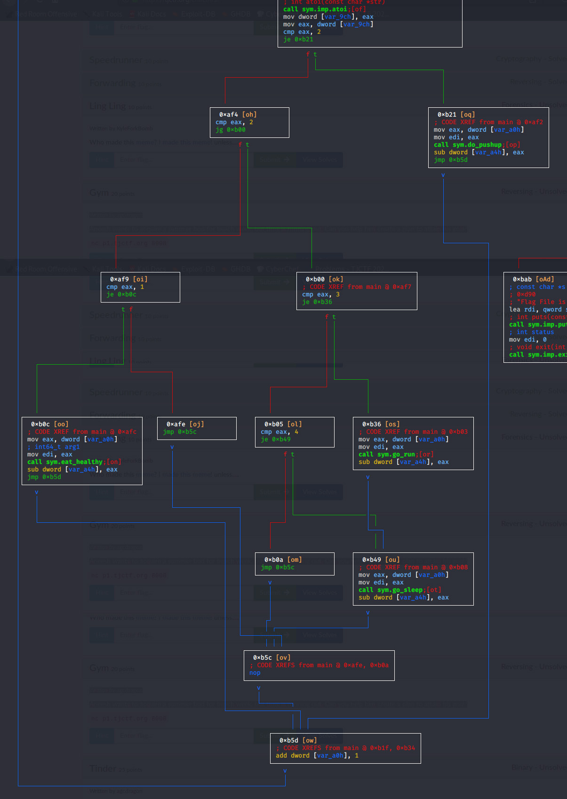

# Gym | TJCTF2020
## Problem
Written by agcdragon
Aneesh wants to acquire a summer bod for beach week, but time is running out. Can you help him create a plan to attain his goal?

## Solution
### 1. Run the binary and see what happens
```bash
kali@kali:~/Desktop/tjctf2020/gym$ ./gym
I'm currently 211 lbs. Can I be exactly 180? Help me out!
-------------------------
Today is day 1.

Choose an activity:
[1] Eat healthy
[2] Do 50 push-ups
[3] Go for a run.
[4] Sleep 8 hours.

1

-------------------------
Today is day 2.

Choose an activity:
[1] Eat healthy
[2] Do 50 push-ups
[3] Go for a run.
[4] Sleep 8 hours.

2

-------------------------
Today is day 3.

Choose an activity:
[1] Eat healthy
[2] Do 50 push-ups
[3] Go for a run.
[4] Sleep 8 hours.

3
                  
-------------------------
Today is day 4. 
Choose an activity:
[1] Eat healthy
[2] Do 50 push-ups
[3] Go for a run.
[4] Sleep 8 hours.

4

-------------------------
Today is day 5.

Choose an activity:
[1] Eat healthy
[2] Do 50 push-ups
[3] Go for a run.
[4] Sleep 8 hours.

3

-------------------------
Today is day 6.

Choose an activity:
[1] Eat healthy
[2] Do 50 push-ups
[3] Go for a run.
[4] Sleep 8 hours.

2

-------------------------
Today is day 7.

Choose an activity:
[1] Eat healthy
[2] Do 50 push-ups
[3] Go for a run.
[4] Sleep 8 hours.

I didn't reach my goal :(
```
Every day you can do one activity. You don't get feedback on your weight each day, so there's no real way to know the value of each action until we examine the binary further.

### 2. Check it out in Radare2
```bash
kali@kali:~/Desktop/tjctf2020/gym$ r2 gym
[0x00000850]> aaaa
[x] Analyze all flags starting with sym. and entry0 (aa)
[x] Analyze function calls (aac)
[x] Analyze len bytes of instructions for references (aar)
[x] Check for objc references
[x] Check for vtables
[x] Type matching analysis for all functions (aaft)
[x] Propagate noreturn information
[x] Use -AA or aaaa to perform additional experimental analysis.
[x] Finding function preludes
[x] Enable constraint types analysis for variables
[0x00000850]> afl
0x00000850    1 42           entry0
0x00000880    4 50   -> 40   sym.deregister_tm_clones
0x000008c0    4 66   -> 57   sym.register_tm_clones
0x00000910    5 58   -> 51   entry.fini0
0x00000950    1 10           entry.init0
0x00000ca0    1 2            sym.__libc_csu_fini
0x0000096d    1 19           sym.do_pushup
0x00000ca4    1 9            sym._fini
0x00000993    1 19           sym.go_sleep
0x00000c30    4 101          sym.__libc_csu_init
0x00000980    1 19           sym.go_run
0x000009a6   23 640          main
0x0000095a    1 19           sym.eat_healthy
0x00000788    3 23           sym._init
0x000007b0    1 6            sym.imp.puts
0x000007c0    1 6            sym.imp.__stack_chk_fail
0x000007d0    1 6            sym.imp.setbuf
0x000007e0    1 6            sym.imp.printf
0x00000000    8 459  -> 485  loc.imp._ITM_deregisterTMCloneTable
0x000007f0    1 6            sym.imp.fgets
0x00000800    1 6            sym.imp.fopen
0x00000810    1 6            sym.imp.atoi
0x00000820    1 6            sym.imp.exit
0x00000830    1 6            sym.imp.sleep
[0x00000850]>
```
We have the main function, and then one function for each activity: sym.go_run, sym.go_sleep, sym.do_pushup and sym.eat_healthy.

### 3. Look at the gym functions
We can check each of the gym functions out in turn.
```bash
[0x000009a6]> pdf @sym.do_pushup
            ; CALL XREF from main @ 0xb29
┌ 19: sym.do_pushup (int64_t arg1);
│           ; var int64_t var_14h @ rbp-0x14
│           ; var int64_t var_4h @ rbp-0x4
│           ; arg int64_t arg1 @ rdi
│           0x0000096d      55             push rbp
│           0x0000096e      4889e5         mov rbp, rsp
│           0x00000971      897dec         mov dword [var_14h], edi    ; arg1
│           0x00000974      c745fc010000.  mov dword [var_4h], 1
│           0x0000097b      8b45fc         mov eax, dword [var_4h]
│           0x0000097e      5d             pop rbp
└           0x0000097f      c3             ret
[0x000009a6]> pdf @sym.go_sleep
            ; CALL XREF from main @ 0xb51
┌ 19: sym.go_sleep (int64_t arg1);
│           ; var int64_t var_14h @ rbp-0x14
│           ; var int64_t var_4h @ rbp-0x4
│           ; arg int64_t arg1 @ rdi
│           0x00000993      55             push rbp
│           0x00000994      4889e5         mov rbp, rsp
│           0x00000997      897dec         mov dword [var_14h], edi    ; arg1
│           0x0000099a      c745fc030000.  mov dword [var_4h], 3
│           0x000009a1      8b45fc         mov eax, dword [var_4h]
│           0x000009a4      5d             pop rbp
└           0x000009a5      c3             ret
[0x000009a6]> pdf @sym.eat_healthy
            ; CALL XREF from main @ 0xb14
┌ 19: sym.eat_healthy (int64_t arg1);
│           ; var int64_t var_14h @ rbp-0x14
│           ; var int64_t var_4h @ rbp-0x4
│           ; arg int64_t arg1 @ rdi
│           0x0000095a      55             push rbp
│           0x0000095b      4889e5         mov rbp, rsp
│           0x0000095e      897dec         mov dword [var_14h], edi    ; arg1
│           0x00000961      c745fc040000.  mov dword [var_4h], 4
│           0x00000968      8b45fc         mov eax, dword [var_4h]
│           0x0000096b      5d             pop rbp
└           0x0000096c      c3             ret
[0x000009a6]> pdf @sym.go_run
            ; CALL XREF from main @ 0xb3e
┌ 19: sym.go_run (int64_t arg1);
│           ; var int64_t var_14h @ rbp-0x14
│           ; var int64_t var_4h @ rbp-0x4
│           ; arg int64_t arg1 @ rdi
│           0x00000980      55             push rbp
│           0x00000981      4889e5         mov rbp, rsp
│           0x00000984      897dec         mov dword [var_14h], edi    ; arg1
│           0x00000987      c745fc020000.  mov dword [var_4h], 2
│           0x0000098e      8b45fc         mov eax, dword [var_4h]
│           0x00000991      5d             pop rbp
└           0x00000992      c3             ret
[0x000009a6]> 
```
In each function, we can see a value being copied into a register, which ends up in eax. We can take this to be the value of each exercise:
- Pushups : 1
- Sleep : 3
- Eat : 4
- Run : 2  

Knowing this now, we could go and try running the program again. However, there is a problem. If we have 7 days to drop from 211 to 180, even if we drop by eating every day, dropping 4 pounds each time, we're not going to get to 180. The most we can get to is 183. 

### 3. Do some dynamic analysis

We can verify this in the binary anyway by doing some dynamic analysis. We'll find the place where the final comparison happens and see what the weight is at that point.
```bash
kali@kali:~/Desktop/tjctf2020/gym$ r2 -d gym
Process with PID 2305 started...
= attach 2305 2305
bin.baddr 0x556cf6d8c000
Using 0x556cf6d8c000
asm.bits 64
Warning: r_bin_file_hash: file exceeds bin.hashlimit
[0x7f86978b8090]> aaa
[x] Analyze all flags starting with sym. and entry0 (aa)
[x] Analyze function calls (aac)
[x] Analyze len bytes of instructions for references (aar)
[x] Check for objc references
[x] Check for vtables
[TOFIX: aaft can't run in debugger mode.ions (aaft)
[x] Type matching analysis for all functions (aaft)
[x] Propagate noreturn information
[x] Use -AA or aaaa to perform additional experimental analysis.
[0x55a77b4f69a6]> db 0x55a77b4f6b7b
[0x55a77b4f69a6]> dc
I'm currently 211 lbs. Can I be exactly 180? Help me out!
-------------------------
Today is day 1.

Choose an activity:
[1] Eat healthy
[2] Do 50 push-ups
[3] Go for a run.
[4] Sleep 8 hours.

1

-------------------------
Today is day 2.

Choose an activity:
[1] Eat healthy
[2] Do 50 push-ups
[3] Go for a run.
[4] Sleep 8 hours.

1

-------------------------
Today is day 3.

Choose an activity:
[1] Eat healthy
[2] Do 50 push-ups
[3] Go for a run.
[4] Sleep 8 hours.

1

-------------------------
Today is day 4.

Choose an activity:
[1] Eat healthy
[2] Do 50 push-ups
[3] Go for a run.
[4] Sleep 8 hours.

1

-------------------------
Today is day 5.

Choose an activity:
[1] Eat healthy
[2] Do 50 push-ups
[3] Go for a run.
[4] Sleep 8 hours.

1

-------------------------
Today is day 6.

Choose an activity:
[1] Eat healthy
[2] Do 50 push-ups
[3] Go for a run.
[4] Sleep 8 hours.

1

-------------------------
Today is day 7.

Choose an activity:
[1] Eat healthy
[2] Do 50 push-ups
[3] Go for a run.
[4] Sleep 8 hours.

1
hit breakpoint at: 55a77b4f6b7b
[0x55a77b4f6b7b]> afvd
var var_8h = 0x7ffc6708a1f8 = (qword)0xcab930fdfce59a00
var var_a4h = 0x7ffc6708a15c = (qword)0x00000008000000b7 <------ This is the final weight
var var_a0h = 0x7ffc6708a160 = (qword)0x0000000100000008
var var_90h = 0x7ffc6708a170 = (qword)0x0000000000000a31
var var_9ch = 0x7ffc6708a164 = (qword)0x0000000000000001
var var_98h = 0x7ffc6708a168 = (qword)0x0000000000000000
var var_50h = 0x7ffc6708a1b0 = (qword)0x00007ffc6708a1d6
[0x55a77b4f6b7b]> ? 0xb7
int32   183                                              <------ Its equal to 183 in decimal
uint32  183
hex     0xb7
octal   0267
unit    183
segment 0000:00b7
string  "\xb7"
fvalue: 183.0
float:  0.000000f
double: 0.000000
binary  0b10110111
trits   0t20210
```
So knowing that these values alone won't get us down to the right number, there must be something else needed. To find out what, we can now check out the main function.
```bash
[0x7f86978b8090]> s main; VV
```
Once we get past the printing of the excercises and accepting input, there's an interesting tree of decisions being made, as seen below:
  
So following down from the top, the logic is as follows:
1. Check if the exercise selection number is 2
2. Check if it's greater than 2
3. If it is, check if it's 3
4. If it is, run the go_run function.... and then run go_sleep afterwards
5. Loop back around to the next day.
  
So with this information, we now know that the values of the exercises are actually as follows:
- Pushups : 1
- Sleep : 3
- Eat : 4
- Run : 2 PLUS 3 for sleep = 5

### 4. Get the flag
So we can now construct a strategy for getting to 181:
- Days 1-6: Run. Results in 211-(5*6) = 181
- Day 7: Pushups Results in 180 exactly.

```bash
kali@kali:~/Downloads$ nc p1.tjctf.org 8008
I'm currently 211 lbs. Can I be exactly 180? Help me out!
-------------------------
Today is day 1.

Choose an activity:
[1] Eat healthy
[2] Do 50 push-ups
[3] Go for a run.
[4] Sleep 8 hours.

3

-------------------------
Today is day 2.

Choose an activity:
[1] Eat healthy
[2] Do 50 push-ups
[3] Go for a run.
[4] Sleep 8 hours.

3

-------------------------
Today is day 3.

Choose an activity:
[1] Eat healthy
[2] Do 50 push-ups
[3] Go for a run.
[4] Sleep 8 hours.

3

-------------------------
Today is day 4.

Choose an activity:
[1] Eat healthy
[2] Do 50 push-ups
[3] Go for a run.
[4] Sleep 8 hours.

3

-------------------------
Today is day 5.

Choose an activity:
[1] Eat healthy
[2] Do 50 push-ups
[3] Go for a run.
[4] Sleep 8 hours.

3

-------------------------
Today is day 6.

Choose an activity:
[1] Eat healthy
[2] Do 50 push-ups
[3] Go for a run.
[4] Sleep 8 hours.

3

-------------------------
Today is day 7.

Choose an activity:
[1] Eat healthy
[2] Do 50 push-ups
[3] Go for a run.
[4] Sleep 8 hours.

2
Congrats on reaching your weight goal!
Here is your prize: tjctf{w3iGht_l055_i5_d1ff1CuLt}
```