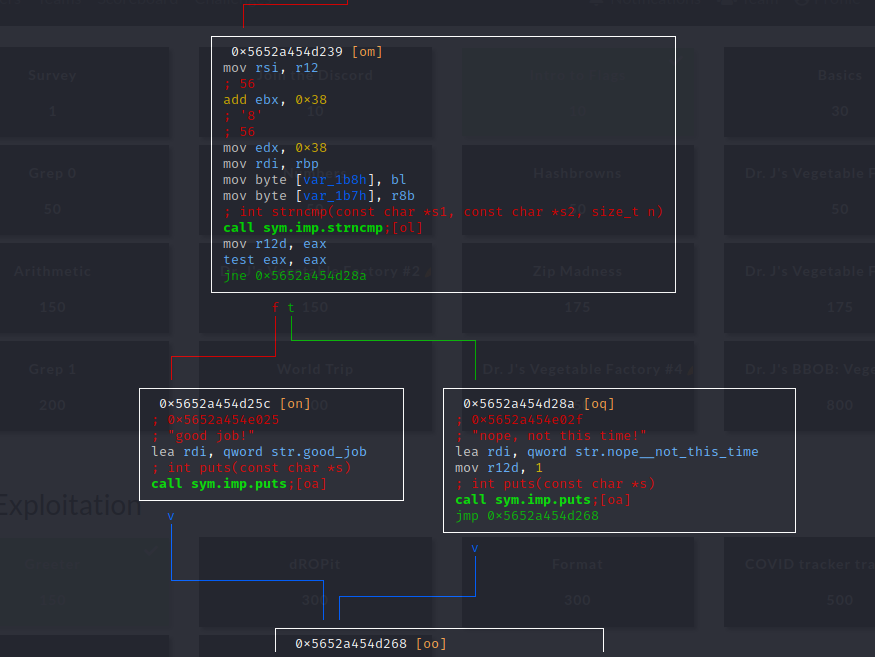

# Generic Flag Checker V2 | NACTF2020

## Problem
Flag Checker Industries™ is back with another new product, the Generic Flag Checker® Version 2℠! This time, the flag has got some foolproof math magic preventing pesky players from getting the flag so easily.

## Solution
### 1. Check out the binary
```bash
┌──(kali㉿kali)-[~/Desktop/nactf/gfc2]
└─$ ./gfc2   
what's the flag?
I dont know
nope, not this time!                                       
                                                                                                                                                                                                   
┌──(kali㉿kali)-[~/Desktop/nactf/gfc2]
└─$ rabin2 -Iz gfc2
[Strings]
nth paddr      vaddr      len size section type  string
―――――――――――――――――――――――――――――――――――――――――――――――――――――――
0   0x00002004 0x00002004 16  17   .rodata ascii what's the flag?
1   0x00002018 0x00002018 9   10   .rodata ascii %0*o24\n%n
2   0x00002025 0x00002025 9   10   .rodata ascii good job!
3   0x0000202f 0x0000202f 20  21   .rodata ascii nope, not this time!
4   0x00002077 0x00002077 7   8    .rodata ascii \a\b\t\n\v\f\r
5   0x00002080 0x00002080 16  17   .rodata ascii nactf20_key*lxgm
arch     x86
baddr    0x0
binsz    12661
bintype  elf
bits     64
canary   true
class    ELF64
compiler GCC: (GNU) 10.2.0
crypto   false
endian   little
havecode true
intrp    /lib64/ld-linux-x86-64.so.2
laddr    0x0
lang     c
linenum  false
lsyms    false
machine  AMD x86-64 architecture
maxopsz  16
minopsz  1
nx       true
os       linux
pcalign  0
pic      true
relocs   false
relro    partial
rpath    NONE
sanitiz  false
static   false
stripped true
subsys   linux
va       true
```
### 2. Static & dynamic analysis
Although I usually perform one and then the other, I do both at once for this one.
```bash
┌──(kali㉿kali)-[~/Desktop/nactf/gfc2]
└─$ r2 gfc2        
[0x000012b0]> aaaa
[Cannot find function at 0x000012b0 sym. and entry0 (aa)
[x] Analyze all flags starting with sym. and entry0 (aa)
[x] Analyze function calls (aac)
[x] Analyze len bytes of instructions for references (aar)
[x] Check for objc references
[x] Check for vtables
[x] Type matching analysis for all functions (aaft)
[x] Propagate noreturn information
[x] Use -AA or aaaa to perform additional experimental analysis.
[x] Finding function preludes
[x] Enable constraint types analysis for variables
[0x000012b0]> afl
0x00001030    1 6            sym.imp.strncmp
0x00001040    1 6            sym.imp.fmemopen
0x00001050    1 6            sym.imp.__isoc99_fscanf
0x00001060    1 6            sym.imp.puts
0x00001070    1 6            sym.imp.fclose
0x00001080    1 6            sym.imp.__stack_chk_fail
0x00001090    1 6            sym.imp.fgets
0x000010a0    1 6            sym.imp.fprintf
0x000010b0    1 6            sym.imp.fseek
0x000012e0    4 41   -> 34   fcn.000012e0
0x000010c0   10 483          main
[0x000012b0]> s main; pdf
            ; DATA XREF from entry0 @ +0x21
            ;-- section..text:
┌ 483: int main (int64_t arg9);
│           ; var int64_t var_1c0h @ rsp+0x8
│           ; var int64_t var_1bch @ rsp+0xc
│           ; var int64_t var_1b8h @ rsp+0x10
│           ; var int64_t var_1b7h @ rsp+0x11
│           ; var int64_t var_1a8h @ rsp+0x20
│           ; var int64_t var_a8h @ rsp+0x120
│           ; var int64_t var_68h @ rsp+0x160
│           ; var int64_t var_20h @ rsp+0x1a8
│           ; arg int64_t arg9 @ xmm2
│           0x000010c0      4154           push r12                    ; [13] -r-x section size 869 named .text
│           0x000010c2      488d3d3b0f00.  lea rdi, qword str.what_s_the_flag ; 0x2004 ; "what's the flag?" ; const char *s
│           0x000010c9      55             push rbp
│           0x000010ca      53             push rbx
│           0x000010cb      4881ecb00100.  sub rsp, 0x1b0
│           0x000010d2      64488b042528.  mov rax, qword fs:[0x28]
│           0x000010db      48898424a801.  mov qword [var_20h], rax
│           0x000010e3      31c0           xor eax, eax
│           0x000010e5      488dac242001.  lea rbp, qword [var_a8h]
│           0x000010ed      e86effffff     call sym.imp.puts           ; int puts(const char *s)
│           0x000010f2      488b15772f00.  mov rdx, qword [obj.stdin]  ; [0x4070:8]=0 ; FILE *stream
│           0x000010f9      be40000000     mov esi, 0x40               ; segment.PHDR ; int size
│           0x000010fe      4889ef         mov rdi, rbp                ; char *s
│           0x00001101      e88affffff     call sym.imp.fgets          ; char *fgets(char *s, int size, FILE *stream)
│           0x00001106      48c7c1400000.  mov rcx, 0x40               ; segment.PHDR
│           0x0000110d      4889ef         mov rdi, rbp
│           0x00001110      b00a           mov al, 0xa
│           0x00001112      f2ae           repne scasb al, byte [rdi]
│           0x00001114      c647ff00       mov byte [rdi - 1], 0
│           0x00001118      488d15f60e00.  lea rdx, qword [0x00002015] ; "w+"
│           0x0000111f      be00010000     mov esi, 0x100
│           0x00001124      31ff           xor edi, edi
│           0x00001126      e815ffffff     call sym.imp.fmemopen
│           0x0000112b      4989c4         mov r12, rax
│           0x0000112e      b81ca08425     mov eax, 0x2584a01c
│           0x00001133      0fc8           bswap eax
│           0x00001135      0fbdd0         bsr edx, eax
│           0x00001138      35aaaaaaaa     xor eax, 0xaaaaaaaa
│           0x0000113d      89c1           mov ecx, eax
│           0x0000113f      488d35d20e00.  lea rsi, qword str.0_o24___n ; 0x2018 ; "%0*o24\n%n" ; const char *format
│           0x00001146      4c8d442408     lea r8, qword [var_1c0h]
│           0x0000114b      4c89e7         mov rdi, r12                ; FILE *stream
│           0x0000114e      31c0           xor eax, eax
│           0x00001150      e84bffffff     call sym.imp.fprintf        ; int fprintf(FILE *stream, const char *format,   ...)
│           0x00001155      31d2           xor edx, edx                ; int whence
│           0x00001157      31f6           xor esi, esi                ; long offset
│           0x00001159      4c89e7         mov rdi, r12                ; FILE *stream
│           0x0000115c      e84fffffff     call sym.imp.fseek          ; int fseek(FILE *stream, long offset, int whence)
│           0x00001161      488d54240c     lea rdx, qword [var_1bch]   ;  ...
│           0x00001166      4c89e7         mov rdi, r12                ; FILE *stream
│           0x00001169      31c0           xor eax, eax
│           0x0000116b      488d35b00e00.  lea rsi, qword [0x00002022] ; "%d" ; const char *format
│           0x00001172      e8d9feffff     call sym.imp.__isoc99_fscanf ; int fscanf(FILE *stream, const char *format, ...)
│           0x00001177      0fb75c2408     movzx ebx, word [var_1c0h]
│           0x0000117c      31c0           xor eax, eax
│           0x0000117e      8a44240c       mov al, byte [var_1bch]
│           0x00001182      488d15f70e00.  lea rdx, qword str.nactf20_key_lxgm ; 0x2080 ; "nactf20_key*lxgm"
│           0x00001189      488d35e00e00.  lea rsi, qword [0x00002070]
│           0x00001190      88dc           mov ah, bl
│           0x00001192      488d3dc70e00.  lea rdi, qword [0x00002060]
│           0x00001199      6689442410     mov word [var_1b8h], ax
│           0x0000119e      488d442420     lea rax, qword [var_1a8h]
│           0x000011a3      660f6f02       movdqa xmm0, xmmword [rdx]
│           0x000011a7      660f6f16       movdqa xmm2, xmmword [rsi]
│           0x000011ab      48c7c1200000.  mov rcx, 0x20               ; "@"
│           ; CODE XREF from main @ 0x11cd
│       ┌─> 0x000011b2      660f6fca       movdqa xmm1, xmm2
│       ╎   0x000011b6      660f3800c8     pshufb xmm1, xmm0
│       ╎   0x000011bb      660f3800c0     pshufb xmm0, xmm0
│       ╎   0x000011c0      660ffc17       paddb xmm2, xmmword [rdi]   ; arg9
│       ╎   0x000011c4      660f7f4cc8f0   movdqa xmmword [rax + rcx*8 - 0x10], xmm1
│       ╎   0x000011ca      48ffc9         dec rcx
│       └─< 0x000011cd      e2e3           loop 0x11b2
│           0x000011cf      4c89e7         mov rdi, r12                ; FILE *stream
│           0x000011d2      4c8da4246001.  lea r12, qword [var_68h]
│           0x000011da      e891feffff     call sym.imp.fclose         ; int fclose(FILE *stream)
│           0x000011df      0fb65c2410     movzx ebx, byte [var_1b8h]
│           0x000011e4      488d0db50e00.  lea rcx, qword [0x000020a0]
│           0x000011eb      4c89e6         mov rsi, r12
│           0x000011ee      440fb6442411   movzx r8d, byte [var_1b7h]
│           0x000011f4      4c8d5938       lea r11, qword [rcx + 0x38]
│           0x000011f8      448d5301       lea r10d, dword [rbx + 1]
│           0x000011fc      4529e2         sub r10d, r12d
│           0x000011ff      90             nop
│           ; CODE XREF from main @ 0x1237
│       ┌─> 0x00001200      418d1432       lea edx, dword [r10 + rsi]
│       ╎   0x00001204      4883c101       add rcx, 1
│       ╎   0x00001208      4883c601       add rsi, 1
│       ╎   0x0000120c      0fb6d2         movzx edx, dl
│       ╎   0x0000120f      440fb64c1420   movzx r9d, byte [rsp + rdx + 0x20]
│       ╎   0x00001215      4501c8         add r8d, r9d
│       ╎   0x00001218      410fb6f8       movzx edi, r8b
│       ╎   0x0000121c      0fb6443c20     movzx eax, byte [rsp + rdi + 0x20]
│       ╎   0x00001221      44884c3c20     mov byte [rsp + rdi + 0x20], r9b
│       ╎   0x00001226      88441420       mov byte [rsp + rdx + 0x20], al
│       ╎   0x0000122a      02443c20       add al, byte [rsp + rdi + 0x20]
│       ╎   0x0000122e      3241ff         xor al, byte [rcx - 1]
│       ╎   0x00001231      8846ff         mov byte [rsi - 1], al
│       ╎   0x00001234      4c39d9         cmp rcx, r11
│       └─< 0x00001237      75c7           jne 0x1200
│           0x00001239      4c89e6         mov rsi, r12                ; const char *s2
│           0x0000123c      83c338         add ebx, 0x38               ; rdx
│           0x0000123f      ba38000000     mov edx, 0x38               ; rdx ; size_t n
│           0x00001244      4889ef         mov rdi, rbp                ; const char *s1
│           0x00001247      885c2410       mov byte [var_1b8h], bl
│           0x0000124b      4488442411     mov byte [var_1b7h], r8b
│           0x00001250      e8dbfdffff     call sym.imp.strncmp        ; int strncmp(const char *s1, const char *s2, size_t n)
│           0x00001255      4189c4         mov r12d, eax
│           0x00001258      85c0           test eax, eax
│       ┌─< 0x0000125a      752e           jne 0x128a
│       │   0x0000125c      488d3dc20d00.  lea rdi, qword str.good_job ; 0x2025 ; "good job!" ; const char *s
│       │   0x00001263      e8f8fdffff     call sym.imp.puts           ; int puts(const char *s)
│       │   ; CODE XREF from main @ 0x129c
│      ┌──> 0x00001268      488b8424a801.  mov rax, qword [var_20h]
│      ╎│   0x00001270      64482b042528.  sub rax, qword fs:[0x28]
│     ┌───< 0x00001279      7523           jne 0x129e
│     │╎│   0x0000127b      4881c4b00100.  add rsp, 0x1b0
│     │╎│   0x00001282      4489e0         mov eax, r12d
│     │╎│   0x00001285      5b             pop rbx
│     │╎│   0x00001286      5d             pop rbp
│     │╎│   0x00001287      415c           pop r12
│     │╎│   0x00001289      c3             ret
│     │╎│   ; CODE XREF from main @ 0x125a
│     │╎└─> 0x0000128a      488d3d9e0d00.  lea rdi, qword str.nope__not_this_time ; 0x202f ; "nope, not this time!" ; const char *s
│     │╎    0x00001291      41bc01000000   mov r12d, 1
│     │╎    0x00001297      e8c4fdffff     call sym.imp.puts           ; int puts(const char *s)
│     │└──< 0x0000129c      ebca           jmp 0x1268
│     │     ; CODE XREF from main @ 0x1279
└     └───> 0x0000129e      e8ddfdffff     call sym.imp.__stack_chk_fail ; void __stack_chk_fail(void)
```
The big weakness with this binary is that despite the way it is deobfuscating the flag in memory to prevent it from showing up in something like strings, the program boils down to a single strncmp check.  
  
### 3. Get the flag
Firstly set a breakpoint on the strncmp function then run the program.
```bash
[0x5652a454d0c0]> db 0x5652a454d250
[0x5652a454d0c0]> dc
what's the flag?
TEST
hit breakpoint at: 5652a454d250
```
The flag can then be retrieved from the register location.
```bash
[0x559fb449c250]> dr
rax = 0x00000000
rbx = 0x000000f4
rcx = 0x559fb449d0d8
rdx = 0x00000038
r8 = 0x000008d4
r9 = 0x00000006
r10 = 0x063726bd
r11 = 0x559fb449d0d8
r12 = 0x7ffef9c8da00
r13 = 0x00000000
r14 = 0x00000000
r15 = 0x00000000
rsi = 0x7ffef9c8da00
rdi = 0x7ffef9c8d9c0
rsp = 0x7ffef9c8d8a0
rbp = 0x7ffef9c8d9c0
rip = 0x559fb449c250
rflags = 0x00000212
orax = 0xffffffffffffffff
[0x559fb449c250]> pxs @ 0x7ffef9c8d9c0
- offset -       0 1  2 3  4 5  6 7  8 9  A B  C D  E F  0123456789ABCDEF
0x7ffef9c8d9c0  5445 5354 0000 0000 0000 0000 0000 0000  TEST............                                                                                                                          
0x7ffef9c8d9d0  0000 0000 0000 0000 0000 0000 0000 0000  ................
0x7ffef9c8d9e0  0000 0000 0000 0000 0000 0000 0000 0000  ................
0x7ffef9c8d9f0  0000 0000 0000 0000 0000 0000 0000 0000  ................
0x7ffef9c8da00  6e61 6374 667b 7330 6d33 7431 6d33 735f  nactf{s0m3t1m3s_
0x7ffef9c8da10  6479 6e34 6d31 635f 346e 346c 7973 3173  dyn4m1c_4n4lys1s
0x7ffef9c8da20  5f77 316e 355f 674b 537a 3367 3652 6946  _w1n5_gKSz3g6RiF
0x7ffef9c8da30  476b 736b 5878 7d00 0000 0000 0000 0000  GkskXx}.........
0x7ffef9c8da40  b0c3 49b4 9f55 0000 0023 3887 58ca 27c6  ..I..U...#8.X.'.
0x7ffef9c8da50  0000 0000 0000 0000 b0c3 49b4 9f55 0000  ..........I..U..
0x7ffef9c8da60  b0c2 49b4 9f55 0000 ca5c 515c 797f 0000  ..I..U...\Q\y...
0x7ffef9c8da70  58db c8f9 fe7f 0000 0000 0000 0100 0000  X...............
0x7ffef9c8da80  c0c0 49b4 9f55 0000 d957 515c 797f 0000  ..I..U...WQ\y...
0x7ffef9c8da90  0000 0000 0000 0000 6b93 50f5 1bfa f000  ........k.P.....
0x7ffef9c8daa0  b0c2 49b4 9f55 0000 0000 0000 0000 0000  ..I..U..........
0x7ffef9c8dab0  0000 0000 0000 0000 0000 0000 0000 0000  ................
[0x559fb449c250]> ps @ 0x7ffef9c8da00
nactf{s0m3t1m3s_dyn4m1c_4n4lys1s_w1n5_gKSz3g6RiFGkskXx}
```