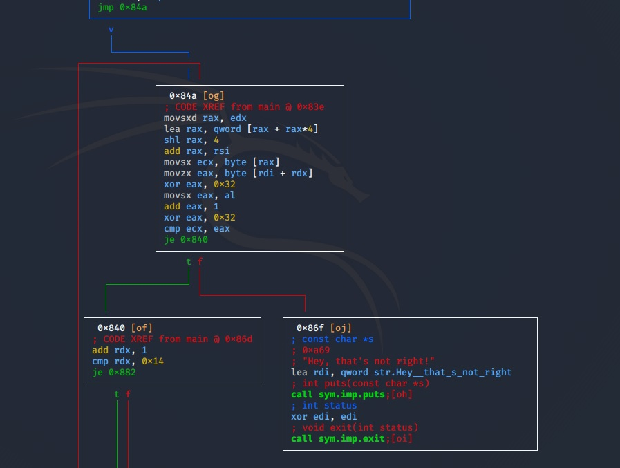

# Whats The Password Revisited | RiceTeaCatPanda
## Problem
There's a password somewhere...

## Solution
### 1. Run strings (lol)
```bash
kali@kali:~/Desktop/whatsthepassword$ strings whats-the-password-revisited 
...
AUATL
[]A\A]A^A_
Whats the password? 
Hey, that's not right!
fL492_r_h4rd3r_th4n_th1s
rtcp{
Nice job! Here's your flag: %s
;*3$"
GCC: (Ubuntu 7.4.0-1ubuntu1~18.04.1) 7.4.0
...
```
Of course it's not that easy, but worth a try.

### 2. Check it out in radare2
 - Note: Good R2 cheatsheet at: https://github.com/zxgio/r2-cheatsheet/blob/master/r2-cheatsheet.pdf

 ```bash
 kali@kali:~/Desktop/whatsthepassword$ r2 whats-the-password-revisited 
[0x000008c0]> aaaa; afl
[x] Analyze all flags starting with sym. and entry0 (aa)
[x] Analyze function calls (aac)
[x] Analyze len bytes of instructions for references (aar)
[x] Check for objc references
[x] Check for vtables
[x] Type matching analysis for all functions (aaft)
[x] Propagate noreturn information
[x] Use -AA or aaaa to perform additional experimental analysis.
[x] Finding function preludes
[x] Enable constraint types analysis for variables
0x000008c0    1 42           entry0
0x00000740    1 6            sym.imp.strncpy
0x00000750    1 6            sym.imp.puts
0x00000760    1 6            sym.imp.__stack_chk_fail
0x00000000    2 41           loc.imp._ITM_deregisterTMCloneTable
0x00000770    1 6            sym.imp.__fgets_chk
0x00000780    1 6            sym.imp.__strcpy_chk
0x00000790    1 6            sym.imp.__printf_chk
0x000007a0    1 6            sym.imp.exit
0x000009c0    5 154  -> 67   entry.init0
0x00000980    5 58   -> 51   entry.fini0
0x000008f0    4 50   -> 40   fcn.000008f0
0x00000718    3 23           fcn.00000718
0x000007c0    7 253          main
```
Only a few functions here to check out.

```bash
[0x000008c0]> s main; pdf
[0x000007c0]> VV
```

Checking out the graph, we can see a loop in which bytes are manipulated until a comparison with ecx is true.
  
This looks like the point in which the final password is compared. However, it is done one byte at a time, and looks to be deobfuscated at runtime with some xoring. I tried patching the binary to jump directly to the function that prints the password, however we end up with the output just showing the first part of the flag observed in strings: "fL492_r_", followed by whatever my fake garbage input was. So that would indicate the first part of the flag is this first sequence that could be viewed in strings, ie: fL492_r_|something we need to find out|


### 3. Do some dynamic analysis
Start back up R2 with the debugger.
```bash
ali@kali:~/Desktop/whatsthepassword$ r2 -d whats-the-password-revisited 
Process with PID 2682 started...
= attach 2682 2682
bin.baddr 0x55a221a14000
Using 0x55a221a14000
asm.bits 64
Warning: r_bin_file_hash: file exceeds bin.hashlimit
[0x7f6a10b0f090]> aaa
[x] Analyze all flags starting with sym. and entry0 (aa)
[x] Analyze function calls (aac)
[x] Analyze len bytes of instructions for references (aar)
[x] Check for objc references
[x] Check for vtables
[TOFIX: aaft can't run in debugger mode.ions (aaft)
[x] Type matching analysis for all functions (aaft)
[x] Propagate noreturn information
[x] Use -AA or aaaa to perform additional experimental analysis.
[0x7f6a10b0f090]> 
```

Looking back at that image - in the function in which the bytes are deobfuscated, a byte is copied from rax into ecx. Then ecx remains the same after that, and is compared with eax at the end. Whatever's being copied into ecx must be the obfuscated byte. We can break once the ecx copy happens and inspect the value.
```bash
[0x55a221a147c0]> db 0x55a221a1485b
[0x55a221a147c0]> dc
Whats the password? thisisntright
hit breakpoint at: 55a221a1485b
[0x55a221a1485b]> dr
rax = 0x55a221c15020
rbx = 0x7ffdb3df36d0
rcx = 0x0000003a      <----------------- The first byte of the password
rdx = 0x00000000
r8 = 0x00000008
r9 = 0x00000040
r10 = 0x00000410
r11 = 0x7f6a10ab50e0
r12 = 0x55a221a148c0
r13 = 0x7ffdb3df37f0
r14 = 0x00000000
r15 = 0x00000000
rsi = 0x55a221c15020
rdi = 0x7ffdb3df36dd
rsp = 0x7ffdb3df36d0
rbp = 0x7ffdb3df36dd
rip = 0x55a221a1485b
rflags = 0x00000202
orax = 0xffffffffffffffff
```

To deobfuscate this byte, we have to reverse the obfuscation process that is done in the function.
```python
kali@kali:~/Desktop$ python3
Python 3.8.3 (default, May 14 2020, 11:03:12) 
[GCC 9.3.0] on linux
Type "help", "copyright", "credits" or "license" for more information.
>>> chr(((0x3a ^ 0x32) - 1) ^ 0x32)
'5'
>>>
```
So 5 is the first character of the flag. At this point, we may continue this process over and over to recover the full flag. However there is a better way.

### 4. Find the obfuscated bytes in memory
Of interest in the deobfuscation function is this line:
```
0x55d0fe203858      0fbe08         movsx ecx, byte [rax]
```
That address in rax is where the byte is being loaded from. If we break here and check the memory address loaded in rax, we should be able to recover the bytes which later make up the password.
```
[0x55d0fe2037c0]> db 0x55d0fe20385b
[0x55d0fe2037c0]> dc
Whats the password? thisisntright
hit breakpoint at: 55d0fe20385b
[0x55d0fe20385b]> px 3000 @ rax
- offset -       0 1  2 3  4 5  6 7  8 9  A B  C D  E F  0123456789ABCDEF
0x55d0fe404020  3a00 0000 0000 0000 0000 0000 0000 0000  :...............                                                                                                              
0x55d0fe404030  0000 0000 0000 0000 0000 0000 0000 0000  ................
0x55d0fe404040  0000 0000 0000 0000 0000 0000 0000 0000  ................
0x55d0fe404050  0000 0000 0000 0000 0000 0000 0000 0000  ................
0x55d0fe404060  0000 0000 0000 0000 0000 0000 0000 0000  ................
0x55d0fe404070  3100 0000 0000 0000 0000 0000 0000 0000  1...............
0x55d0fe404080  0000 0000 0000 0000 0000 0000 0000 0000  ................
0x55d0fe404090  0000 0000 0000 0000 0000 0000 0000 0000  ................
0x55d0fe4040a0  0000 0000 0000 0000 0000 0000 0000 0000  ................
0x55d0fe4040b0  0000 0000 0000 0000 0000 0000 0000 0000  ................
0x55d0fe4040c0  5200 0000 0000 0000 0000 0000 0000 0000  R...............
0x55d0fe4040d0  0000 0000 0000 0000 0000 0000 0000 0000  ................
0x55d0fe4040e0  0000 0000 0000 0000 0000 0000 0000 0000  ................
0x55d0fe4040f0  0000 0000 0000 0000 0000 0000 0000 0000  ................
0x55d0fe404100  0000 0000 0000 0000 0000 0000 0000 0000  ................
0x55d0fe404110  3000 0000 0000 0000 0000 0000 0000 0000  0...............
0x55d0fe404120  0000 0000 0000 0000 0000 0000 0000 0000  ................
0x55d0fe404130  0000 0000 0000 0000 0000 0000 0000 0000  ................
0x55d0fe404140  0000 0000 0000 0000 0000 0000 0000 0000  ................
0x55d0fe404150  0000 0000 0000 0000 0000 0000 0000 0000  ................
0x55d0fe404160  3400 0000 0000 0000 0000 0000 0000 0000  4...............
...
```
Going down, all the original flag bytes are there. We collect them all, and then can deofuscate them all at once with a script (see decodebytes.py).

```
[0x55d0fe20385b]> px 2000 @ rax > obfsflag.txt
```
and then:
```bash
kali@kali:~/Desktop/whatsthepassword$ python3 decodebytes.py 
rtcp{fL92_r_50m371m32_5Pr34D_0U7}
```